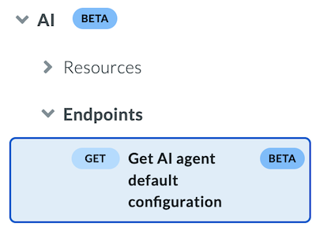

# API versioning strategy

Box provides versioning capabilities for selected API endpoints. The version control system guarantees seamless functioning of existing endpoint versions, even if Box introduces new ones.

API versioning empowers Box to continually enhance its platform, while also offering third-party developers a reliable avenue for feature updates and deprecations.

<Message type='tip'>

To stay informed about the forthcoming API modifications, monitor the [Changelog](https://developer.box.com/changelog/) and maintain a current email address in the Developer Console's App Info section.

</Message>

<Message type='notice'>

In 2024, Box introduced year-based API versioning.

All endpoints available at the end of 2024 were assigned the version `2024.0`.

**No action is required for API users to continue using Box APIs.**

To make version-aware API calls, include the `box-version` header with the value `2024.0` in your requests.

</Message>

## How Box API versioning works

<Message type='notice'>

Box API supports versioning in `header`. To determine which version to use, look at the API reference and included sample requests.

</Message>

### Versioning in `header`

Box API processes the `box-version` header which should contain a valid version name. For example, when the client wants
to get a list of all sign requests using version `2025.0`, the request should look like this:

```curl
curl --location 'https://api.box.com/2.0/sign_requests' \
     --header 'box-version: 2024.0' \
     --header 'Authorization: Bearer …
```

If the provided version is correct and supported by the endpoint, a response is sent to the client.
If the endpoint is available in multiple versions, the response will include the `box-version` header, 
which indicates the version used to handle the request.
Endpoints introduced after 2024 may return a `400` error code if the version is incorrect.
More information about versioning errors can be found [here](g://api-calls/permissions-and-errors/versioning-errors).

## Release schedule and naming convention

Box can introduce a new breaking change to certain endpoints **once per year**. 
Introducing a new version of the Sign Request endpoint means that **all paths and HTTP methods** of an endpoint will support it.

For example, if Sign Request endpoints receive a new version it will apply to all endpoints listed in the table:

| Method | Request URL                                        | Description                              |
| ------ | -------------------------------------------------- | ---------------------------------------- |
| GET    | `https://api.box.com/2.0/sign_requests/:id`        | Retrieves specific sign request details. |
| GET    | `https://api.box.com/2.0/sign_requests/`           | Retrieves all sign requests.             |
| POST   | `https://api.box.com/2.0/sign_requests/`           | Creates new sign requests.               |
| POST   | `https://api.box.com/2.0/sign_requests/:id/resend` | Sends a specific sign request again.     |
| POST   | `https://api.box.com/2.0/sign_requests/:id/cancel` | Cancels a specific sign request.         |

### Naming convention

New API versions are labeled according to the calendar year of their release.

**Example**: If a new version of the Sign Requests endpoint is released in 2025, it will be named `2025.0`.

Box can issue a new breaking change to API endpoints **once** per year, reserving the right to release an additional breaking change to address security or privacy concerns. In such cases, the new version will be incremented by one in the suffix.

**Example**: If security issues need addressing in the previously released version `2025.0` of Sign Requests, the new version will be labeled `2025.1`.

Each stable version is supported for a minimum of 12 months. This means that when a new version is released, the previous version becomes deprecated and will be available for use, but no new features will be added.
It also means, that a new version cannot be released sooner than every 12 months.

We strongly recommend updating your apps to make requests to the latest stable API version. However, if your app uses a stable version that is no longer supported, then you will get a response with an HTTP error code `400 - Bad Request`. For details, see [Versioning Errors](g://api-calls/permissions-and-errors/versioning-errors).

If your request doesn't include a version, the API defaults to the initial Box API version—the version available before 
year-based versioning was introduced. However, relying on this behavior is not recommended when adopting deprecated 
changes. To ensure consistency, always specify the API version, with each request. By making your application 
version-aware, you anchor it to a specific set of features, ensuring consistent behavior throughout the supported 
timeframe.

### Endpoint versioning indication

To keep you informed about the current API state, and improve the readability of the versioned API reference, the affected endpoints are marked with a pill based on the `x-stability-level` tag or `deprecated` attribute.



|    Schema element   | Pill name | Description|
|---------------------|-----------|------------|
| `x-stability-level: beta` | Beta | Endpoints marked with **beta**, are offered subject to Box’s Main Beta Agreement, meaning the available capabilities may change at any time. Although beta endpoints not the same as versioned endpoints, they are a part of API lifecycle. |
|`x-stability-level: stable` or no `x-stability-level` tag  | Latest version | The latest version applies to APIs that are already versioned. **Latest version** marks the most recent stable API version of an endpoint.| 
| `deprecated: true` | Deprecated |  An endpoint is deprecated, which means it is still available for use, but no new features are added. Such an endpoint is annotated with the `deprecated` attribute set to `true`.|

## Versioning errors

When using versioned API actions such as calling an incorrect API version in header or a deprecated version can lead to errors.

For details on possible errors, see [versioning errors](g://api-calls/permissions-and-errors/versioning-errors).

## How Box SDK versioning works

The versioning strategy applies only to [next generation generated SDKs](https://developer.box.com/sdks-and-tools/#next-generation-sdks).

Box SDKs support the **All Versions In** SDK approach.
This means that every release of SDK provides access to all endpoints in any version which is currently live. All generated SDKs use manager's approach - they group all endpoints with the same domain in one manager.

For example `FolderManager` contains methods to: `create_folder`, `get_folder_by_id`, `update_folder_by_id`, `delete_folder_by_id`, `get_folder_items` and `copy_folder`. This division is done based on the value of `x-box-tag` field, which is assigned to each method in Public API Service specification. It mostly corresponds to the root of the endpoint URL, but not necessarily. For example: `FolderManager` contains methods with `https://api.box.com/2.0/folders` root URL, but the same base URL is also used in some methods of `SharedLinkFoldersManager`.
References to all managers are stored under one Box Client object.

See an example of the endpoint's lifecycle:

1. Initial state (only one version is available).

    ```js
    class FilesManager {
        async updateFileById(
            fileId: string,
            requestBody: UpdateFileByIdRequestBody,
            queryParams: UpdateFileByIdQueryParams,
            headers: UpdateFileByIdHeaders
        ): Promise < FileFull > {}
    }
    ```

2. A new `v2025_0` version of the endpoint is introduced (previous version is deprecated).

    The SDK introduces a new method for each new version of an endpoint. These methods are stored in the same manager as the old ones, but their names and corresponding classes are suffixed with the version number. The old method is deprecated with a notice indicating the minimal maintenance date – this will be the date when the endpoint will be considered for end-of-life status.

    ```js
    class FilesManager {
        /**
         * @deprecated This endpoint will be EOL'ed after 05-2026.
            */
        async updateFileById(
            fileId: string,
            requestBody: UpdateFileByIdRequestBody,
            queryParams: UpdateFileByIdQueryParams,
            headers: UpdateFileByIdHeaders
        ): Promise<FileFull> {}

        async updateFileById_2025_0(
            fileId: string,
            requestBody: UpdateFileByIdRequestBody_2025_0,
            queryParams: UpdateFileByIdQueryParams_2025_0,
            headers: UpdateFileByIdHeaders_2025_0
        ): Promise<FileFull_2025_0> {}
    }
    ```

3. The API endpoint is marked as End-of-Life (EOL)

    The SDK releases a breaking change release with removed end-of-life (EOL) endpoints. Ideally, we should group the end-of-life dates for all endpoints into one date per quarter to avoid releasing numerous new major versions of SDKs.

    ```js
    class FilesManager {
        async updateFileById_2025_0(
            fileId: string,
            requestBody: UpdateFileByIdRequestBody_2025_0,
            queryParams: UpdateFileByIdQueryParams_2025_0,
            headers: UpdateFileByIdHeaders_2025_0
        ): Promise < FileFull_2025_0 > {}
    }
    ```

## Breaking vs non-breaking changes

Breaking changes in the Box API occur within versioned releases, typically accompanied by a new major API version. Minor adjustments, which do not disrupt existing functionality, can be integrated into an existing API version. The following table lists both breaking and non-breaking changes.

| API Change                                               | Breaking change |
| -------------------------------------------------------- | --------------- |
| New endpoints                                            | No              |
| New [read-only](https://swagger.io/docs/specification/data-models/data-types/) or optional fields in request                 | No              |
| New required fields in request                           | Yes             |
| New string constant in request                           | Yes             |
| Deprecation                                              | No              |
| Retired / End-of-Life endpoints                          | Yes             |
| Rename/reshape of a field, data type, or string constant | Yes             |
| More restrictive change to field validations             | Yes             |
| Less restrictive change to field validations             | No              |
| Changing HTTP status code returned by an operation       | Yes             |
| Removing a declared property                             | Yes             |
| Removing or renaming APIs or API parameters              | Yes             |
| Adding a required request header                         | Yes             |
| Adding more error codes                                  | No              |
| Removing or modifying error codes                        | Yes             |
| Adding a member to an enumeration                        | Yes             |

<Message type='tip'>

The [oasdiff](https://github.com/Tufin/oasdiff/blob/main/BREAKING-CHANGES-EXAMPLES.md) tool allows detecting most of the possible breaking changes.
</Message>

## AI agent configuration versioning

[AI agent](g://box-ai/ai-agents) versioning gives the developers more control over model version management and ensures consistent responses. For details, see [AI agent configuration versioning guide](g://box-ai/ai-agents/ai-agent-versioning).

## Support policy and deprecation information

When new versions of the Box APIs and Box SDKs are released, earlier versions will be retired. Box marks a version as `deprecated` at least 24 months before retiring it. In other words, a deprecated version cannot become end-of-life
sooner than after 24 months.
Similarly, for individual APIs that are generally available (GA), Box declares an API as `deprecated` at least 24 months in advance of removing it from the GA version.

When we increment the major version of the API (for example, from `2024.0` to `2025.0`), we're announcing that the current version (in this example, `2024.0`) is immediately deprecated and we'll no longer support it 24 months after the announcement. We might make exceptions to this policy for service security or health reliability issues.

When an API is marked as deprecated, we strongly recommend that you migrate to the latest version as soon as possible. In some cases, we'll announce that new applications will have to start using the new APIs a short time after the original APIs are deprecated.

When customer calls deprecated API endpoint, the response will contain a header:

```sh
Deprecation: date="Fri, 11 Nov 2023 23:59:59 GMT"
Box-API-Deprecated-Reason: https://developer.box.com/reference/deprecated
```

The date tells clients when this version was marked as deprecated.

## Versioning considerations

When building your request, consider the following:

 * If you do not specify a version, the service will return the initial version that existed before year-based versioning was introduced. If the initial version does not exist, the response will return an HTTP error code `400 - Bad Request`.
 * If the version header is specified but the requested version is unavailable, the response will return an HTTP error code `400 - Bad Request`.

For details, see [versioning errors](g://api-calls/permissions-and-errors/versioning-errors).

When Box deprecates a resource or a property of a resource in the API, the change is communicated in one or more of the following ways:

* Calls that include the deprecated behavior return the response header `Box-API-Deprecated-Reason` and a link to get more information:

    ```sh
    box-version: 2023.0
    Deprecation: version="version", date="date"
    Box-API-Deprecated-Reason: https://developer.box.com/reference/deprecated
    ```

* A deprecation announcement is posted in the developer changelog.
* The API reference is updated to identify the affected resource and any action you need to take. Affected endpoints are marked with **deprecated** pill.
* If there is an imminent backwards-incompatible change that affects your app, then the contact email for your app might be contacted about the deprecation.

## Additional resources

* [API reference](https://developer.box.com/reference/)
