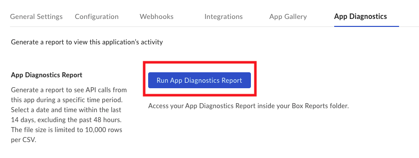
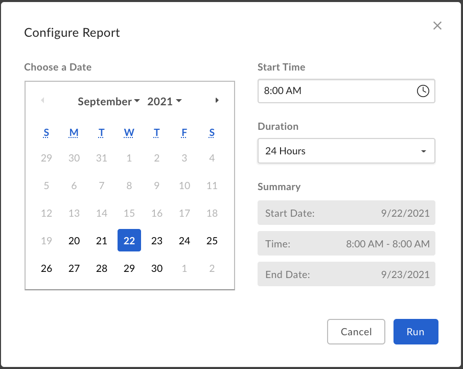
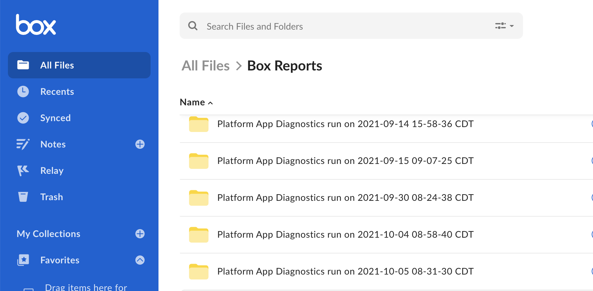
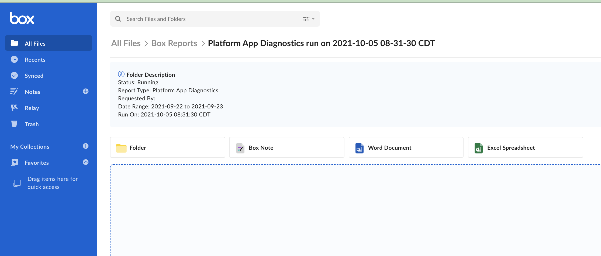
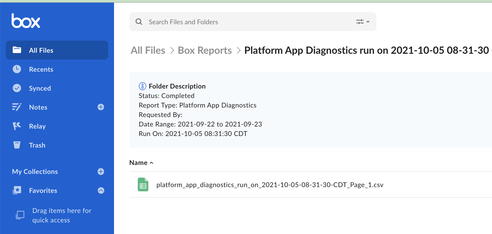
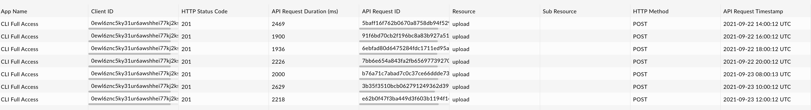

# App Diagnostics Report

The App Diagnostics Report provides a spreadsheet detailing each API call made
by a given application during a specified timeframe. The report gives you
access to the `API Request ID`, which can be given to Box Support for
troubleshooting purposes.

<Message type='warning'>
  This report will not include:
    * API calls made within the last 48 hours
    * Authorization and Token API calls

  We are working on including the above and thereby making the report suitable
  for real-time troubleshooting in the future.
</Message>

## 1. Click on the **App Diagnostics** Tab

To run the App Diagnostics Report, click the **App Diagnostics** option located
along the top of your application's configuration section in
the [Developer Console][console].

<ImageFrame center shadow>

</ImageFrame>

## 2. Click **Run App Diagnostics Report** to configure your report

Clicking **Run App Diagnostics Report** will display a popup to select report
filters and parameters.

<ImageFrame center shadow>

</ImageFrame>

## 3. Select Report Parameters and Click **Run**

You can select a date in the last two weeks, starting 48 hours prior to today.
A report can be run for up to a total of 24 hours. Click **Run** to
generate a report.

<ImageFrame center shadow>

</ImageFrame>

## 4. Access the Box Reports Folder

Navigate to [All Files][allfiles] and locate the Box Reports folder. If this is
your first time running a report, this folder is automatically generated. If
you are an Admin, this is the same folder you access
[Admin Console Reports][reports]. Open the folder.

<ImageFrame center shadow>

</ImageFrame>

## 5. Find and Open the latest Platform App Diagnostics Report Folder

You will see any reports you have run in the Box Reports folder.
Locate and open the most recent Platform App Diagnostics run folder.

<ImageFrame center shadow>

</ImageFrame>

## 6. Check the Status

The report will take time to complete. You can see the status in the box at the
top of the folder.

<ImageFrame center shadow>

</ImageFrame>

## 7. Report Completed

Upon completion, the status will change, and the `.csv` file will appear in the
folder.

<ImageFrame center shadow>

</ImageFrame>

## 8. Open the Report

You can open the file in your web browser or download it to view locally. If
you need help from [Box Support][support], you can send in the report with your
ticket by attaching a downloaded copy or via shared link.

<ImageFrame center shadow>

</ImageFrame>

The report has nine columns.

<!-- markdownlint-disable line-length -->

| Column | Description        |                                                                                                                                                                                    |
| --------------- | -------------- | ---------------------------------------------------------------------------------------------------------------------------------------------------------------------------------- |
| App Name                  | The name of the application |
| Client ID                 | The Client ID of the application |
| HTTP Status Code          | The response code returned from Box |
| API Request Duration (ms) | The amount of time from API call to response |
| API Request ID            | An unique identifier that can be used by Box Support                            |
| Resource                  | The primary resource accessed in the API call |
| Sub Resource              | The secondary resource accessed in the API call |
| HTTP Method               | The type of HTTP method used in the API call |
| API Request Timestamp     | The timestamp of the API call |

[support]: https://support.box.com/hc/en-us/requests/new
[console]: https://app.box.com/developers/console
[allfiles]: https://app.box.com/folder/0
<!-- i18n-enable localize-links -->
[reports]: https://support.box.com/hc/en-us/articles/360043696534-Running-Reports
<!-- i18n-disable localize-links -->
