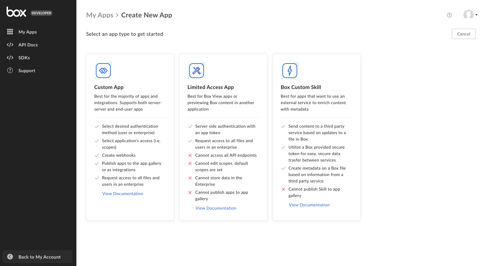

# Application Types

The following is an overview of the different Box Application types you can
create.

<ImageFrame border center>
  
</ImageFrame>

<!-- markdownlint-disable line-length -->

| Application Type              | Authentication Methods                                              |
| ----------------------------- | ------------------------------------------------------------------- |
| [Custom App][custom-apps]     | [OAuth 2.0][oauth2], [JWT][jwt], or [Client Credentials Grant][ccg] |
| [Limited Access App][laa]     | [App Token][apptoken]                                               |
| [Custom Skill][custom-skills] | No selection needed                                                 |

<!-- markdownlint-enable line-length -->

<CTA to="guide://applications/app-types/select">
  Learn how to select an application type
</CTA>

<!-- markdownlint-enable line-length -->

[oauth2]: g://authentication/oauth2
[jwt]: g://authentication/jwt
[apptoken]: g://authentication/app-token
[devtoken]: g://authentication/tokens/developer-tokens
[custom-apps]: g://applications/app-types/custom-apps
[custom-skills]: g://applications/app-types/custom-skills
[ccg]: g://authentication/client-credentials/
[laa]: g://applications/app-types/limited-access-apps/
[insights]: https://support.box.com/hc/en-us/articles/20738406915219-Platform-Insights