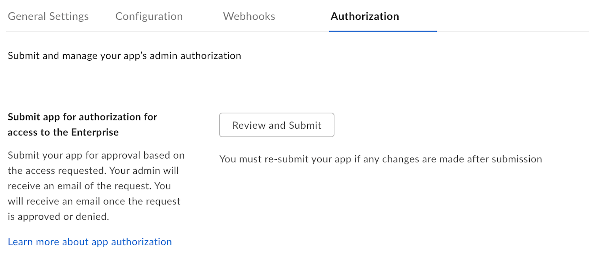

# App Approval

Custom App that are configured with [JWT][jwt] or [App Token][app-token]
authentication will need to be authorized within the Box enterprise by the
enterprise Admin User before it can be used.

## Approval Notifications

A semi-automated process for app approval is available in the developer console.

Head over to your application in the [developer console][devconsole] and
select the "General" link from the left sidebar in your application
and scroll down to the "App Authorization" section.

<ImageFrame border width="400" center>
  
</ImageFrame>

By submitting the application for approval it will send an email to your
enterprise admin to have them enable the application. More information on this
process is available in our [community article on app authorization][app-auth].

## Manual Approval

If the above process is not an option, the following are instructions on how to
manually approve the application.

### As developer

As the developer, head over to the application in the [developer
console][devconsole] and copy the app's client ID and provide this to your admin.

<Message>
  # Finding a Box Admin

  If you don't know your enterprise admin, go to the Box [account
  settings][settings] page  and scroll to the bottom. If an admin contact is set
  you should see contact  information under "Admin Contact".
</Message>

### As admin

As the admin, head over to the [admin console][adminconsole] select the "Apps"
tab.

<ImageFrame border center>
  
</ImageFrame>

Scroll down to the "Custom Applications" section and click on the "Authorize New
App" button.

<ImageFrame border center>
  
</ImageFrame>

When asked for the API key, enter the client ID for the application that the
developer provided.

## Re-authorization on changes

When the application's scopes or access level change the application needs to be
re-authorized. Repeat the process above and request a new Access Token for the
new changes to take effect.

In the same section where the application was initially authorized, the admin can
re-authorize the same application.

<ImageFrame border center>
  
</ImageFrame>

[devconsole]: https://app.box.com/developers/console
[settings]: https://app.box.com/account
[adminconsole]: https://app.box.com/master/settings/custom
[jwt]: g://authentication/jwt
[app-token]: g://authentication/app-token
[app-auth]: https://community.box.com/t5/Managing-Developer-Sandboxes/Authorizing-Apps-in-the-Box-App-Approval-Process/ta-p/77293
