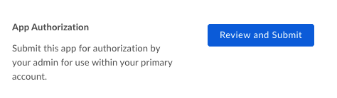

# Setup with App Tokens

A Custom App can be set up to use server-side
[App Tokens][app-token] for authentication.

<CTA to='g://authentication/app-token'>
  Learn how App Token authentication works
</CTA>

## Prerequisites

To set up a Custom App using App Token authentication you will need to pass the
following requirements.

* You need to be a be able to access the [Developer Console][devconsole] for
  your enterprise, or sign up for a [developer account][devaccount].

## Create the app

### 1. Log in to the Developer Console

Head over to the [Developer Console][devconsole] and select "Create New App".

### 2. Create a Custom App

Select the "Custom App" option from the list of application types and select
"Next".

<ImageFrame border>
  
</ImageFrame>

### 3. Select App Token authentication

On the next screen, select "Standard OAuth 2.0 (User Authentication)" and select
"Next".

<ImageFrame border width="400" center>
  
</ImageFrame>

### 4. Provide a name

Finally, provide a unique name for your application. This name needs to be
unique across all applications on Box.

<ImageFrame border width="600" center>
  
</ImageFrame>

## App Authorization

Before the application can be used and App Tokens can be created, the
application will need to be authorized within the Box enterprise by the
enterprise Admin User.

Head over to your application in the [developer console][devconsole] and
select the "General" link from the left sidebar in your application
and scroll down to the "App Authorization" section.

<ImageFrame border width="400" center>
  
</ImageFrame>

By submitting the application for authorization you  will send an email to your
enterprise admin to have them enable your application. More information on this
process is available in our [community article on app authorization][app-auth].

## Basic configuration

Before the application can be used, some basic additional configuration might be
required.

### Primary and Secondary App Tokens

Authentication in this kind of application is done through preconfigured [App
Tokens][app-token]. To configure an app token, head over to the [developer
console][devconsole], select your application, and select the "Configuration"
panel from the left-hand sidebar.

Now scroll down to the "Primary Access Token" section and create a first Access
Token by selecting the "Generate Key" button.

<ImageFrame border width="600" center>
  
</ImageFrame>

Tokens can be configured to automatically expire or be valid indefinitely.
After creation, the key will be enabled and can be used to make [API
calls][api-calls].

<Message warning>
  # App authorization

  App Tokens can not be generated until the application has been authorized.
</Message>

### CORS Domains

If your application is making API calls from front-end browser code in
Javascript then the domain that these calls will be made from will need to be
allowed due to [Cross Origin Resource Sharing][cors], also known as CORS.

Fill in the full URI(s) of the domains that should be enabled in your
application to make these kind of requests. If all requests will be made from
server-side code, this section may be left blank.

<ImageFrame border>
  
</ImageFrame>

[devconsole]: https://app.box.com/developers/console
[devaccount]: https://account.box.com/signup/n/developer
[devtoken]: g://authentication/access-tokens/developer-tokens
[scopes]: g://api-calls/permissions-and-errors/scopes
[cors]: https://en.wikipedia.org/wiki/Cross-origin_resource_sharing
[app-token]: g://authentication/app-token
[api-calls]: g://api-calls
[app-auth]: https://community.box.com/t5/Managing-Developer-Sandboxes/Authorizing-Apps-in-the-Box-App-Approval-Process/ta-p/77293
