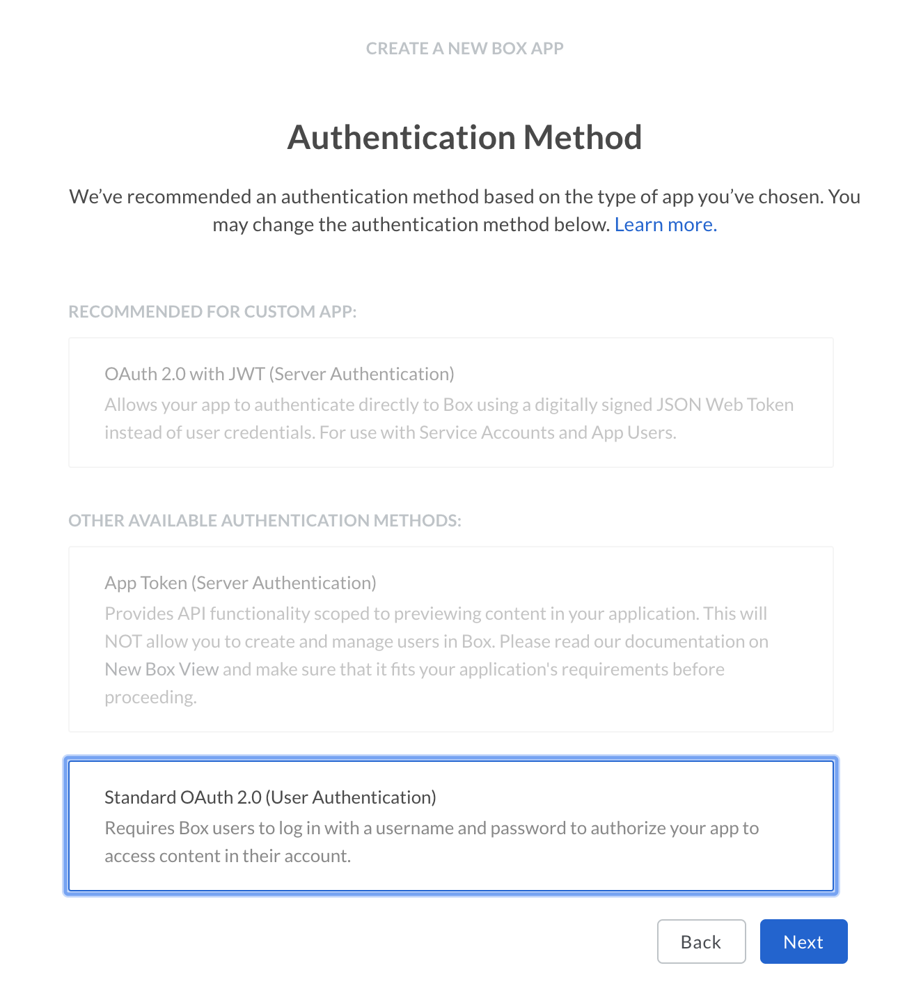
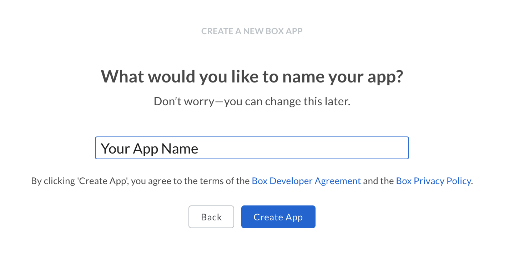
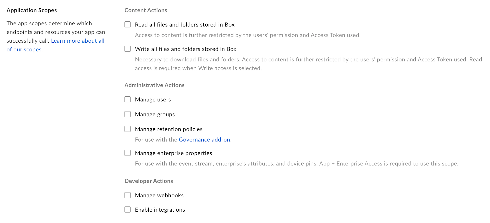

# Setup with OAuth 2.0

A Custom App can be set up to use client-side [OAuth 2.0][oauth2] authentication.

<CTA to='g://authentication/oauth2'>
  Learn how OAuth 2.0 authentication works
</CTA>

## Prerequisites

To set up a Custom App using OAuth 2.0 authentication you will need to pass the
following requirements.

* You need to be a be able to access the [Developer Console][devconsole] for
  your enterprise, or sign up for a [developer account][devaccount].

## Create the app

### 1. Log in to the Developer Console

Head over to the [Developer Console][devconsole] and select "Create New App".

### 2. Create a Custom App

Select the "Custom App" option from the list of application types and select
"Next".

<ImageFrame border>
  
</ImageFrame>

### 3. Select OAuth 2.0 authentication

On the next screen, select "Standard OAuth 2.0 (User Authentication)" and select
"Next".

<ImageFrame border width="400" center>
  
</ImageFrame>

### 4. Provide a name

Finally, provide a unique name for your application. This name needs to be
unique across all applications on Box.

<ImageFrame border width="600" center>
  
</ImageFrame>

<Message>
  Your application is now configured and ready to be used. You can use the
  [Developer Token][devtoken] to immediately make API calls to your own account.
</Message>

## Basic configuration

Before the application can be used, some basic additional configuration might be
required.

### Redirect URI

During the OAuth 2.0 flow a user will need to be redirected to the Box web app
in the browser to provide their login credentials and authorize your application
access to their data.

After this, the user is redirected back to the redirect URI of your application.
This URI can be any secure HTTPS URL, or a less secure HTTP URL for a server
running on `localhost`.

<ImageFrame border width="600" center>
  
</ImageFrame>

### Application Scopes

These options define what permissions your application has to access data. See
the [scopes guide][scopes] for detailed information on each option.

<ImageFrame border width="600" center>
  
</ImageFrame>

### CORS Domains

If your application is making API calls from front-end browser code in
Javascript then the domain that these calls will be made from will need to be
allowed due to [Cross Origin Resource Sharing][cors], also known as CORS.

Fill in the full URI(s) of the domains that should be enabled in your
application to make these kind of requests. If all requests will be made from
server-side code, this section may be left blank.

<ImageFrame border>
  
</ImageFrame>

[devconsole]: https://app.box.com/developers/console
[devaccount]: https://account.box.com/signup/n/developer
[devtoken]: g://authentication/access-tokens/developer-tokens
[scopes]: g://api-calls/permissions-and-errors/scopes
[cors]: https://en.wikipedia.org/wiki/Cross-origin_resource_sharing
[oauth2]: g://authentication/oauth2
