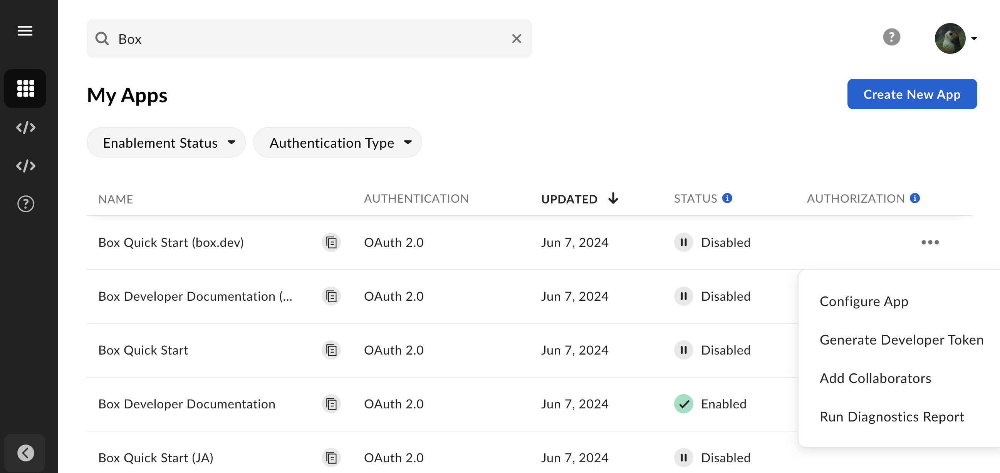

# Applications

Box Developer Console allows you to create applications
you can then use to integrate with Box.
**My Apps** view displays a list of already created applications
and gives you quick access to their configuration details.
This way, you don't need to open
the app each time you want to generate
a Developer Token, copy the Client ID, or generate a report.

## Features

**My Apps** page allows you to:

* Search through the list of already created apps.
* Filter the apps by **Enablement Status** and **Authentication Type**.
* Create [a new app][select].
* Copy the app's [Client ID][clientcredentials].
* Rename the app and access its details with one click.
* Check application [enablement][enablement] and [authorization][authorization] status. Apps published to App Center display status from App Center.

The **Options menu** available for every entry allows you to:

* Access the configuration details of your application.
* Generate a [Developer Token][token].
* Add collaborators to your application.
* Run the [App Diagnostics Report][report].

## App Insights

Admins and co-admins can access the Platform Insights
dashboard that provides a comprehensive
view of the organization’s platform usage.
This includes app-related data, such as:

* The total number of API calls per application.
* A list of top applications within the enterprise.
* A list of pending application approvals.
* A list of applications awaiting enablement.

See [Platform Insights][insights] for details.

<Message type='notice'>
You need the following permissions to access
and view Platform Insights:
  * View settings and apps for your company
  * Edit settings and apps for your company
  * Run new reports and access existing reports
</Message>

[token]: g://authentication/tokens/developer-tokens
[authorization]: g://authorization
[enablement]: g://authorization/custom-app-approval#user-authentication-apps
[select]: g://applications/app-types/select
[report]: g://api-calls/permissions-and-errors/app-diagnostics-report
[clientcredentials]: g://authentication/client-credentials
[insights]: https://support.box.com/hc/en-us/articles20738406915219-Platform-Insights
