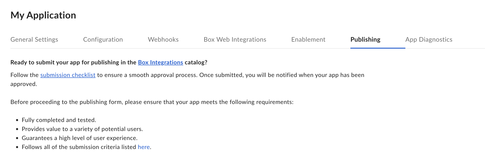

# Integrations

The [Box Integrations][app-center] is the first place for Box users to find out
about applications that they can use in combination with Box. If your
application is suited to be used by other enterprises, listing your service in
the Integrations can be a great way to find new users.
Integrations groups apps into sections so that you can
quickly find featured, most popular, or recently added apps.

  

## Developing and app or becoming a Box Partner

If you would more information on developing an application for the Box Integrations or becoming a Box Partner, visit our [Box Partner Resources][bp] guides on our community site.

## Publishing an app

Use the following steps to publish an application in Box Integrations.

### Prerequisites

Your application must meet the following requirements:

* The application is in a finished state and ready for production usage.
* The application leverages OAuth 2.0 authentication, as the Integrations does not support any other authentication methods.
* You are a developer with access to the application in the [Developer Console][devconsole].

### Steps

1. Navigate to the [Developer Console][devconsole] and select your application to submit.
2. Select the **Publishing** tab from the top menu.

    

3. Fill in the form with your application's categories, a short and a long
description, screenshots and an app icon.
4. Click **Preview** to see a preview of your application listing.
5. Finally, submit the application for approval by clicking the **Submit for Approval** button.

<Message>
  # Approval completion

  Once a request for approval is received, the Box Partner team will be
  notified and review your request as soon as possible.

  For any questions, please email [`integrate@box.com`][email] or submit a
  support ticket.
</Message>

## Unpublishing an application

Once approved and published, an application can be unpublished from the same
control panel. Navigate to the [Developer Console][devconsole] and select
your application. Then, select the **Integrations** panel from the left-hand
sidebar. The app can be unpublished from this page.

[app-center]: https://app.box.com/services
[devconsole]: https://cloud.app.box.com/developers/console
[email]: mailto:integrate@box.com
[bp]: https://support.box.com/hc/en-us/sections/360009473734-Box-Partner-Resources
