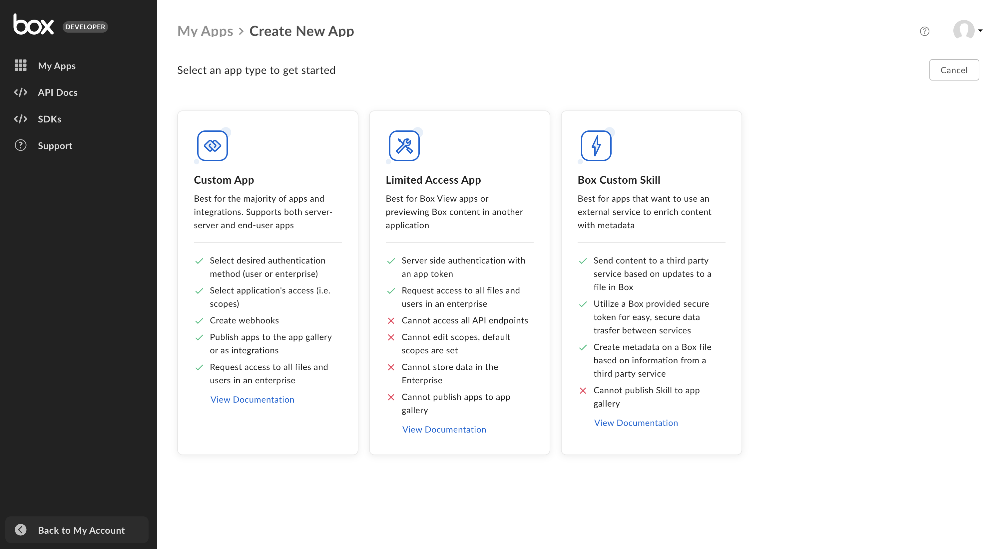

# Select App Type

Upon creating a new Box application in the
[Developer Console][dev-console], you must select
one of the following types of applications. The type of application you select
is dependent on the use case for your project and will only impact the
available authentication methods when configuring your application. You cannot
change this selection later on. 

<ImageFrame shadow center>
  
</ImageFrame>

## Custom App

<!-- markdownlint-disable line-length -->

|                            |                                                                            |
| -------------------------- | -------------------------------------------------------------------------- |
| **Authentication methods** | [OAuth 2.0][oauth2], [JWT][jwt], or Client Credentials Authentication      |
| **Notable Features**        | Webhooks, App Gallery, and Web App Integrations                           |

<!-- markdownlint-enable line-length -->

Custom App encompasses most use cases and is the most flexible option.
This application type allows for interaction with our 150+ endpoints.
For example, downloading/uploading, searching, applying metadata and more.

A Custom App typically presents Box functionality to a user within a custom
interface. Box offers pre-built user interface components known as UI
Elements for functionality like browsing, search, viewing and more that can be
customized, or you can build your own.

<CTA to="g://applications/custom-apps">Learn more about Custom Apps</CTA>

### Use Cases

Example use cases for a Custom App include:

- A file vault in an application that allows an end user to access files that
  have been shared with them, while also providing access for employees to the
  same files through the Box Web app.

  An example of this is financial advisor sharing statements and investment
  prospectuses with investors that can be viewed and commented on within a 
  custom application.

- A file upload feature in an application that allows an end user to submit and
  upload files from within a custom-built application to Box that initiates
  a business process with the Box Web app.

  An example of this is a candidate submitting a PDF of a resume to a
  recruiting portal then can then be routed to an appropriate employee for
  review.

## Limited Access App

|                            |                                       |
| -------------------------- | ------------------------------------- |
| **Authentication methods** | [App Token][app-token]                |
| **Notable Features**       | Limited API access                    |

A Limited Access App is best for leveraging
[Box View][view-app] or previewing
Box content within another application. This type of application can only
interact with a limited number of endpoints. 

## Custom Skills

|                            |                                |
| -------------------------- | ------------------------------ |
| **Authentication methods** | Access Tokens in Skills events |
| **Notable Features**       | Limited API access             |

A Custom Skill, or Box Skill is a type of application that performs custom
processing for files uploaded to Box. Skills are designed to make it possible to
use third-party Machine Learning services to automatically extract information
from files uploaded to Box.

Box Skills need to be enabled on a folder by a Box Admin. After this an event is
sent to the Skill's application server every time a file is uploaded to the
folder. This application can then download the file, inspect it or hand it off
to a machine learning service, and write powerful metadata to the file.

Working with Box Skills simplified by providing pre-authorized API credentials
with every Skill Event. For this reason though, Box Skills allow for limited API
access, mainly to read the file and write Metadata to the file.

<CTA to="g://applications/custom-skills">Learn more about Custom Skills</CTA>

### Use Cases

Example use cases for Custom Skills include:

- A process that automatically extracts license plate details from images and
  writes the details back to the file as keywords.

- A process that automatically detects faces in videos, and writes the timestamps
  at which these faces occur back to the file as a timeline.
  
[oauth2]: g://authentication/oauth2
[jwt]: g://authentication/jwt
[app-token]: g://authentication/app-token
[custom-apps]: g://applications/custom-apps
[dev-console]: https://app.box.com/developers/console
[view-app]: https://developer.box.com/guides/embed/box-view/
