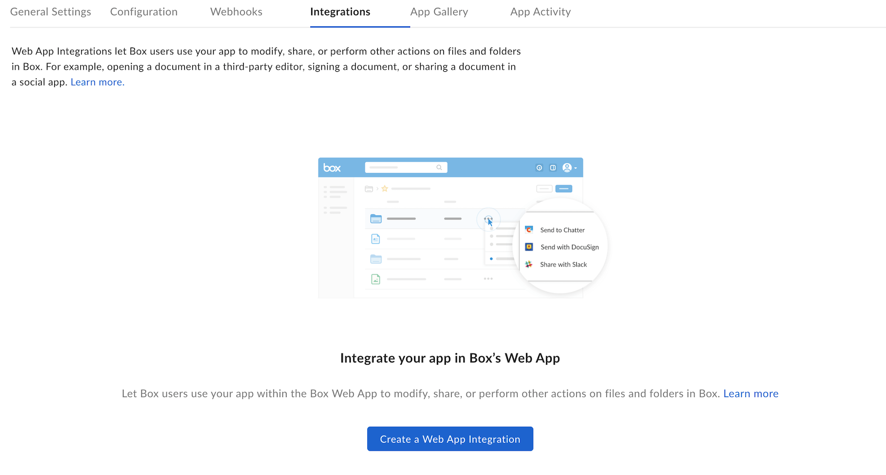

# Create Web App Integration

This guide explains how to set up a Web App Integration with a Platform App.

<message type='warning'>
Server-side integration is no longer supported.
This means the applications using server-side actions will still be working,
but you won't be able to modify the server-side configuration options such as
Preliminary Callback URL or Basic Authentication.
You will be able to deactivate them and change the implementation to a new one.
</message>

## Create an OAuth 2.0 Application

Navigate to the [Developer Console][devconsole] and create a [Platform App][ca]
that leverages [OAuth 2.0 authentication][custom-oauth2].

## Create a New Integration

Then, navigate to the **Integrations** tab and click
**Create a Web App Integration**.

<ImageFrame center shadow border>
  
</ImageFrame>

## Configure Integration

To configure the integration, follow the guidance below for each value.

### App Info

| Field | Description |
|--------------------------- |----------------------------------------------------------------------------------------------------------------------------------------------------------------------------------------------------------------------------------|
| Integration name | The name of your integration, which users see in the Box Web App when they select the **More Options** > **Integrations** menu on a file or folder. |
| Description | The description of the integration displayed in the Box Integrations. |
| Supported file extensions | The integration will only appear as an option in the **More Options** > **Integrations** menu for the selected file extensions. |
| Permissions requirement | Determines what permissions level users need to see the integration. **Download permissions are required** allows users to download the file - they will not be able to update it. **Full permissions are required** allows users to download and update the file. |
| Integration scopes | Specifies the scope of your integration - either the file/folder from which integration is invoked, or its parent folder. |
| Display on shared pages toggle| Determines if an integration can be shown to external users on a shared page. If enabled, users who are not collaborating on the content will see the integration in the context-menu when accessing the items through a shared link. |
| Lock to only allow the current user to overwrite the file using your integration toggle | Determines if different web app integrations can edit the file at the same time. |
| Integration type | Select desired integration type. Available options are: **Files**, **Folders**, **Both**. |

### Callback Configuration

| Field | Description |
|--------------------------|-------------------------------------------------------------------------------------------------------------------------------------------------------------------------------------------------------------------------------------------------------------------------------------------------------------------------------------------------------------------------|
| Client Callback URL | Handles additional callback requests from Box after the primary request with [Popup Integrations][pu]. If the application specifies a file parameter in the REST method, the preliminary callback URL cannot originate from the client. As a result, a second request must be made from the client to your server so the server can send the necessary interface to the user. |
| User Experience | Informs that the integration will open in a new window.|
| New Window Settings | Determines if the application opens in a new tab. |

### Callback Parameters

The **Callback Parameters** section configures the parameters that Box sends to
the callback URL when a user accepts a confirmation prompt. If this setting is
not configured, Box does not send any parameters to the callback URL.
To add a parameter, select the **Method** (GET or POST),
specify the **Parameter name** and add a **Parameter value**.

<message type='warning'>
The **File** method is no longer supported. If you already used this method,
you cannot edit its values. You can change the **File** method to **Get**
or **Post**, but you can't undo this action.
</message>

For example: **GET - `userid` - `#user_id#`**.

The following parameter values are available.

| Parameter | Method | Description |
|-----------|--------|-------------|
| `user_id` | GET, POST | The Box [user ID][uid]. This information is used in Popup Integrations in which user authentication is required to complete an action. You can store the Box ID in your application to enable subsequent authentication requests from the integration.|
| `user_name` | POST | The full name or email address of the Box user. Not all Box users specify their names at all times. |
| `file_id` | GET, POST | The Box [file ID][fid]. You can use this ID to make Box API calls that affect the file. |
| `file_name` | POST | The name of the file.  |
| `file_extension` | GET, POST | The extension of the file. |
| `auth_code` | GET, POST | The OAuth 2.0 [authorization code][code], which is generated by Box upon successful authentication. Your application must then supply this authorization code to Box in exchange for an OAuth 2.0 Access Token. An authorization header containing a valid Access Token must be included in every Box API request.
| `redirect_to_box_url` | GET, POST | In Popup Integrations, the URL to which requests are sent by the confirmation prompt. Use this URL to redirect users to the All Files page. This parameter closes the popup panel and refreshes the All Files page to reflect any changes performed by the integration. If you do not want to add this parameter to your application, you can specify the entire URL.
**Success**: `#redirect_to_box_url#&status=success&message=Your%20action%20was%20successful%2E`.  
**Failure**: `#redirect_to_box_url#&status=failure&message=Your%20action%20was%20unsuccessful%2E`.|

### Integration Status

- **Development**: The integration is visible and available only to application collaborators listed under the **General Settings** tab. This option is best used when the application is still in development and undergoing testing.
- **Online**: The integration is visible and available to all Box users. This option is best used when development is complete and the application is ready to publish in the Integrations.
- **Maintenance**: The integration is visible and available only to application collaborators listed under the **General Settings** tab. This option is best used after the integration is published in the Integrations, but needs to perform maintenance updates or troubleshoot issues. Use this option to temporarily take the integration offline for everyone except the application's collaborators.

## Example Use Cases of Box Integrations

When a user chooses a Popup Integration, Box sends a callback request to the
primary callback URL. It sends the callback parameters have been configured to
the server. In some cases, Box may make a second request if the
client cannot get all the data it needs from the first request.

The following example does not require a client callback URL:

- The Popup Integration performs a REST call using a `download_file_url` callback parameter.
- The user clicks **OK** in the confirmation prompt to accept the popup.
- Box sends a request to the following URL (the primary callback URL plus the callback parameter): `http://www.doceditor.com/service?apikey=abc&file=&redirect=`.
- The response from the callback URL displays a user interface to the user who made the request. The popup has all the information needed to continue the action and an additional client callback is not needed.

The following example requires a client callback URL:

- The Popup Integration performs a REST call using a file-callback parameter.
- The user clicks **OK** in the confirmation prompt to accept the popup.
- The popup displays a page where Box sends a POST request with the contents of a file, along with the callback parameters to the remote server.
- Box receives the response from the remote server and directs the client to POST the response to the client callback URL. The server identified by the URL interprets the response and redirects the user with the correct session ID.

## Client-callback URL Request Format

The POST request that Box sends to the client callback URL takes the response
from the primary callback URL and forwards it to the same URL along with the
same data as the original callback.

| Client Callback URL | Example |
|------------------------------------------------------------------|----------------------------------------------------------|
| Two GET parameters and one POST parameter: `http://your-client-callback-url.com/?get_param1=value1&get_param2=value2` | `POST data: post_param1=value1initial_callback_response` |

The response to the client-callback request is an HTTP status 302, redirecting
the user to the correct URL or to the HTML for a UI.

Most often the URL points to a separate API or custom script developed for Web
App Integrations, which parses the result of the primary callback URL. Also,
note that the URL must be publicly accessible on the internet.

## Making Integration Publicly Available

To make a Box integration publicly available it needs to be listed in the App
Center. Follow the [Integrations][integrations] guide for more details.

[ca]: g://applications/app-types/platform-apps
[pu]: g://applications/web-app-integrations/types
[uid]: page://platform/appendix/locating-values/#user-ids
[fid]: page://platform/appendix/locating-values/#content-ids
[code]: g://authentication/oauth2/without-sdk/#3-user-grants-application-access
[custom-oauth2]: g://authentication/oauth2/oauth2-setup
[devconsole]: https://app.box.com/developers/console
[devaccount]: https://account.box.com/signup/n/developer
[integrations]: g://applications/integrations
