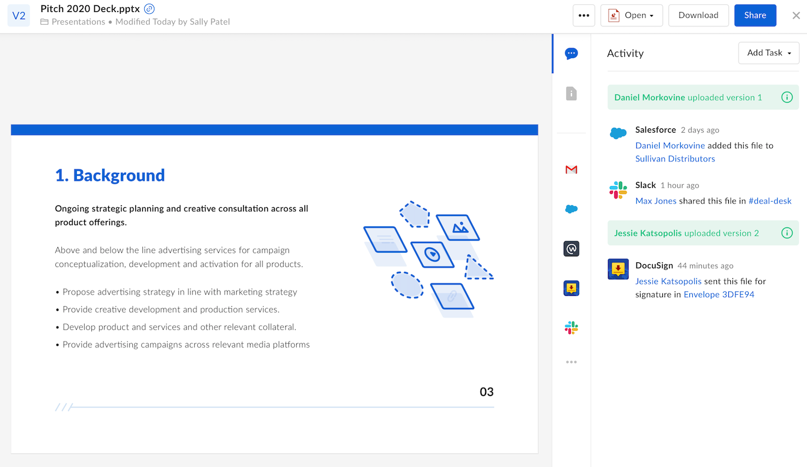

# Web App Integration

Box Platform enables an application to provide features to Box users directly
within the Box web application. Web App Integrations allow applications to
become part of the Box user experience by allowing users to share and edit files
with third-party applications.

## Features

Using a Web App Integration, a user can modify, share, or edit content stored in
Box using a third-party application. It can also offer new features to Box users
through [Recommended Apps][recommended-apps], which show up in Box Preview.

<ImageFrame border shadow width='600' center>
  
</ImageFrame>

By enabling a Web App Integration, an application can be added to Recommended
Apps, allowing users to use their files in the application. Integrations can be
restricted to certain content types and file extensions.

<CTA to="g://applications/web-app-integrations/configure">
  Learn how to create a Web App Integration
</CTA>

[app-gallery]: g://applications/app-gallery
[custom-app]: g://authentication/oauth2/oauth2-setup
[oauth2]: g://authentication/oauth2
[devconsole]: https://app.box.com/developers/console
[recommended-apps]: https://community.box.com/t5/Organizing-and-Tracking-Content/Installing-Recommended-Apps-in-your-Enterprise/ta-p/80134
