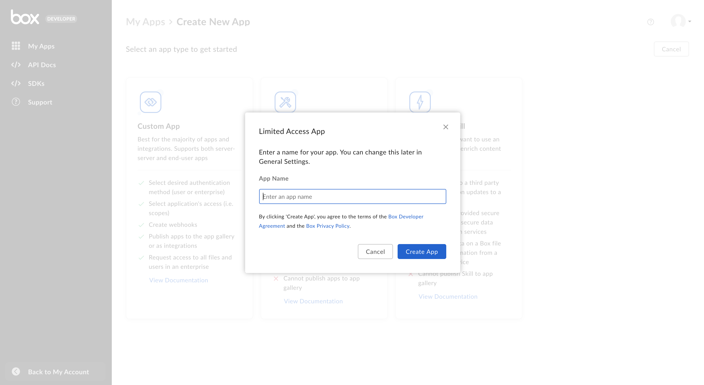
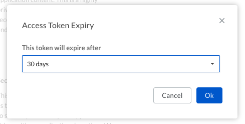

# Setup with App Token Auth

A Limited Access App can be set up to use server-side [App Tokens][app-token]
for authentication.

<CTA to='g://authentication/app-token'>
  Learn how App Token authentication works
</CTA>

## Prerequisites

To set up a Custom App using server-side authentication, you will need to ensure
you have access the [Developer Console][devconsole] from your Box enterprise 
account. Alternatively, you may sign up for a [developer account][devaccount].

## App creation steps

### 1. Log in to the Developer Console

Log into Box and navigate to the [Developer Console][devconsole]. 
Select **Create New App**.

### 2. Create a Custom App

Select **Limited Access App** from the list of application types. 
A modal will appear to prompt the next step.

<ImageFrame border>
  
</ImageFrame>

### 3. Select an app name

Finally, select a unique name for your application and click **Create App**.

<ImageFrame border width="600" center>
  
</ImageFrame>

## App Authorization

Once a keypair is successfully added to your application your Box enterprise
Admin needs to authorize the application within the Box Admin Console.

Navigate to the **General Settings** tab for your application within the
[Developer Console][devconsole] and scroll down to the **App Authorization**
section.

<ImageFrame border width="400" center>
  
</ImageFrame>

Click **Submit and Review** to send an email to your Box enterprise Admin for
approval. More information on this process is available in our 
[authorization guide][auth].

## Basic configuration

Before the application can be used, some basic additional configuration might be
required.

### Primary and Secondary App Tokens

Authentication with Limited Access Apps is done through preconfigured [App
Tokens][app-token]. To configure an app token, navigate to the **Configuration**
tab for your application within the [Developer Console][devconsole]. 

Scroll down to the **Primary Access Token** section and click the
**Generate Key** button.

<ImageFrame border width="600" center>
  
</ImageFrame>

App tokens can be configured to automatically expire or be valid indefinitely.
After creation, the key can be used to make [API calls][api-calls].

<Message warning>
  # App authorization

  App Tokens can not be generated until the application is successfully 
  authorized within the Box Admin Console.
</Message>

### CORS Domains

If your application makes API calls from front-end browser code in
Javascript, the domain that these calls are made from will need to be
added to an allow-list due to [Cross Origin Resource Sharing][cors],
also known as CORS. If all requests will be made from server-side code,
you may skip this section.

To add the full URI(s) to the allow-list, navigate to the **CORS Domain** 
section at the bottom of the **Configuration** tab in the
[Developer Console][devconsole].

<ImageFrame border>
  
</ImageFrame>

[devconsole]: https://app.box.com/developers/console
[devaccount]: https://account.box.com/signup/n/developer
[devtoken]: g://authentication/tokens/developer-tokens
[scopes]: g://api-calls/permissions-and-errors/scopes
[cors]: https://en.wikipedia.org/wiki/Cross-origin_resource_sharing
[app-token]: g://authentication/app-token
[api-calls]: g://api-calls
[auth]: g://authorization
