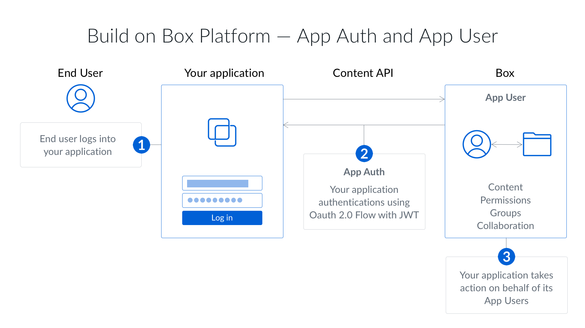

# JWT Auth

Server-side authentication using JWT one of the most powerful ways to
authenticate to the Box API. JWT is an [open standard](https://jwt.io/)
designed to allow powerful server-to-server authentication.

<ImageFrame border>
  
</ImageFrame>

Server-side authentication using JSON Web Tokens (JWT) is only available to
Custom Apps and Enterprise Integrations. It does not involve a user into the
authorization flow and as such can be used to act on behalf of any user in an
enterprise. JWT uses a public/private key pair verify the application's
permissions.

## JWT Restrictions

Server-side authentication using JWT works by creating a claim on the
application's server and then signing this using the application's secret key.
In most cases, the claim is that the server is allowed to act on
behalf of the Box application.

For this reason every application that uses JWT has an associated [Service
Account](g://authentication/user-types) that is the default user that it
authenticates as. This user is an admin-like user and for this
reason JWT applications require an actual Box admin's approval before they can
be used.

## When to use JWT

Server-side authentication with JWT is the ideal authentication method for apps
that:

- Work with users that don't have a Box account
- Want to use their own identity system
- Don't want users to have to know that they are using Box
- Want to store data within the application's Box account and not within the the
  user's Box account
