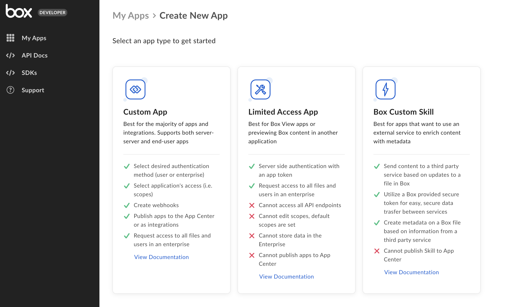
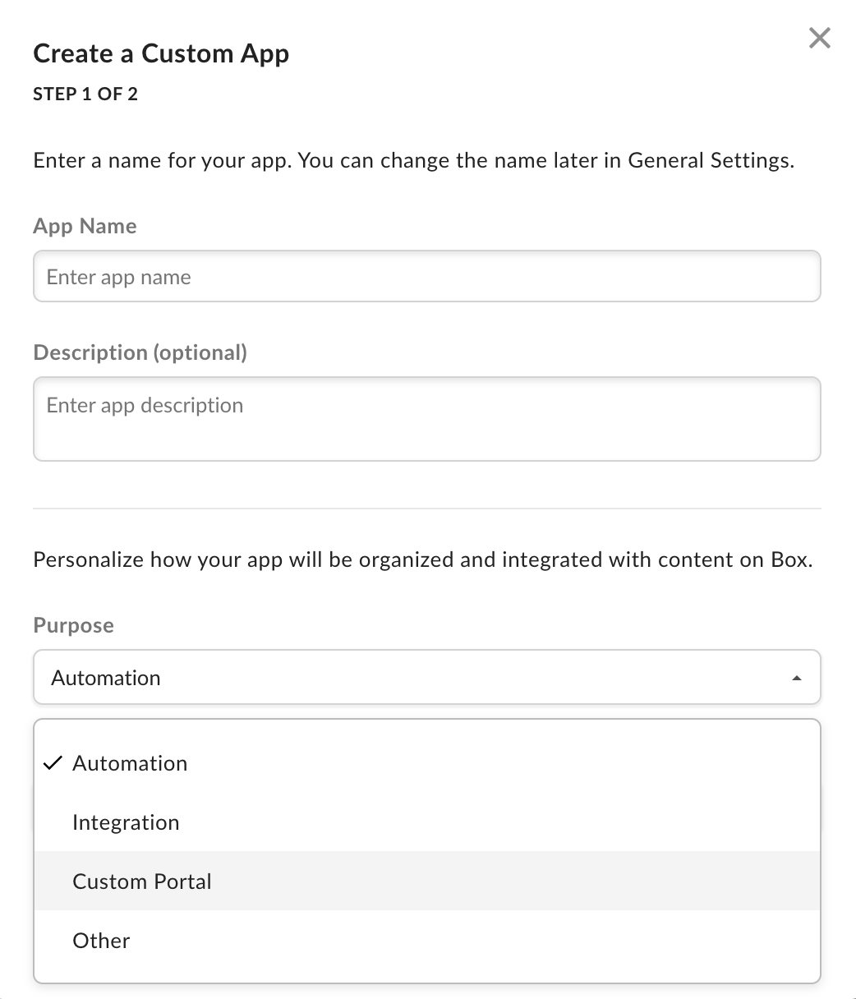
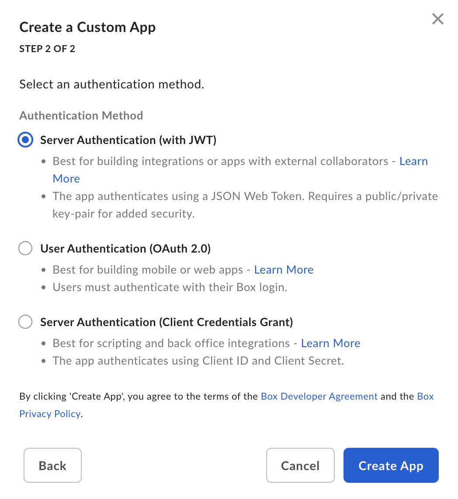
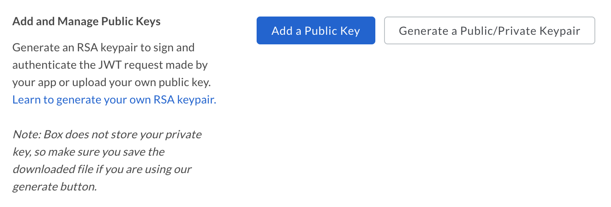
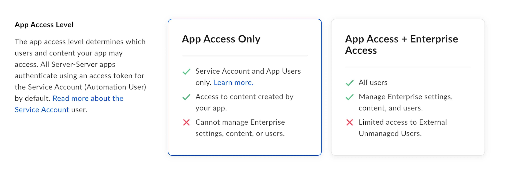
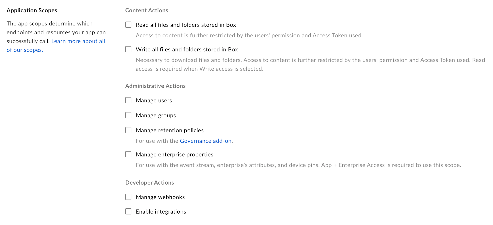
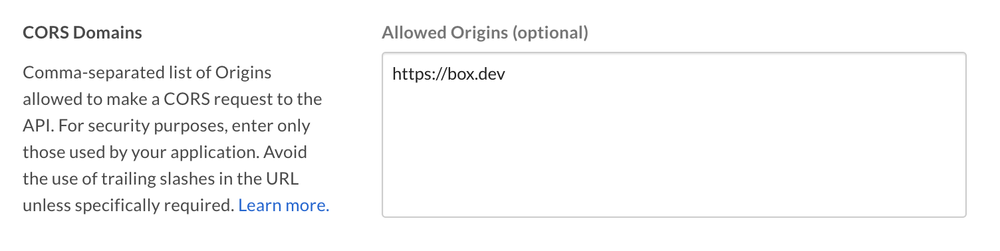

# Setup with JWT

A Custom App can be set up to use server-side authentication with
[JWT][jwt].

<CTA to='g://authentication/jwt'>
  Learn how JWT authentication works
</CTA>

## Prerequisites

To set up a Custom App using server-side authentication, you will need to ensure
you have access the [Developer Console][devconsole] from your Box enterprise 
account. Alternatively, you may sign up for a [developer account][devaccount].

## App creation steps

### Navigate to the Developer Console

Log into Box and go to the [Developer Console][devconsole]. 
Select **Create New App**.

### Select application type

Select **Custom App** from the list of application types. A modal will appear to
prompt a selection for the next step.

<ImageFrame border>
  
</ImageFrame>

### Provide basic application information

<!-- markdownlint-disable line-length -->

To describe your app, provide an app name and description.
Use the drop-down list to select the app's purpose. Depending on the option chosen, you might need to specify further details.

| Purpose | Details|
|------| --------| 
|Automation, Custom Portal| Specify if the app is built by a customer or partner. |
|Integration|  Specify the integration category, external system name if the app is built by a customer or partner. |
|Other| Specify the app purpose and if it is built by a customer or partner. |

<!-- markdownlint-enable line-length -->

<ImageFrame border center width="300">>
  
</ImageFrame>

### Select application authentication

Select **Server Authentication (with JWT)** if you would like to verify 
application identity [with a key pair][kp] and confirm with **Create App**.

<Message warning>
Once you make a selection, you will not be able to change to a different 
authentication method without creating a new application.
</Message>

<ImageFrame border width="300" center>
  
</ImageFrame>

## Public and private key pair

<Message>
  This section can be skipped if you selected Server Authentication
  (Client Credentials Grant) as your authentication method.
</Message>

Once a Custom App is created leveraging Server Authentication with JWT, a key 
pair can be generated via the configuration tab within the
[Developer Console][devconsole]. Alternatively, you can generate your
own and supply Box with the public key. Regardless of the method you select,
your Box account will need to have [2FA][2fa] enabled for security purposes.

### Generate a keypair (Recommended)

If you would like to use a Box generated keypair, navigate to the
[Developer Console][devconsole] where you can generate a configuration file.
This file includes a public/private keypair and a number of other application
details that are necessary for authentication.

To generate this file, navigate to the **Configuration** tab of the
[Developer Console][devconsole] and scroll down to the
**Add and Manage Public Keys** section.

<ImageFrame border width="600" center>
  
</ImageFrame>

Click the **Generate a Public/Private Keypair** button to have Box generate a
keypair you. This will trigger the download of a JSON configuration file that 
you can move to your application code.

<Message danger>
  For security reasons, Box will not store your private key. If you lose your 
  private key, you will need to reset the entire keypair.
</Message>

### Manually add keypair

Alternatively, you may generate your own keypair and upload the public key to
the [Developer Console][devconsole].

To create a keypair using OpenSSL, open a terminal window and run the
following commands.

```shell
openssl genrsa -des3 -out private.pem 2048
openssl rsa -in private.pem -outform PEM -pubout -out public.pem
```

<Message>
 # For Windows Systems

 Windows users can install and use the [Cygwin][cygwin] package to run OpenSSL.
</Message>

Then, navigate to the configuration tab for your application within the
[Developer console][devconsole] and scroll down to the
**Add and Manage Public Keys** section.

<ImageFrame border width="600" center>
  
</ImageFrame>

Click the **Add a Public Key** button, enter the public key generated using the
steps above and click **Verify and Save**.

## App Authorization

Before the application can be used, a Box Admin needs to authorize the
application within the Box Admin Console.

Navigate to the **Authorization** tab for your application within the
[Developer Console][devconsole].

<ImageFrame border center>
  
</ImageFrame>

Click **Review and Submit** to send an email to your Box enterprise Admin for
approval. More information on this process is available in our 
[support article for app authorization][app-auth].

<CTA to='g://authorization/custom-app-approval'>
  Learn how to authorize a Custom Application
</CTA>

## Basic configuration

### Application Access

An application's access level determines which users and content your app may
access. By default, an application can only successfully interact with the
content of its [Service Account][sa] and any [App Users][user-types]. 
To access existing Managed Users of an
enterprise and groups that were not created by
the app itself, navigate to the **Application Access**
settings accessible in the **Configuration** tab of the
[Developer console][devconsole] and set
to **App + Enterprise Access**. Otherwise access to such
Managed Users and groups will be blocked.

<ImageFrame border>
  
</ImageFrame>

### Application Scopes

An application's scopes determine which endpoints and resources an application
can successfully call. See the [scopes guide][scopes] for detailed information
on each option.

<ImageFrame border width="600" center>
  
</ImageFrame>

### CORS Domains

If your application makes API calls from front-end browser code in
Javascript, the domain that these calls are made from will need to be
added to an allow-list due to [Cross Origin Resource Sharing][cors],
also known as CORS. If all requests will be made from server-side code,
you may skip this section.

To add the full URI(s) to the allow-list, navigate to the **CORS Domain** 
section at the bottom of the **Configuration** tab in the
[Developer console][devconsole].

<ImageFrame border>
  
</ImageFrame>

<!-- i18n-enable localize-links -->
[devconsole]: https://app.box.com/developers/console
[devaccount]: https://account.box.com/signup/n/developer
<!-- i18n-disable localize-links -->
[devtoken]: g://authentication/tokens/developer-tokens
[scopes]: g://api-calls/permissions-and-errors/scopes
<!-- i18n-enable localize-links -->
[cors]: https://en.wikipedia.org/wiki/Cross-origin_resource_sharing
<!-- i18n-disable localize-links -->
[user-types]: page://platform/user-types
[sa]: page://platform/user-types/#service-account
<!-- i18n-enable localize-links -->
[cygwin]: http://www.cygwin.com/
[app-auth]: https://community.box.com/t5/Managing-Developer-Sandboxes/Authorizing-Apps-in-the-Box-App-Approval-Process/ta-p/77293
<!-- i18n-disable localize-links -->
[jwt]: g://authentication/jwt
<!-- i18n-enable localize-links -->
[2fa]: https://support.box.com/hc/en-us/articles/360043697154-Two-Factor-Authentication-Set-Up-for-Your-Account
<!-- i18n-disable localize-links -->
[kp]: g://authentication/jwt/without-sdk/#public-and-private-key-pair
[ccg]: g://authentication/jwt/without-sdk/#client-credentials-grant
