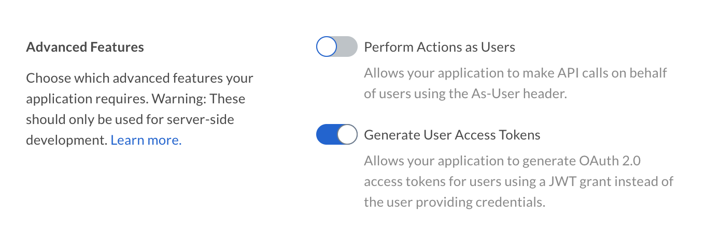

# User Access Token

It is possible for a JWT application to create an Access Token for a specific
user instead of for the [Service Account][sa].

## Preconditions

The application must be configured to allow the creation of user Access Tokens.
This setting can be found in the **Configuration** tab of the
[Developer Console][devconsole].

<ImageFrame border center>
  
</ImageFrame>

Additionally, the authenticated user needs to be a user with Admin permissions,
meaning either an Admin, Co-Admin, or Service Account. See our guide on
[User Types](page://platform/user-types) for more details.

## User Access Tokens with SDKs

To create a Box SDK client that authenticates as a specific user, follow the
steps described in the [JWT with SDK guide](g://authentication/jwt/with-sdk),
but create a user client instead of an "Enterprise" client.

<Tabs>
  <Tab title='.Net'>

```csharp
var userId = "12345";
var sdk = new BoxJWTAuth(config);
var token = sdk.UserToken(appUserID);
BoxClient client = sdk.UserClient(userToken, userId);
```

  </Tab>

  <Tab title='Java'>

```java
String userId = "12345";
BoxDeveloperEditionAPIConnection api = new BoxDeveloperEditionAPIConnection.getAppUserConnection(userId, config)
```

  </Tab>

  <Tab title='Python'>

```python
user = client.user(user_id='12345')

auth = JWTAuth(
    client_id='[CLIENT_ID]',
    client_secret='[CLIENT_SECRET]',
    user=app_user,
    jwt_key_id='[JWT_KEY_ID]',
    rsa_private_key_file_sys_path='[CERT.PEM]',
    rsa_private_key_passphrase='[PASSPHRASE]'
)
auth.authenticate_user()
user_client = Client(auth)
```

  </Tab>

  <Tab title='Node'>

```js
var sdk = BoxSDK.getPreconfiguredInstance(config);
var client = sdk.getAppAuthClient('user', '12345');
```

  </Tab>
</Tabs>

<CTA to='g://authentication/jwt/with-sdk'>
  Learn more about using the Box SDKs with JWT
</CTA>

## User Access Tokens without SDKs

To create a user Access Token that authenticates as a specific user, follow the
steps as described in the
[JWT without SDK guide](g://authentication/jwt/without-sdk) but instead of creating
a claim for the enterprise, create one for a specific user ID.

<Tabs>
  <Tab title='.Net'>

```csharp
var userId = "12345";

var claims = new List<Claim>{
    new Claim("sub", userid),
    new Claim("box_sub_type", "user"),
    new Claim("jti", jti),
};
```

  </Tab>

  <Tab title='Java'>

```java
String userId = "12345";

JwtClaims claims = new JwtClaims();
claims.setIssuer(config.boxAppSettings.clientID);
claims.setAudience(authenticationUrl);
claims.setSubject(userId);
claims.setClaim("box_sub_type", "user");
claims.setGeneratedJwtId(64);
claims.setExpirationTimeMinutesInTheFuture(0.75f);
```

  </Tab>

  <Tab title='Python'>

```python
user_id = '12345'

claims = {
    'iss': config['boxAppSettings']['clientID'],
    'sub': user_id,
    'box_sub_type': 'user',
    'aud': authentication_url,
    'jti': secrets.token_hex(64),
    'exp': round(time.time()) + 45
}
```

  </Tab>
  <Tab title='Node'>

```js
let user_id = '12345';

let claims = {
    iss: config.boxAppSettings.clientID,
    sub: user_id,
    box_sub_type: "user",
    aud: authenticationUrl,
    jti: crypto.randomBytes(64).toString("hex"),
    exp: Math.floor(Date.now() / 1000) + 45
};
```

  </Tab>
  <Tab title='Ruby'>

```ruby
user_id = '12345'

claims = {
  iss: config['boxAppSettings']['clientID'],
  sub: user_id,
  box_sub_type: 'user',
  aud: authentication_url,
  jti: SecureRandom.hex(64),
  exp: Time.now.to_i + 45
}
```

  </Tab>
  <Tab title='PHP'>

```php
$userId = '12345';

$claims = [
  'iss' => $config->boxAppSettings->clientID,
  'sub' => $userId,
  'box_sub_type' => 'user',
  'aud' => $authenticationUrl,
  'jti' => base64_encode(random_bytes(64)),
  'exp' => time() + 45,
  'kid' => $config->boxAppSettings->appAuth->publicKeyID
];
```

  </Tab>
</Tabs>

<CTA to='g://authentication/jwt/with-sdk'>
  Learn more about manually using JWT authentication
</CTA>

[devconsole]: https://app.box.com/developers/console
[sa]: page://platform/user-types/#service-account