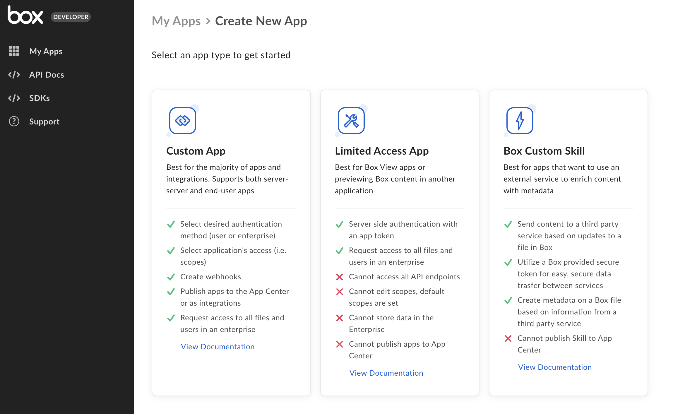
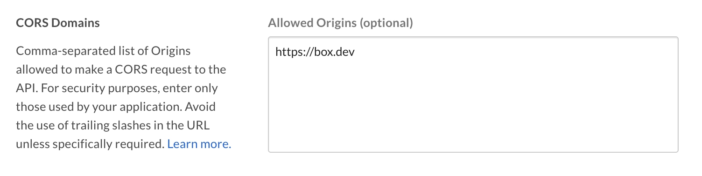

# Setup with OAuth 2.0

A Custom App can be set up to use client-side [OAuth 2.0][oauth2] authentication.

<CTA to='g://authentication/oauth2'>
  Learn how OAuth 2.0 authentication works
</CTA>

## Prerequisites

To set up a Custom App using OAuth 2.0 authentication, you will need to ensure
you have access the [Developer Console][devconsole] from your Box enterprise 
account. Alternatively, you may sign up for a [developer account][devaccount].

## App creation steps

### Navigate to the Developer Console

Log into Box and go to the 
[Developer Console][devconsole]. Select **Create New App**.

### Select application type

Select **Custom App** from the list of application types. A modal will appear to
prompt a selection for the next step.

<ImageFrame border>
  
</ImageFrame>

### Provide basic application information

<!-- markdownlint-disable line-length -->

To describe your app, provide an app name and description.
Use the drop-down list to select the app's purpose. Depending on the option chosen, you might need to specify further details.

| Purpose | Details|
|------| --------| 
|Automation, Custom Portal| Specify if the app is built by a customer or partner. |
|Integration|  Specify the integration category, external system name if the app is built by a customer or partner. |
|Other| Specify the app purpose and if it is built by a customer or partner. |

<!-- markdownlint-enable line-length -->

[Auth selection screen](../images/custom-app-selection.png)

### Select application authentication

Select **User Authentication (OAuth 2.0)** and confirm with **Create App**.

<Message warning>
Once you make a selection, you will not be able to change to a different 
authentication method without creating a new application.
</Message>

## Basic configuration

Before the application can be used, some additional configuration is
required.

### Redirect URI

During the OAuth 2.0 flow, users are redirected to their browser to
authenticate and then authorize the application to take actions on their behalf.

Prior to redirecting the user, Box verifies that the `redirect_uri` parameter
passed into the [authorization URL][url-redirect] matches one of the redirect
URIs configured for the application. This will be an exact match check, meaning
the URIs must be exactly the same. Localhost and loopback address redirect URIs
will be permitted redirect to any port, but the scheme, domain, path and query
parameters must match one of the configured URIs.

You can configure these under the OAuth 2.0 Redirect URI section on the
Configuration page in the developer console. These must be valid URIs that are
HTTPS, or a less secure HTTP for localhost or loopback address. We do not
permit duplicate URIs to be saved.

<Message warning>
  Starting November 29, 2021, new applications using OAuth 2.0 will
  require the URIs set in the configuration tab of the Developer Console to
  strictly match the one used during redirect. In addition, both new and
  existing applications, will gain the ability to add multiple redirect URIs.

  If you configured multiple redirect URIs for the application, 
  the authorization URL must include the `redirect_uri` parameter matching one
  of the URIs configured in the developer console. 
  If the parameter is not specified, the user will see a `redirect_uri_missing`
  error and will not be redirected back to the app after granting application
  access.

  For existing applications, the deadline to make changes to this URL to avoid
  service disruption is May 13, 2022.
</Message>

<ImageFrame border width="600" center>
  
</ImageFrame>

### Application Scopes

Scopes define what permissions your application has in order to access data. See
the [scopes guide][scopes] for detailed information on each option.

  

### CORS Domains

If your application makes API calls from front-end browser code in
Javascript, the domain that these calls are made from will need to be
added to an allow-list due to [Cross Origin Resource Sharing][cors],
also known as CORS. If all requests will be made from server-side code,
you may skip this section.

To add the full URI(s) to the allow-list, navigate to the **CORS Domain** 
section at the bottom of the **Configuration** tab in the
[Developer Console][devconsole].

[devconsole]: https://app.box.com/developers/console
[devaccount]: https://account.box.com/signup/n/developer
[devtoken]: g://authentication/tokens/developer-tokens
[scopes]: g://api-calls/permissions-and-errors/scopes
[cors]: https://en.wikipedia.org/wiki/Cross-origin_resource_sharing
[oauth2]: g://authentication/oauth2
[url-redirect]: e://get-authorize/#param-redirect_uri