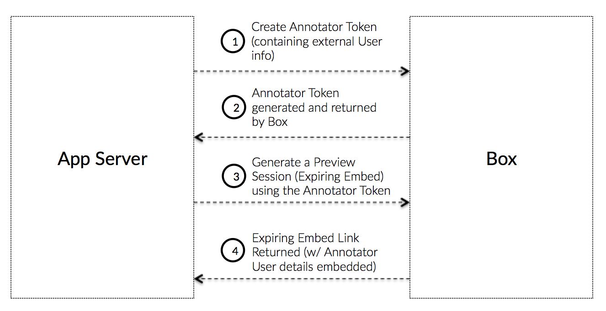

# Annotator Tokens

Annotations is one of the key features supported by new Box View, that allows
developers to provide collaboration capabilities right from within the embedded
Box preview in their application.

Box View supports three annotation types: highlight only, highlight
annotation, and point annotation. Annotations are only supported on document
and image previews.

<ImageFrame border>
  
</ImageFrame>

## What is an Annotator Token

An Annotator Token is an Access Token that allows an application to create a
Preview Embed Link for a file that a user can make annotations on. As an
application might not create a new App User for every one of the application's
users, the Annotator token allows the application to track which of their
own users made the annotations.

The Annotator Token is used instead of a regular Access Token, App Token, or File
Token to generate a preview session (an expiring embed link) that is linked to a
unique user ID and display name.

<Message warning>
  Since a preview session generated using an annotator token is tied to a
  specific external user, it is strongly recommended that an application
  generates different preview sessions using different annotator tokens for
  different end users of an application.
</Message>

## External user info

The external display name associated with an annotation is essentially a
stateless "label" appended to the annotation. This means that once an annotation
has been added, the display name is permanently associated with the annotation
and cannot be updated unless the annotation is deleted and added again with the
updated display name.

## Create without SDKs

To create an annotator token, follow the instructions for [manually
authenticating through JWT](g://authentication/jwt/without-sdk) but replace the
JWT claim with the following data.

<Tabs>
  <Tab title='.Net'>

```csharp
var claims = new List<Claim>{
    new Claim("sub", '[EXTERNAL_USER_ID]'),
    new Claim("name", '[EXTERNAL_USER_DISPLAY_NAME]'),
    new Claim("box_sub_type", "external"),
    new Claim("jti", jti),
};
```

  </Tab>

  <Tab title='Java'>

```java
JwtClaims claims = new JwtClaims();
claims.setIssuer(config.boxAppSettings.clientID);
claims.setAudience(authenticationUrl);
claims.setSubject("[EXTERNAL_USER_ID]");
claims.setName("[EXTERNAL_USER_DISPLAY_NAME]");
claims.setClaim("box_sub_type", "external");
claims.setGeneratedJwtId(64);
claims.setExpirationTimeMinutesInTheFuture(0.75f);
```

  </Tab>

  <Tab title='Python'>

```python
claims = {
    'iss': config['boxAppSettings']['clientID'],
    'sub': '[EXTERNAL_USER_ID]',
    'name': '[EXTERNAL_USER_DISPLAY_NAME]',
    'box_sub_type': 'external',
    'aud': authentication_url,
    'jti': secrets.token_hex(64),
    'exp': round(time.time()) + 45
}
```

  </Tab>
  <Tab title='Node'>

```js
let claims = {
    iss: config.boxAppSettings.clientID,
    sub: "[EXTERNAL_USER_ID]",
    name: "[EXTERNAL_USER_DISPLAY_NAME]",
    box_sub_type: "external",
    aud: authenticationUrl,
    jti: crypto.randomBytes(64).toString("hex"),
    exp: Math.floor(Date.now() / 1000) + 45
};
```

  </Tab>
  <Tab title='Ruby'>

```ruby
claims = {
  iss: config['boxAppSettings']['clientID'],
  sub: "[EXTERNAL_USER_ID]",
  name: "[EXTERNAL_USER_DISPLAY_NAME]",
  box_sub_type: 'external',
  aud: authentication_url,
  jti: SecureRandom.hex(64),
  exp: Time.now.to_i + 45
}
```

  </Tab>
  <Tab title='PHP'>

```php
$claims = [
  'iss' => $config->boxAppSettings->clientID,
  'sub' => '[EXTERNAL_USER_ID]',
  'name' => '[EXTERNAL_USER_DISPLAY_NAME]',
  'box_sub_type' => 'external',
  'aud' => $authenticationUrl,
  'jti' => base64_encode(random_bytes(64)),
  'exp' => time() + 45,
  'kid' => $config->boxAppSettings->appAuth->publicKeyID
];
```

  </Tab>
</Tabs>

<!-- markdownlint-disable line-length -->

| Parameter      | Type   | Description                                                                                             |
| -------------- | ------ | ------------------------------------------------------------------------------------------------------- |
| `sub`          | String | The external user ID to tie this annotation to. This can be any arbitrary ID tracked by the application |
| `box_sub_type` | String | `external` to signify an external user ID                                                               |
| `box_sub_type` | String | The external user name to tie this annotation to. This will be displayed in the Box UI                  |

<!-- markdownlint-enable line-length -->

Then, convert this claim to an assertion according to the guide and pass this
assertion to the [`POST /oauth2/token`](e://post-oauth2-token)
endpoint together with an existing valid Access Token, App Token, or File Token,
as well as a set of scopes, and the resource for which to create the token.

<Tabs>
  <Tab title='.Net'>

```csharp
var content = new FormUrlEncodedContent(new[]
{
    new KeyValuePair<string, string>(
        "grant_type", "urn:ietf:params:oauth:grant-type:token-exchange"),
    new KeyValuePair<string, string>(
        "resource", "https://api.box.com/2.0/files/123456"),
    new KeyValuePair<string, string>(
        "subject_token", "[ACCESS_TOKEN]"),
    new KeyValuePair<string, string>(
        "subject_token_type", "urn:ietf:params:oauth:token-type:access_token"),
    new KeyValuePair<string, string>(
        "scope", "item_preview"),
    new KeyValuePair<string, string>(
        "actor_token", "[JWT_ASSERTION_FOR_ANNOTATOR_TOKEN]"),
    new KeyValuePair<string, string>(
        "actor_token_type", "urn:ietf:params:oauth:token-type:id_token"),
});
```

  </Tab>

  <Tab title='Java'>

```java
List<NameValuePair> params = new ArrayList<NameValuePair>();

params.add(new BasicNameValuePair(
    "grant_type", "urn:ietf:params:oauth:grant-type:token-exchange"));
params.add(new BasicNameValuePair(
    "resource", "https://api.box.com/2.0/files/123456"));
params.add(new BasicNameValuePair(
    "subject_token", "[ACCESS_TOKEN]"));
params.add(new BasicNameValuePair(
    "subject_token_type", "urn:ietf:params:oauth:token-type:access_token"));
params.add(new BasicNameValuePair(
    "scope", "item_preview"));
params.add(new BasicNameValuePair(
    "actor_token", "[JWT_ASSERTION_FOR_ANNOTATOR_TOKEN]"));
params.add(new BasicNameValuePair(
    "actor_token_type", "urn:ietf:params:oauth:token-type:id_token"));
```

  </Tab>

  <Tab title='Python'>

```python
params = urlencode({
    'grant_type': 'urn:ietf:params:oauth:grant-type:token-exchange',
    'resource': 'https://api.box.com/2.0/files/123456',
    'subject_token': '[ACCESS_TOKEN]',
    'subject_token_type': 'urn:ietf:params:oauth:token-type:access_token',
    'scope': 'item_preview',
    'actor_token': '[JWT_ASSERTION_FOR_ANNOTATOR_TOKEN]',
    'actor_token_type': 'urn:ietf:params:oauth:token-type:id_token'
}).encode()
```

  </Tab>
  <Tab title='Node'>

```js
let accessToken = await axios
    .post(
        authenticationUrl,
        querystring.stringify({
            grant_type: "urn:ietf:params:oauth:grant-type:token-exchange",
            resource: "https://api.box.com/2.0/files/123456",
            subject_token: "[ACCESS_TOKEN]",
            subject_token_type: "urn:ietf:params:oauth:token-type:access_token",
            scope: "item_preview",
            actor_token: "[JWT_ASSERTION_FOR_ANNOTATOR_TOKEN]",
            actor_token_type: "urn:ietf:params:oauth:token-type:id_token"
        })
    )
    .then(response => response.data.access_token);
```

  </Tab>
  <Tab title='Ruby'>

```ruby
params = URI.encode_www_form({
  grant_type: 'urn:ietf:params:oauth:grant-type:token-exchange',
  resource: 'https://api.box.com/2.0/files/123456',
  subject_token: '[ACCESS_TOKEN]',
  subject_token_type: 'urn:ietf:params:oauth:token-type:access_token',
  scope: 'item_preview',
  actor_token: '[JWT_ASSERTION_FOR_ANNOTATOR_TOKEN]',
  actor_token_type: 'urn:ietf:params:oauth:token-type:id_token'
})
```

  </Tab>
  <Tab title='PHP'>

```php
$params = [
  'grant_type' => 'urn:ietf:params:oauth:grant-type:token-exchange',
  'resource' => 'https://api.box.com/2.0/files/123456',
  'subject_token' => '[ACCESS_TOKEN]',
  'subject_token_type' => 'urn:ietf:params:oauth:token-type:access_token',
  'scope' => 'item_preview',
  'actor_token' => '[JWT_ASSERTION_FOR_ANNOTATOR_TOKEN]',
  'actor_token_type' => 'urn:ietf:params:oauth:token-type:id_token'
];
```

  </Tab>
</Tabs>

<!-- markdownlint-disable line-length -->

| Parameter          | Description                                                              |
| ------------------ | ------------------------------------------------------------------------ |
| `resource`         | An optional full URL path to the file the token should be restricted to. |
| `actor_token`      | The JWT assertion created earlier                                        |
| `actor_token_type` | Always set to `urn:ietf:params:oauth:token-type:id_token`                |

<!-- markdownlint-enable line-length -->

## Create with SDKs

To create a JWT annotator token with an SDK an application can exchange any
active token for another token.

<Tabs>
  <Tab title='Node'>

```js
var options = {
    actor: {
        id: "[EXTERNAL_USER_ID]",
        name: "[EXTERNAL_USER_DISPLAY_NAME"
    }
};

client
    .exchangeToken(
        "item_preview",
        "https://api.box.com/2.0/files/123456",
        options
    )
    .then(tokenInfo => {
        //=> tokenInfo.accessToken
    });
```

  </Tab>
</Tabs>
