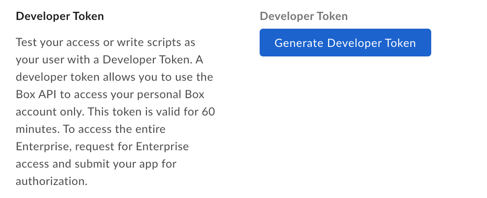

# Developer Tokens

A Developer Token is an Access Token available to developers during development
and testing. These tokens are short lived, as they expire after 60 minutes, and
cannot be refreshed programmatically.

## Create Developer Token

To create a Developer Token for an application:

- Navigate to the Box [Developer Console][devconsole] and select the application to create a Developer Token for.
- Select the **Configuration** tab.
- Under Developer Token, select **Generate Developer Token**.

<Message>
You can also generate a Developer Token directly from [My Platform Apps][apps]
view, using the menu available for each app.
</Message>

<ImageFrame border center shadow>
  
</ImageFrame>

## Using Developer Token

A Developer Token can be used like any Access Token in the `Authorization`
header of an API call.

```curl
curl https://api.box.com/2.0/users/me \
    -H "authorization: Bearer [DEVELOPER_TOKEN]"
```

<Message warning>
  A Developer Token is associated with the the user that is logged in to the
  Developer Console when the token is generated.
</Message>

Our SDKs can be initialized with a Developer Token to create a basic API client.

<Samples id='x_auth' variant='init_with_dev_token' />

<Message type='danger'>
  # Developer tokens should not be used in production environments

Developer Tokens should only be used for development or testing purposes.
</Message>

<Message warning>
  When you explicitly revoke a developer token for a given app via the
  Developer console, all webhooks created by that application get deleted.
</Message>

[devconsole]: https://app.box.com/developers/console

## Using SDKs and Developer Tokens

To learn more about Developer Tokens for each SDK head over to:

- [.Net][.Net]

- [Java][Java]

- [Python][Python]

- [Node][Node]

- [IOS][IOS]

[.Net]: https://github.com/box/box-windows-sdk-v2/blob/main/docs/authentication.md#developer-token
[Java]: https://github.com/box/box-java-sdk/blob/main/doc/authentication.md#developer-token
[Python]: https://github.com/box/box-python-sdk/blob/main/docs/usage/authentication.md#developer-token
[Node]: https://github.com/box/box-node-sdk/blob/main/docs/authentication.md#developer-token
[IOS]: https://github.com/box/box-ios-sdk/blob/main/docs/usage/authentication.md#developer-token
[apps]: g://applications