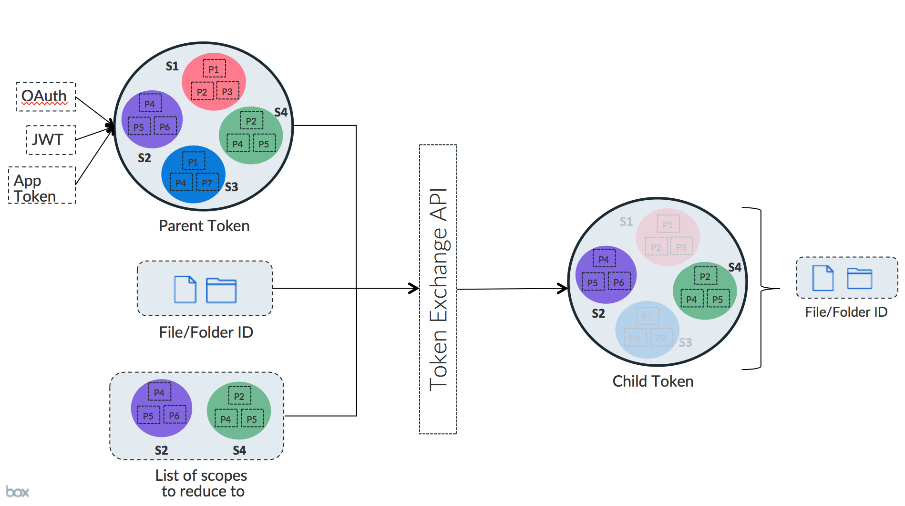

# Downscope a Token

Downscoping is a way to exchange an existing Access Token for a new one that is
more restricted.

## Reasons to downscope

An application might need to share the Access Token with an
environment that it does not fully control. A common example of this would be
when using Box UI Elements in a web browser.

When an application needs to pass an Access Token to the browser there is a
potential security risk that needs to be resolved. In order to limit this risk the
Access Token can be exchanged for a new token with much stricter permissions.

## High-level overview

A downscoped token is a token that has fewer permissions (scopes) than the
original token, as well as the optional additional restriction to only allow
access to a specific file.

<ImageFrame border>
  
</ImageFrame>

The new token takes the permissions of the original token and restricts them
to the tokens passed in, as well as the resource provided.

## Downscoping in practice

To downscope a token, pass the `POST /oauth2/token` endpoint an existing Access
Token, a list of scopes, as well as an optional file URL to restrict the token to.

<Samples id="post_oauth2_token" variant="downscope_token" />

| Parameter            | Description                                                                                                                                                                                                                                |
| -------------------- | ------------------------------------------------------------------------------------------------------------------------------------------------------------------------------------------------------------------------------------------ |
| `subject_token`      | The original token to downscope. This can be a token that was acquired through OAuth 2.0, JWT token exchange, or as an App Token.                                                                                                          |
| `scope`              | A space-delimited list of [scopes][scopes] to limit the new token to. Any valid scope for the application can be used, though a special set of [scopes for Box UI elements][scopes_down] is available                                      |
| `resource`           | An optional full URL path to the file the token should be restricted to.                                                                                                                                                                   |
| `box_shared_link`    | An optional [shared link](g://shared-links) URL for a file or folder on Box. Password protected links are not supported. This option cannot be used in addition to the `resource` option nor can it be a shared link created on a weblink. |
| `subject_token_type` | Always set to `urn:ietf:params:oauth:token-type:access_token`                                                                                                                                                                              |
| `grant_type`         | Always set to `urn:ietf:params:oauth:grant-type:token-exchange`                                                                                                                                                                            |

## Downscoped Access Token Object

A downscoped Access Token returned by the `POST /oauth2/token` endpoint contains
extra information on the specific restrictions.

```json
{
  "access_token": "1!DgsZ6V9kMWZu2StrxwQDF5BudQNen-xUmU2cfcVKArE....",
  "expires_in": 4175,
  "token_type": "bearer",
  "restricted_to": [
    {
      "scope": "item_preview",
      "object": {
        "type": "folder",
        "id": "1234567890",
        "sequence_id": "0",
        "etag": "0",
        "name": "Test"
      }
    }
  ],
  "issued_token_type": "urn:ietf:params:oauth:token-type:access_token"
}
```

Most importantly here is the list of `restricted_to` entries that will contain
each combination of `object` and `scope` that the new token has the permissions for.

<Message warning>
  A downscoped token does not include a refresh token. To get a new downscoped
  token, refresh the original refresh token and use that new token to get a
  downscoped token.
</Message>

[scopes]: guide://api-calls/permissions-and-errors/scopes
[scopes_down]: guide://api-calls/permissions-and-errors/scopes/#scopes-for-downscoping
