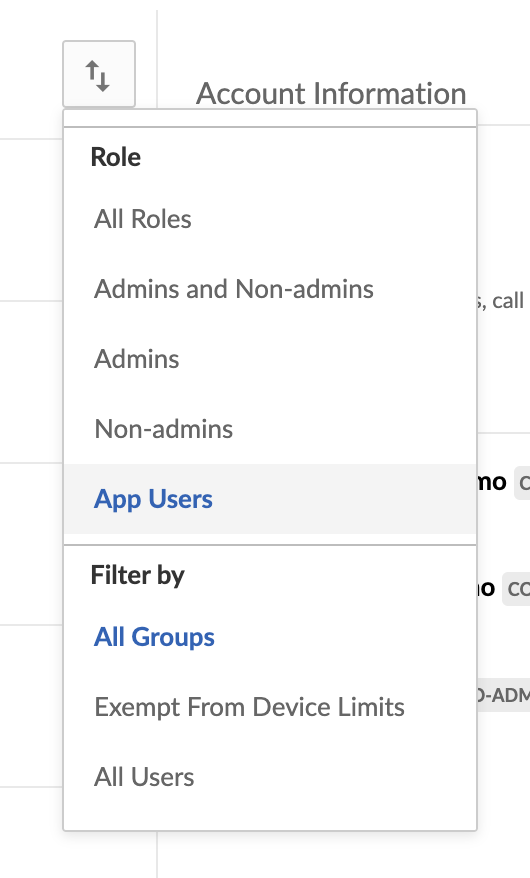

# App Users

App users can only be accessed via the API, meaning they do not have login
credentials, and are created by a Service Account. Therefore, the application
must leverage server to server authentication in order to use App Users. App
users are tied to the application used to create them, and while they can
collaborate on content outside of the application, the user itself cannot be
moved under another application.

## Creation

App users are created by using a Service Account access token to call the create
user endpoint The is_platform_access_only body parameter needs to be set to true
or a managed user is created instead.

Since every Box account must have an email address, Box assigns one. The format
will always be `AppUser_AppServiceID_RandomString@boxdevedition.com`. For
example: `AppUser_1025847_LOCqkWI79A@boxdevedition.com`.

The numbers surrounded by underscores are also unique to the application and
are called a Service ID. To locate a Service ID in the Developer Console, click
on on the tile for an application and look at the URL. For example,
`https://exampl.app.box.com/developers/console/app/1025847` . As you can see,
this application corresponds to the App User provided in the example above.

## Use Cases

App Users extend the functionality of Box’s Platform to applications serving any
user, whether or not they have an existing Box account. App users are often used
by applications that manage their own user authentication, but want to store the
data for these users in unique Box user accounts.

- Customer Portals: Websites or applications where clients or patients can log
  in to access information provided by employees at a company and/or to store and
  retrieve their own sensitive documents.
- Vendor Portals: Content distribution sites for companies to provide materials
  including marketing collateral, price lists, product information, sales
  agreements or contracts, and other documents to vendors. Box's groups and
  permission model allow for companies to quickly and easily organize content
  for partners based on partner criteria and/or tier.
- Branded Customer Facing Applications: The ability to create App Users on
 behalf of an end-user allows companies to build seamless customer-facing
 features such as permissions, auditing, and reporting. This is particularly
 valuable for regulated industries such as Financial Services and Healthcare.
 Moreover, user-based data from our user-reporting capabilities allows
 developers to leverage analytics tools to better understand user behavior.

## Benefits & Concerns

- Actions can be fully audited through user activity report and events endpoint 

## Acceess

App users are accessible via the Users & Groups tab of the Admin Console. To
filter for these users, use the view options button > Role > App Users.

<ImageFrame center shadow border>

</ImageFrame>

## Permissions 

App Users cannot see or interact any content in the folder tree of the Service
Account unless explicitly added as a collaborator. Again, because App Users does
not have login credentials, they cannot access content outside of the
Custom Application. 

