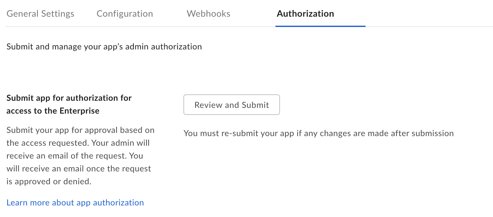
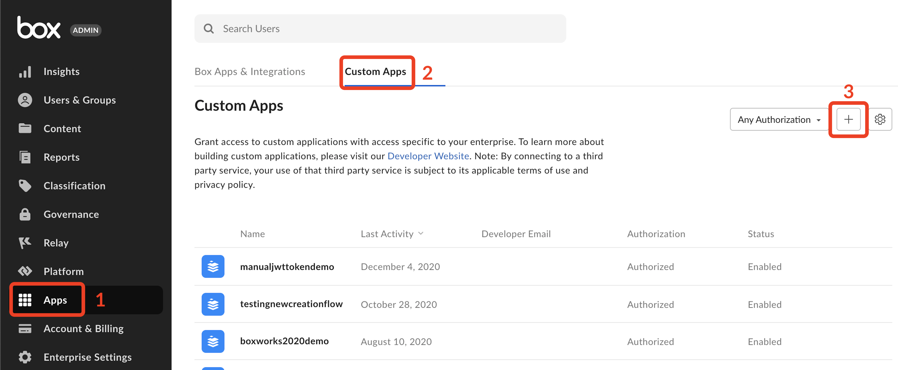
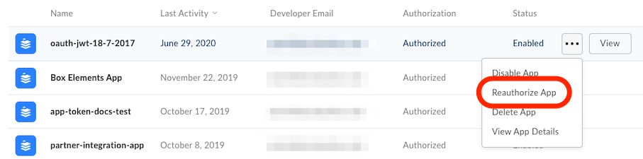

# Custom App Approval

Server authentication applications using [JWT][jwt] or
[Client Credentials Grant][ccg] must be authorized by a Box Admin before use.

A Box Admin needs an application's client ID in order to properly authorize it
in the Admin Console. 

## Approval Notifications

A semi-automated process to submit an app approval is available in the Developer
Console.

Navigate to the **Authorization** tab for your application in the
[Developer Console][devconsole].

<ImageFrame border width="400" center>
  
</ImageFrame>

Submitting the application for approval will send an email to your
enterprise's Primary Admin to approve the application. More information on this
process is available in our [support article on app authorization][app-auth].

## Manual Approval

The following steps provide instructions on how to manually approve the
application.

### As a developer

As the developer, navigate to the **Configuration** tab for your application
in the [Developer Console][devconsole]. Scroll down to the OAuth 2.0 Credentials
section and copy the Client ID value to provide to a Box Admin.

<Message>
  # Finding a Box Admin

  If you don't know your enterprise Admin, go to your Box [Account
  Settings][settings] page and scroll to the bottom. If an admin contact is set
  you should see their contact information under "Admin Contact".
</Message>

### As an Admin

As a Box Admin, navigate to the [Admin Console][adminconsole] and
select the **Apps** tab (1) from the left navigation panel. Then, click the
**Custom Apps** tab (2) at the top of your screen. On this screen, you will
see a **+** button in the top right corner to add a new app authorization.

<ImageFrame border center>
  
</ImageFrame>

In the popup that appears, enter the client ID for the application that the
developer collected from the **Configuration** tab of the
[Developer Console][devconsole].

A [secondary step][ss] may be necessary depending on enabled enterprise
settings.

## Re-authorization on changes

When the application's scopes or access level change the application needs to be
re-authorized. Repeat the process above and request a new Access Token for the
new changes to take effect.

In the same section where the application was initially authorized, an Admin
can re-authorize the application by clicking on the ellipses to the right
of the application name to **Reauthorize App**.

<ImageFrame border center>
  
</ImageFrame>

[devconsole]: https://app.box.com/developers/console
[ccg]: g://authentication/client-credentials
[settings]: https://app.box.com/account
[adminconsole]: https://app.box.com/master/settings/custom
[jwt]: g://authentication/jwt
[app-token]: g://authentication/app-token
[app-auth]: https://community.box.com/t5/Managing-Developer-Sandboxes/Authorizing-Apps-in-the-Box-App-Approval-Process/ta-p/77293
[ss]: g://authorization/#enterprise-settings
