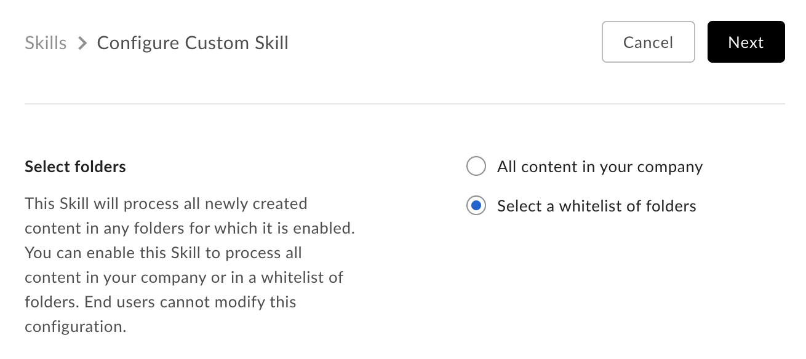
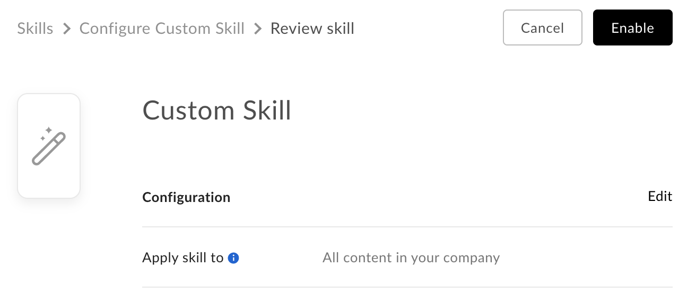

# Approval

Custom Skills will need to be enabled on a folder by the enterprise's Box Admin
before it can be used.

## As developer

As the developer, head over to the application in the [developer
console][devconsole] and copy the app's Client ID and provide this to your admin.

<Message>
  # Finding a Box Admin

  If you don't know your enterprise admin, go to the Box [account
  settings][settings] page  and scroll to the bottom. If an admin contact is set
  you should see contact  information under "Admin Contact".
</Message>

## As an Admin

To enable your Custom Skill application, head over to the [Skills section of the
Box Admin Console][adminconsole] and click the "Add Skill" link to add a new
skill.

Enter the Client ID (API key) for the Custom Skill application. This is the
Client ID that was provided by the developer.

Click "Next" and select the folder(s) where the Box Skill application should
operate.

<ImageFrame border>
  
</ImageFrame>

There are two options here:

* **All content in your company** authorizes the Skill at the root folder of
  every user. This results in every file uploaded to any folder being processed
  by the Box Skill application
* **Select a list of folders** enables the application to a specific folder
  or set of folders on which the Skill application operates.

<ImageFrame border>
  
</ImageFrame>

Click "Enable Skill" and accept the terms and agreements. The Custom Skill has
now been enabled. Any new content added to the folder(s) you selected will now
trigger an event to be sent to the Invocation URL provided in the Box Developer
Console.

<Message>
  # 10 Skill applications per enterprise

  There is a limit of 10 enabled Skills per enterprise at any given time. Please
  contact your Box Sales Representative to enable more skills in an enterprise.
</Message>

[adminconsole]: https://app.box.com/master/skills
[devconsole]: https://app.box.com/developers/console
