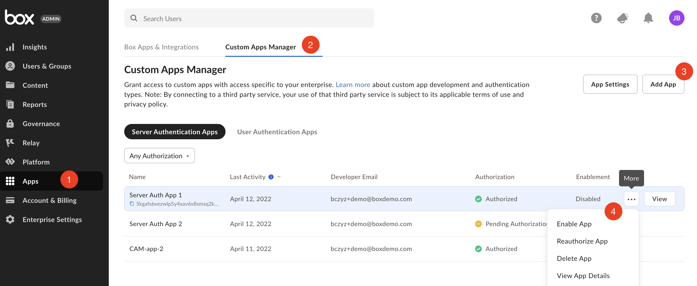
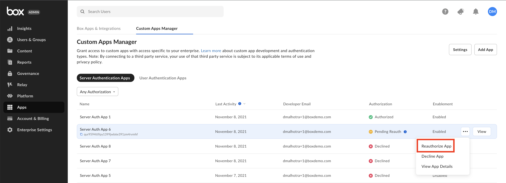

# Limited Access App Approval

Limited Access Integrations are automatically authorized for use in an enterprise upon
creation. 

However, if the enterprise setting to
**Require manual Admin authorization for Limited Access Apps** is enabled,
an Admin must preform additional steps. 

## Approval Notifications

A semi-automated process to submit an app approval is available in the Developer
Console.

Navigate to the **Authorization** tab for your application in the
[Developer Console][devconsole].

<ImageFrame border width="400" center>
  
</ImageFrame>

Submitting the application for approval will send an email to your
enterprise's Primary Admin to approve the application. More information on this
process is available in our [support article on app authorization][app-auth].

## Manual Approval

The following steps provide instructions on how to manually approve the
application.

### As a developer

1. Navigate to the **Configuration** tab for your application in the [Developer Console][devconsole].
2. Scroll down to the OAuth 2.0 Credentials section and copy the **Client ID** value to provide to a Box Admin.

Alternatively, hover over the application in the
[My Platform Apps][apps] view to look up the **ClientID** and then
copy it using the `copy` button.

<Message>
  # Finding a Box Admin

  If you don't know your enterprise Admin, go to your Box [Account
  Settings][settings] page and scroll to the bottom. If an admin contact is set
  you should see their contact  information under **Admin Contact**.
</Message>

### As an Admin

As a Box Admin, navigate to the [Admin Console][adminconsole] and
select the **Integrations** > **Platform Apps Manager** > **Add Platform App**

<ImageFrame border center>
  
</ImageFrame>

In the popup that appears, enter the Client ID for the application that the
developer collected from the **Configuration** tab of the Developer Console.

## Re-authorization on changes

When the application's scopes or access level change the application needs to be
re-authorized. Repeat the process above and request a new Access Token for the
new changes to take effect.

In the same section where the application was initially authorized, an Admin
can re-authorize the application by clicking on the ellipses to the right
of the application name to **Reauthorize App**.

<ImageFrame border center>
  
</ImageFrame>

<!-- i18n-enable localize-links -->
[devconsole]: https://app.box.com/developers/console
<!-- i18n-disable localize-links -->
[ccg]: g://authentication/client-credentials
<!-- i18n-enable localize-links -->
[settings]: https://app.box.com/account
[adminconsole]: https://app.box.com/master/settings/custom
<!-- i18n-disable localize-links -->
[jwt]: g://authentication/jwt
[app-token]: g://authentication/app-token
<!-- i18n-enable localize-links -->
[app-auth]: https://support.box.com/hc/en-us/articles/360043697014-Authorizing-Apps-in-the-Box-App-Approval-Process
<!-- i18n-disable localize-links -->
[apps]: g://applications