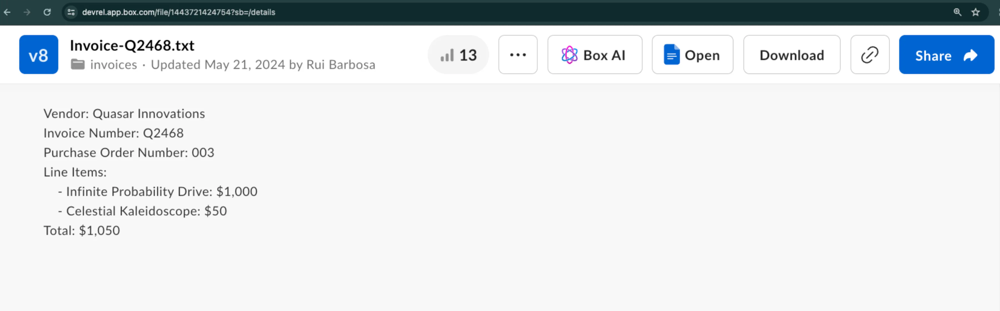

# Extract metadata from file (structured)

With Box AI API, you can extract metadata from the provided file
and get the result in the form of key-value pairs.
As input, you can either create a structure using the `fields` parameter, or use an already defined metadata template.
To learn more about creating templates, see [Creating metadata templates in the Admin Console][templates-console] or use the [metadata template API][templates-api].

## Before you start

Make sure you followed the steps listed in [getting started with Box AI][prereq] to create a platform app and authenticate.

## Send a request

To send a request, use the
`POST /2.0/ai/extract_structured` endpoint.

<Samples id='post_ai_extract_structured' />

### Parameters

To make a call, you must pass the following parameters. Mandatory parameters are in **bold**.

<Message type='notice'>
The `items` array can have exactly one element.
</Message>

| Parameter                            | Description                                                                                                                                                                                                                                                                                                                                                                                                                                                                                                               | Example                                                  |
| ------------------------------------ | ------------------------------------------------------------------------------------------------------------------------------------------------------------------------------------------------------------------------------------------------------------------------------------------------------------------------------------------------------------------------------------------------------------------------------------------------------------------------------------------------------------------------- | -------------------------------------------------------- |
| **`metadata_template`**              | The metadata template containing the fields to extract. For your request to work, you must provide either `metadata_template` or `fields`, but not both.                                                                                                                                                                                                                                                                                                                                                                  |                                                          |
| **`metadata_template.type`**         | The type of metadata template.                                                                                                                                                                                                                                                                                                                                                                                                                                                                                            | `metadata_template`                                      |
| **`metadata_template.scope`**        | The scope of the metadata template that can either be `global` or `enterprise`. Global templates are those available to any Box enterprise, whereas `enterprise` templates are bound to a specific enterprise.                                                                                                                                                                                                                                                                                                            | `metadata_template`                                      |
| **`metadata_template.template_key`** | The name of your metadata template.                                                                                                                                                                                                                                                                                                                                                                                                                                                                                       | `invoice`                                                |
| **`items.id`**                       | Box file ID of the document. The ID must reference an actual file with an extension.                                                                                                                                                                                                                                                                                                                                                                                                                                      | `1233039227512`                                          |
| **`items.type`**                     | The type of the supplied input.                                                                                                                                                                                                                                                                                                                                                                                                                                                                                           | `file`                                                   |
| `items.content`                      | The content of the item, often the text representation.                                                                                                                                                                                                                                                                                                                                                                                                                                                                   | `This article is about Box AI`.                          |
| `fields.type`                        | The type of the field. It include but is not limited to `string`, `float`, `date`, `enum`, and `multiSelect`.                                                                                                                                                                                                                                                                                                                                                                                                             | `string`                                                 |
| `fields.description`                 | A description of the field.                                                                                                                                                                                                                                                                                                                                                                                                                                                                                               | `The person's name.`                                     |
| `fields.displayName`                 | The display name of the field.                                                                                                                                                                                                                                                                                                                                                                                                                                                                                            | `Name`                                                   |
| `fields.key`                         | A unique identifier for the field.                                                                                                                                                                                                                                                                                                                                                                                                                                                                                        | `name`                                                   |
| `fields.options`                     | A list of options for this field. This is most often used in combination with the `enum` and `multiSelect` field types.                                                                                                                                                                                                                                                                                                                                                                                                   | `[{"key":"First Name"},{"key":"Last Name"}]`             |
| `fields.options.key`                 | A unique identifier for the field.                                                                                                                                                                                                                                                                                                                                                                                                                                                                                        | `First Name`                                             |
| `fields.prompt`                      | Additional context about the key (identifier) that may include how to find and format it.                                                                                                                                                                                                                                                                                                                                                                                                                                 | `Name is the first and last name from the email address` |
| `ai_agent`                           | The AI agent used to override the default agent configuration. This parameter allows you to, for example, replace the default LLM with a custom one using the [`model`][model-param] parameter, tweak the base [`prompt`][prompt-param] to allow for a more customized user experience, or change an LLM parameter, such as `temperature`, to make the results more or less creative. Before you use the `ai_agent` parameter, you can get the default configuration using the [`GET 2.0/ai_agent_default`][agent] request. For specific use cases, see the [AI model overrides tutorial][overrides]. |                                                          |

## Use cases

This example shows you how to extract metadata from a sample invoice in a structured way.
Let's assume you want to extract the vendor name, invoice number, and a few more details.



### Create the request

To get the response from Box AI, call `POST /2.0/ai/extract_structured` endpoint with the following parameters:

- `items.type` and `items.id` to specify the file to extract the data from.
- `fields` to specify the data that you want to extract from the given file.
- `metadata_template` to supply an already existing metadata template.

<Message type='notice'>

You can use either `fields` or `metadata_template` to specify your structure, but not both.

</Message>

### Use `fields` parameter

The `fields` parameter allows you to specify the data you want to extract. Each `fields` object has a subset of parameters you can use to add more information about the searched data.
For example, you can add the field type, description, or even a prompt with some additional context.

```bash
curl --location 'https://api.box.com/2.0/ai/extract_structured' \
--header 'Content-Type: application/json' \
--header 'Authorization: Bearer <ACCESS_TOKEN>'' \
--data '{
    "items": [
        {
            "id": "1517628697289",
            "type": "file"
        }
    ],
    "fields": [
        {
            "key": "document_type",
            "type": "enum",
            "prompt": "what type of document is this?",
            "options": [
                {
                    "key": "Invoice"
                },
                {
                    "key": "Purchase Order"
                },
                {
                    "key": "Unknown"
                }
            ]
        },
        {
            "key": "document_date",
            "type": "date"
        },
        {
            "key": "vendor",
            "description": "The name of the entity.",
            "prompt": "Which vendor is sending this document.",
            "type": "string"
        },
        {
            "key": "document_total",
            "type": "float"
        }
    ]
  }'
```

The response lists the specified fields and their values:

```bash
{
    "document_date": "2024-02-13",
    "vendor": "Quasar Innovations",
    "document_total": $1050,
    "document_type": "Purchase Order"
}
```

### Use metadata template

If you prefer to use a metadata template, you can provide its `template_key`, `type`, and `scope`.

```bash
curl --location 'https://api.box.com/2.0/ai/extract_structured' \
--header 'Content-Type: application/json' \
--header 'Authorization: Bearer <ACCESS_TOKEN>' \
--data '{
    "items": [
        {
            "id": "1517628697289",
            "type": "file"
        }
    ],
    "metadata_template": {
        "template_key": "rbInvoicePO",
        "type": "metadata_template",
        "scope": "enterprise_1134207681"
    }
}'
```

The response lists the fields included in the metadata template and their values:

```bash
{
  "documentDate": "February 13, 2024",
  "total": "$1050",
  "documentType": "Purchase Order",
  "vendor": "Quasar Innovations",
  "purchaseOrderNumber": "003"
}
```

### Enhanced Extract Agent

To start using the agent, you need:

- A Box Platform App with enabled `Manage AI` scope. 
- The app installed and enabled in your Box instance.
- A file to test with.

Calling an Enhanced Extract Agent works like calling the AI API - set the `type` to `AI Agent ID`, then string to the Enhanced Extract AI agent. 

To extract data using the Enhanced Extract Agent you need:

- Inline field definitions created with `agentCreateAiExtractStructuredMetadataTemplate` if your fields change frequently,
- or a metadata template that contains the data about the fields you wish to extract, if your extracted fields stay the same. 

See the full sample Python script that demonstrates how to call the Enhanced Extract Agent on a file using the Box AI SDK:

```Python
from box_sdk_gen import (
    AiAgentReference,
    AiAgentReferenceTypeField,
    AiItemBase,
    AiItemBaseTypeField,
    BoxClient,
    BoxCCGAuth,
    CCGConfig,
    CreateAiExtractStructuredMetadataTemplate
)

# Create your client credentials grant config from the developer console
ccg_config = CCGConfig(
    client_id="my_box_client_id", # replace with your client id
    client_secret="my_box_client_secret", # replace with your client secret
    user_id="my_box_user_id", # replace with the box user id that has access
                              # to the file you are referencing
)
auth = BoxCCGAuth(config=ccg_config)
client = BoxClient(auth=auth)
# Create the agent config referencing the enhanced extract agent
enhanced_extract_agent_config = AiAgentReference(
    id="enhanced_extract_agent",
    type=AiAgentReferenceTypeField.AI_AGENT_ID
)
# Use the Box SDK to call the extract_structured endpoint
box_ai_response = client.ai.create_ai_extract_structured(
    # Create the items array containing the file information to extract from
    items=[
        AiItemBase(
            id="my_box_file_id", # replace with the file id
            type=AiItemBaseTypeField.FILE
        )
    ],
    # Reference the Box Metadata template 
    metadata_template=CreateAiExtractStructuredMetadataTemplate(
        template_key="InvoicePO",
        scope="enterprise"
    ),
    # Attach the agent config you created earlier
    ai_agent=enhanced_extract_agent_config,
)
print(f"box_ai_response: {box_ai_response.answer}")
```

[prereq]: g://box-ai/ai-tutorials/prerequisites
[agent]: e://get_ai_agent_default
[model-param]: r://ai_agent_text_gen#param_basic_gen_model
[prompt-param]: r://ai_agent_text_gen#param_basic_gen_prompt_template
[templates-console]: https://support.box.com/hc/en-us/articles/360044194033-Customizing-Metadata-Templates
[templates-api]: g://metadata/templates/create
[overrides]: g://box-ai/ai-agents/ai-agent-overrides
[changelog]: page://changelog
[blog]: https://medium.com/box-developer-blog