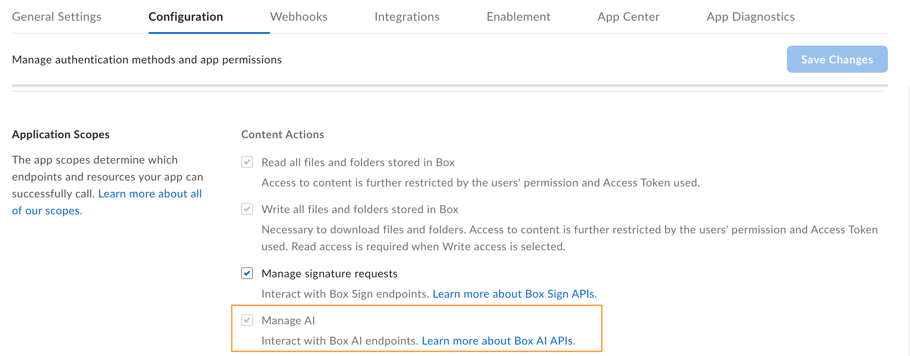

# Get started with Box AI

To implement Box AI API in your solutions, you need
to make sure you have access to the functionality.
You will also need a platform application with
enabled Box AI scope, and a developer token to
authenticate your calls.

<Message type="notice">
To use Box AI Platform API, make sure it is enabled by an
admin in the Admin Console. If you want to use
the Box AI Platform APIs in your sandbox, request access
from the Box AI team using [this form][form].
</Message>

## Create a platform application

First you need to create a platform application
you will use to make calls. To create
an application, follow the guide
on [creating platform apps][createapps].

## Enable Box AI Platform API access

To interact with Box AI Platform API,
you need the `ai.readwrite` [scope][scope]
added for your application.
Before you add the scope,
make sure that the Box Admin has granted you
the access to Box AI Platform API. If you can't see the
**Manage AI** option in your app configuration
settings, contact your admin.

To add a scope:

1. Open your application in Developer Console.
2. Go to **Configuration** > **Required Access Scopes** > **Content Actions**
3. Select the **Manage AI** scope. Box Platform will automatically include the scope when making the call. If you are added as an collaborator for a given app, but do not have Box AI API access, you will see the **Manage AI** scope checked and grayed out. This means the app owner has the AI scope enabled but you cannot change this setting.

    

4. Submit your app for [authorization or enablement][authorization]. If you want to enable Box AI Platform API for an existing application, you must [re-authorize][reauthorization] it.

## Generate a developer token

You need a developer token
to authenticate your app when sending requests.

To generate a token:

1. Go to **Developer Console** > **My Platform Apps**.
2. Click the **Options menu** button (…) on the right.
3. Select **Generate Developer Token**. The token will be automatically generated and saved to clipboard.

You can also open your app, go to
**Configuration** > **Developer Token**
and generate the token.

<Message type="notice">
A developer token is only valid for one hour.
</Message>

For additional details, see [developer token][token].
After you generate the token, you can use it in cURL
or other clients, such as [Postman][postman], to make
calls.

[token]: g://authentication/tokens/developer-tokens
[scope]: g://api-calls/permissions-and-errors/scopes
[oauthscopes]: g://api-calls/permissions-and-errors/scopes#scopes-oauth-2-authorization
[createapps]: g://applications/app-types/platform-apps
[postman]: g://tooling/postman
[form]: https://forms.gle/Nsh3TwM3W8qg4U35A
[authorization]: g://authorization
[reauthorization]: g://authorization/platform-app-approval#re-authorization-on-changes
