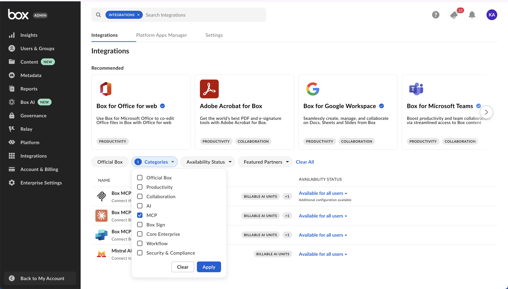

# Remote Box MCP server

[Remote Box MCP server](https://modelcontextprotocol.io/introduction) is a standardized way for AI Agents to connect and interact with third-party applications like Box, enabling seamless access to content and AI capabilities across platforms. The Box MCP server acts as a bridge that allows leading AI Agent platforms — such as Copilot Studio, Claude Enterprise, Mistral Le Chat — to securely query and utilize Box data and AI-powered tools without exposing raw file content. Through OAuth authorization, users can grant AI Agents controlled access to their Box accounts, enabling intelligent document handling, advanced search, and multi-file AI queries directly within these external AI environments.

## Access and manage predefined Box MCP servers

1. Click **Integrations** in the sidebar of Box Admin Console. 
2. Use *Categories* filter and choose MCP or search for a predefined Box MCP server in the search field search at the top of the window.
3. Beside the selected MCP server, click the state, then select the state you want to enable.

<ImageFrame noborder center>
  
</ImageFrame>

## Create an unlisted Box MCP server

1. Click **Integrations** in the sidebar of Box Admin Console.
2. Search for **Box MCP server** in the search field search at the top of the window.
3. Hover on the **Box MCP server** application, then click **Configure**.
4. In the **Additional Configuration** section, click on **+ Add Integration Credentials**.
5. Enter integration name and click **Save**.
6. Expand details of the newly created entry.
7. Copy the generated **Client ID** and **Client Secret**. 
8. Enter the **Redirect URI** provided by the external MCP client. 
9. Under **Access Scopes**, enable **Content Actions**.

## Add Box MCP server on the Client Side

Exact steps for adding Box MCP server may vary depending on the AI platform. Refer to your platform’s documentation for client-side setup instructions. Check this sample code for reference:

To connect to Box from the AI Agent platform, you need to:

* Add endpoint URL: `https://mcp.box.com`
* Pass client ID and client secret. Box generates these in the Integration Credentials section of your Admin Console when configuring the Box MCP server, above.
* Pass an MCP name: `box-remote-mcp`
* Provide an `authorization_token`

```python
  response = await client.beta.messages.create(
      model="claude-3-opus-20240229",  # Or your preferred model
      max_tokens=4096,
      messages=conversation_history,
      mcp_servers=[
          {
              "type": "url",
              "url": "https://mcp.box.com",
              "name": "box-remote-mcp",
              "authorization_token": BEARER_TOKEN,
          }
      ],
      betas=["mcp-client-2025-04-04"]
  )
```

### Amazon Quick Suite

To add the remote Box MCP server in Amazon Quick Suite, follow these steps:

1. In the Amazon Quick Suite console, choose **Integrations** and create new integration by choosing **Model Content Protocol**.
2. Enter a name and a description in the **Create integration** page.
3. Set the MCP server endpoint to `https://mcp.box.com`.
4. Choose Auto-publishing to make the integration immediately available for personal use.
5. Click **Next**, select the authentication method, and provide the required configuration.

  * For OAuth, use the client credentials you created in the Box Developer Console when configuring the Box MCP server.
  * Add token URL: `https://api.box.com/oauth2/token`.
  * Add authorization URL: `https://account.box.com/api/oauth2/authorize`.
  * Ensure the Amazon Quick Suite redirect URI is allow‑listed in Box Platform App settings.

6. Grant access to Box.
7. Select **Create and continue**, review the integration, then **Next**. Optionally share the integration with other users.

For details, see Amazon Quick Suite documentation: [Model Context Protocol (MCP) integration](https://docs.aws.amazon.com/quicksuite/latest/userguide/mcp-integration.html).

<iframe width="100%" height="500" src="https://www.youtube.com/embed/S2kns2tYJjA?si=AWuXpvrjJY0J0qBb" title="Box remote MCP with Amazon Quick Suite" frameborder="0" allow="accelerometer; autoplay; clipboard-write; encrypted-media; gyroscope; picture-in-picture; web-share" referrerpolicy="strict-origin-when-cross-origin" allowfullscreen></iframe>

### Anthropic's Messages API

Connect the remote Box MCP server with [Anthropic's Messages API](https://docs.anthropic.com/en/api/messages). Clone [this sample chat bot project](https://github.com/box-community/mcp-client-remote-mcp-react) to get started quickly. It allows you to have a conversation with an Anthropic model, which has access to tools provided by the Box remote MCP server.

Watch a video that features a demo project, a React based chat bot that leverages remote Box MCP.

<iframe width="100%" height="500" src="https://www.youtube.com/embed/Rcn8p-nLJtI?si=dWsMnE6reTE-aKQw" title="Box remote MCP" frameborder="0" allow="accelerometer; autoplay; clipboard-write; encrypted-media; gyroscope; picture-in-picture; web-share" referrerpolicy="strict-origin-when-cross-origin" allowfullscreen></iframe>

### Azure API Center

To add the remote Box MCP server in Azure API Center's Enterprise Registry, follow the instructions provided by Azure. Detailed steps and guidance are available in the official Microsoft documentation: [Add an MCP Server in Azure API Center's Enterprise Registry](https://learn.microsoft.com/en-us/azure/api-center/register-discover-mcp-server).

### Claude

To start using the remote Box MCP server in [Claude](https://claude.ai/directory), go to Claude app settings and click *Connectors*. Within this view click *Browse connectors* and choose Box. Ensure to grant Claude access to Box.

See a demo video that showcases how to connect Box MCP with the Claude desktop app.

<iframe width="100%" height="500" src="https://www.youtube.com/embed/OJVjXZkPd54?si=PSiV6aKkUnL7CXoG" title="YouTube video player" frameborder="0" allow="accelerometer; autoplay; clipboard-write; encrypted-media; gyroscope; picture-in-picture; web-share" referrerpolicy="strict-origin-when-cross-origin" allowfullscreen></iframe>

### Copilot Studio

To add the remote Box MCP server, follow the instructions provided by the Copilot Studio side. Detailed steps and guidance are available in the official Microsoft documentation: [Add an MCP Server in Copilot Studio](https://learn.microsoft.com/en-us/microsoft-copilot-studio/agent-extend-action-mcp#add-tools-from-an-existing-mcp-connector-to-an-agent).

### GitHub Copilot

To set up the Box MCP server with GitHub Copilot, go to the [overview page](https://github.com/mcp/box/mcp-server-box-remote) and click *Install MCP server*. You'll be redirected to the VS Code editor. Click *Install* and complete OAuth to grant access to Box. 

You may need to manually enter your Client ID and Client Secret. When registering your OAuth application, make sure to include following redirect URIs:

```curl
http://127.0.0.1:33418
https://vscode.dev/redirect
```

<iframe width="100%" height="500" src="https://www.youtube.com/embed/Y1a16jhCVPc?si=MOutZC3_tGtpcJ7c" title="Box remote MCP with Github Copilot" frameborder="0" allow="accelerometer; autoplay; clipboard-write; encrypted-media; gyroscope; picture-in-picture; web-share" referrerpolicy="strict-origin-when-cross-origin" allowfullscreen></iframe>

### Groq

To integrate Box MCP server with Groq, follow the tutorial available in the [Groq API Cookbook](https://github.com/groq/groq-api-cookbook/tree/main/tutorials/03-mcp/mcp-box). This tutorial provides step-by-step instructions for setting up and using Box MCP with Groq.

Watch a [video demonstration](https://groq.enterprise.slack.com/files/U089GJTGFFA/F09QXEZ3V17/groq_box_mcp_tutorial__1.mp4) of the Groq and Box MCP integration.

### Microsoft Foundry Tools

Box is available in the Microsoft Foundry Tools catalog. To add the remote Box MCP server, refer to the official Microsoft documentation: [Discover tools in the Microsoft Foundry Tools](https://learn.microsoft.com/en-us/azure/ai-foundry/agents/concepts/tool-catalog?view=foundry).

### Mistral AI’s Le Chat

To enable Box MCP for [Mistral AI’s Le Chat](https://chat.mistral.ai/chat), visit [connectors page](https://chat.mistral.ai/connections), click *Connect* and grant access to Box. Alternatively, directly form the chat view, click *Tools* and choose Box.

<ImageFrame noborder center>
  
</ImageFrame>

### OpenAI AgentKit

Box enables agentic enterprise support with OpenAI AgentKit. For more information and a demonstration, see the [Box blog post](https://blog.box.com/box-enables-agentic-enterprise-support-openais-new-agentkit).

### Windows

Box MCP server is available for Windows. For more information, visit the [Windows Agentic page](https://developer.microsoft.com/en-us/windows/agentic/).

<Message type='notice'>

This integration is currently in preview and the customer experience may change.

</Message>

### Using Box AI Features with the MCP Server

When you use Box AI in third-party applications, you can achieve the best experience and highest quality results by accessing the applications through the Box MCP server. This ensures full functionality, improved performance, and a seamless user experience.

## Available tools

The remote Box MCP server provides access to a comprehensive set of tools that enable AI agents to interact with Box content and features. These tools are organized by functional category to help you quickly identify the right capabilities for your use case.

### User and authentication

Manage user authentication and retrieve information about the authenticated user.

| Tool | Description|
| ---- | ---------- |
| `who_am_i`| Returns detailed information about the currently authenticated Box user.|

### Content management

Manage files and folders, perform searches, and handle content operations across your Box environment.

#### File operations

| Tool | Description|
| ---- | ---------- |
| `get_file_content` | Returns the content of a file stored in Box. |
| `get_file_details` | Gets comprehensive file information from Box including metadata, permissions, and version details. |
| `update_file_properties` | Updates file properties, including name, description, tags, and collections. |
| `upload_file` | Uploads a new file to Box. |
| `upload_file_version` | Uploads a new file version by providing the entire file contents to update an existing file in Box. |

#### Folder operations

| Tool | Description|
| ---- | ---------- |
| `create_folder` | Creates a new folder in Box. |
| `get_folder_details` | Retrieves comprehensive folder information including metadata, permissions, and collaboration settings. |
| `list_folder_content_by_folder_id`| Lists files, folders, and web links in a folder. |
| `update_folder_properties` | Updates folder properties, including name, description, tags, and collections. |

#### Search

| Tool | Description|
| ---- | ---------- |
| `search_files_keyword`| Searches for files using keywords. Supports metadata filters, file extension filtering, and field selection.|
| `search_folders_by_name`| Searches for folders within Box by name using keyword matching.|

### Box AI

Use AI-powered tools to ask questions, extract insights, and analyze content across files and hubs.

| Tool | Description|
| ---- | ---------- |
| `ai_qa_hub`| Asks a question to a Box Hub using Box AI.|
| `ai_qa_single_file`| Asks a question to a single file using Box AI.|
| `ai_qa_multi_file`| Asks a question to multiple files using Box AI.|
| `ai_extract_freeform`| Extracts metadata from files using Box AI in freeform format without requiring predefined template structures.|
| `ai_extract_structured`| Extracts structured metadata from files using Box AI based on either custom fields definition or an existing metadata template.|

### Collaboration

Enable team collaboration through comments, shared links, and collaboration management tools.

| Tool | Description|
| ---- | ---------- |
| `create_file_comment` | Creates a new comment on a specific file. |
| `list_file_comments` | Lists all comments on a specific file. |
| `list_tasks` | Lists all tasks associated with a specific file, including status, message, and due dates. |

### Hubs

Create and manage Box Hubs for organizing collaborative content and resources around specific topics or projects.

| Tool | Description |
| ---- | ---------- |
| `add_items_to_hub` | Adds files, folders, or web links to a specific hub. |
| `create_hub` | Creates a new hub. |
| `get_hub_details` | Retrieves detailed information about a specific hub. |
| `get_hub_items` | Gets items (files and folders) associated with a specific hub. |
| `list_hubs` | Lists all hubs accessible to the authenticated user. |
| `update_hub` | Updates the title and description of a specific hub. |

## Feedback

To share feedback or ask questions about Box MCP server, visit the [Box AI API thread](https://community.box.com/box-ai-api-8) of the Box Developer Community forum.
