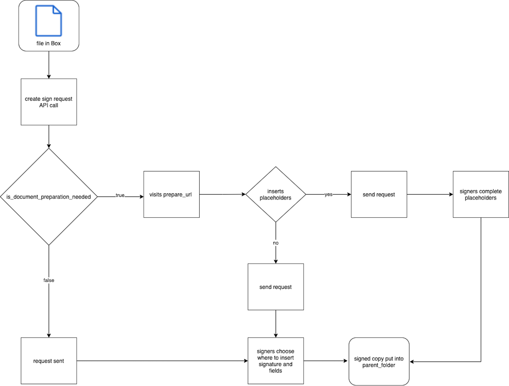
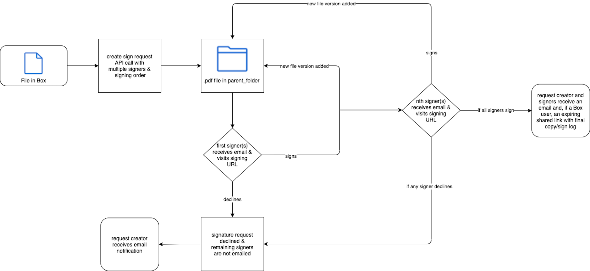
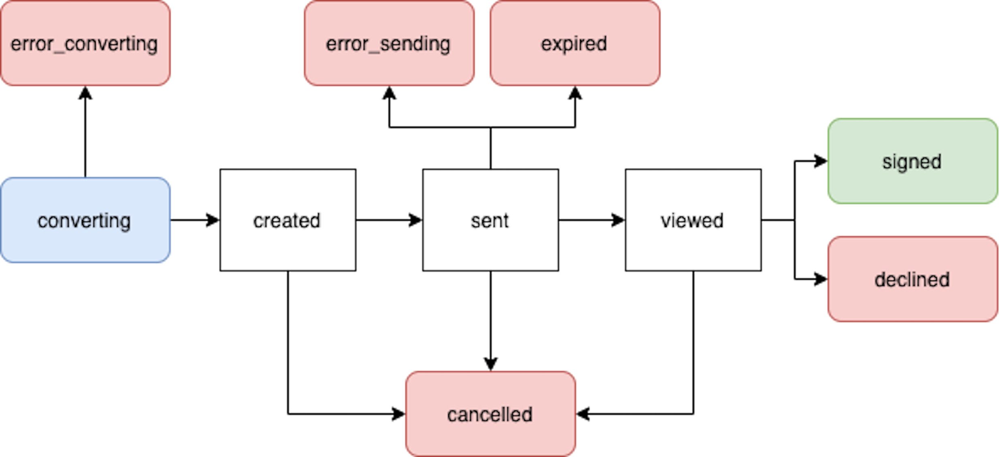

# Create Box Sign Request

At minimum, to [create Box Sign request][create] you need
the a file you want to be signed, a destination folder for the signed
document/[signing log][log], and signers.

<Samples id='post_sign_requests' />

<Message type='warning'>
Creation of the CFR Part 11 signature requests with public API
is not supported. See [21 CFR Part 11 Compliance Support][CFR]
for more information.
</Message>

## Document preparation

Preparing a document prior to sending a Box Sign request allows developers to
add date, text, checkbox, and/or signature placeholders for signers. This can be
done with UI or [tags][tags] directly in the document. If this is not done,
signers receive an unprepared document and can place signatures and fields at
their own discretion. However, developers can leverage controls in the request
that allow them to turn features for the unprepared document on and off.

Setting `is_document_preparation_needed` to `true` provides a `prepare_url` in
the response. Visiting this link in your browser allows you to complete document
preparation and send the request in the UI.

To learn more about document tags, please see our [support article][tags].

<Message type='warning'>
Prefill tags created in a template with the Box web app cannot be accessed from
the API.
</Message>

<ImageFrame border center shadow>
  
</ImageFrame>

## Files

Each Box Sign request begins with a file that needs to be signed. If the file
does not already exist in Box, it must be [uploaded][upload], in a separate
API call, prior to creating the request. Multiple files can be signed in one
request. File ID of the first file in a request is specified in the
`source_files` body parameter.

<Message type='warning'>
The requester must have download privileges to the file in Box. Review
our [collaboration levels][collab] to ensure this requirement is met.
</Message>

Supported file types include:

- All [documents][documents]
- All [presentations][presentations]
- Images: `png`, `jpg`, `jpeg`, `tiff` only
- Text-based files: `.csv`, `.txt` only

All file types are converted to `.pdf` for the signature process. This converted
document can be found in the `parent_folder` upon successfully sending a
request. This means that the final, signed document is a `.pdf`, regardless of
the original file type. As each signer completes the request, Box Sign will
automatically add a new file version.

File size limits are determined by your account type. Please see our
[uploads guide][uploads] for more information.

## Parent folder

The folder ID specified in the `parent_folder` body parameter determines the
destination of the final signed document and [signing log][log]. This folder
cannot be the All Files or root level, which is represented by folder ID `0`.

## Signers

Each signer must be assigned a [role][role]:  `signer`, `approver`, or `final copy_reader`.

If the requester is not given a role, a signer with the role `final_copy_reader`
is automatically created. This means they only receive a copy of the final,
signed document and [signing log][log].

Signers do not need to have an existing Box account, nor create one, in order to
sign documents. Unlike other API endpoints, signers are invited by email address
and not Box `user_id`.

If necessary, signers can log in to Box before signing the request. In such
case set the parameter `login_required` to `true` for signers. If the signer
does not have an existing account, they will have an option to create a free
Box account.

<Message type='warning'>
Box Sign will only attempt to send signing emails to the email addresses
provided for signers in the request. For Box users, this does not include email
aliases unless specified. Please double check to ensure all provided signer
email addresses are valid.
</Message>

### Inputs

The `inputs` parameter represents placeholders that the user can interact with.
The `document_tag_id` parameter can be populated with data you want to
pass when creating a sign request.

## Templates

You can create a sign request using a template.
To do so, you must provide the `template_id` parameter.
See [this guide][templates] to learn more about using templates
when creating sign requests.

## Redirects

The URLs specified in the `redirect_url` and `declined_redirect_url`
allow you to redirect signers to a custom landing page
after signing or declining the sign request.
For example, if you integrate your application with Box Sign,
you can redirect signers back to your application
or to a custom landing page.
You can set redirect URLs globally for all signers
as well as for specific signers only.
This means that Box Sign will use specific URLs
for signers of your choice, and global
settings for the rest.
If you don't configure any redirect URLs
Box Sign will redirect signers to a default page.

<Message type='warning'>
The default page includes the following note:
"Once the document has been completed by all parties,
a limited-time link to a finalized copy will be be emailed to you,
and, if you have a Box account, a copy will be placed in your account."
If you decide to redirect the signers to a different page, this information
will not be available to signers.
</Message>

## Multiple signers and signing order

Signing order is determined by ordering the provided `order` numbers from
smallest to largest. If two numbers are the same, signers will receive the
request at the same time.

Initially, only the signer(s) with the lowest assigned `order` number will
receive a Box Sign request email. Once they sign, the following user(s) will
an email and so on. Box Sign automatically adds a new version of the
document to the `parent_folder` as each user signs.

If any signer declines, any remaining signers will not receive a Box Sign
request email. The overall request is declined.

<ImageFrame border center shadow>
  
</ImageFrame>

## Request status

- `converting`: The file is converted to a `.pdf` for the signing process once the sign request is sent.
- `error_converting`: An issue was encountered while converting the file to a `.pdf`.
- `created`: If `document_preparation_is_needed` is set to `true`, but the `prepare_url` has not yet been visited.
- `sent`: The request was successfully sent, but no signer has interacted with it.
- `error_sending`: An issue was encountered while sending the request.
- `viewed`: Once the first, or only, signer clicks on **Review document** in the signing email or visits the signing URL.
- `downloaded`: The signing document was downloaded by signer.
- `signed`: All signers completed the request.
- `signed and downloaded`: The signing document was signed and downloaded by signer.
- `declined`: If any signer declines the request.
- `cancelled`: If the request is cancelled via UI or API.
- `expired`: The date of expiration has passed with outstanding, incomplete signatures.
- `finalizing`: If all signers have signed the request, but the final document with signatures and the signing log has not been generated yet.
- `error_finalizing`: If the `finalizing` phase did not complete successfully.

Encountering an error status requires creating a new sign request to retry.

<ImageFrame border center shadow>
  
</ImageFrame>

[upload]: e://post-files-content/
[documents]: g://representations/supported-file-types/#documents
[presentations]: g://representations/supported-file-types/#presentations
[uploads]: g://uploads/direct
[create]: e://post-sign-requests
<!-- i18n-enable localize-links -->
[tags]: https://support.box.com/hc/en-us/articles/4404085855251-Creating-templates-using-tags
[log]: https://support.box.com/hc/en-us/articles/4404095202579-Viewing-the-signing-log
[role]: https://support.box.com/hc/en-us/articles/4404105660947-Roles-for-signers
[collab]: https://support.box.com/hc/en-us/articles/360044196413-Understanding-Collaborator-Permission-Levels
<!-- i18n-disable localize-links -->
[embed]: g://embed/box-embed
[embedguide]: g://embed/box-embed#programmatically
[signrequest]: e://post-sign-requests
[externalid]: e://post-sign-requests#param-signers-embed_url_external_user_id
[cloudgame]: g://embed/box-embed#cloud-game
[templates]: g://box-sign/sign-templates
[CFR]: https://support.box.com/hc/en-us/articles/24169443030163
