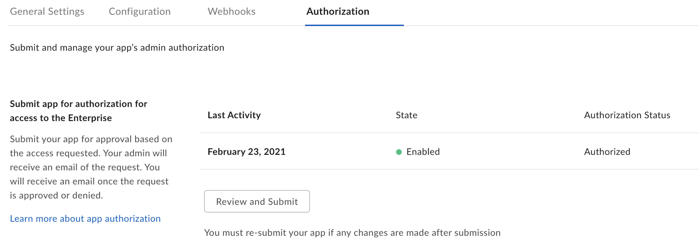
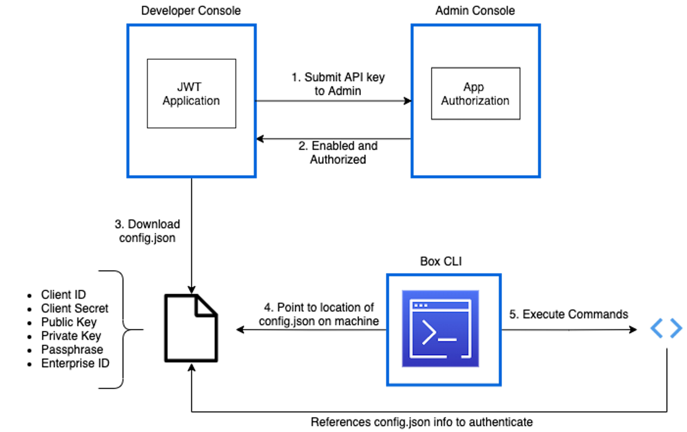

# Box CLI with JWT Authentication

Previously, our [Box CLI Quick Start Guide][qs], followed the JWT or server
authentication application setup flow. Since we released a new OAuth 2.0
version of the Box CLI, we updated it to use the new feature. We migrated
the original JWT setup instructions here, in case you would still like
to use the server authentication application type.

## Setup a JWT application

The first step to using the CLI with server authentication is creating a Box
application in the
[Developer Console][dc], which the CLI can use behind the scenes to make API
calls. If you would like to associate your CLI with an existing JWT application
you can skip this step. However, you will want to ensure that, at a minimum, the
following scopes are set in the **Configuration** tab of your application:

- Read all files and folders stored in Box
- Write all files and folders stored in Box

1. From the left-hand navigation panel on your All Files page, open the
   [Developer Console][dc]. If this is your first time using the Box
   API and this option is not already available, you can add it to your account
   by clicking [here][dc].

2. Click **Create New App** > **Custom App** > **Server Authentication
   (with JWT)** > name the application > **Create App**

<Message warning>
  Server Authentication (with JWT) always requires Admin authorization before
  use.
</Message>

## Configure the application

This will bring you to the application’s configuration page where you need to
choose its access and permissions. Again, keep in mind that because of the
application’s authentication type, it will require Admin approval.

At a minimum, you will need the following [scopes][scopes]:

- Read all files and folders stored in Box
- Write all files and folders stored in Box

You can choose either App Access Only or App + Enterprise Access as the
[application access][aa].

## Authorize the application

All applications leveraging Server Authentication must be authorized in the
Admin Console before making successful API calls. This is because all JWT
applications have a [Service Account][sa], which, based on the applications
[scopes][scopes], may be able to perform Admin actions.

Steps for developers and Admins can be found in our [authorization guide][ag].

If you would like more information on how scopes, application access, tokens,
and permissions work together, please see our article on understanding
[Box's security mechanisms][blogpost].

<Message warning>
   If configuration changes are made to this application, it will need to be 
   reauthorized in order for the changes to take effect.
</Message>

You will know when an application is ready for use by visiting its Authorization
tab in the [Developer Console][dc]. The state and status must be enabled and
authorized.

<ImageFrame center>
    
</ImageFrame>

## Download Required Data

The CLI needs a configuration file stored locally in order to make API calls.

To download the configuration file, visit the **Configuration** tab in the 
[Developer Console][dc]. Click **Generate a Public/Private Keypair**, which will
send you through 2FA verification before automatically downloading the
configuration file for your application. For more information see
our [guide][keypair]. 

<Message warning>
   For security reasons 2FA must be enabled on your Box account to successfully
   generate a public/private keypair.
</Message>

Locate the downloaded file on your machine which has a default name in the
format: `EnterpriseID_publicKeyID_config.json`. You may leave this name or
choose to rename it. This guide assumes the file is renamed to `config.json`. 

<Message warning>
   It is critical you place the file in a location where it will not be
   inadvertently deleted or moved. If this occurs you will need to repeat the
   step 2 to reconfigure the CLI. 
</Message>

## CLI Installation and Configuration

Installers are available for Windows and macOS. However, the raw source-code is
available if you would like to build the CLI in other environments.

## Windows & macOS Installers

To install the latest CLI on your machine, download the latest
`.exe` for Windows or `.pkg` for macOS for the latest release.

<CTA to="https://github.com/box/boxcli/releases">
  Download the latest CLI installer
</CTA>

## Linux & Node install

Additionally, the CLI can be installed as a Node package on any platform,
including Linux. For this to work you will need to have
[Node JS](https://nodejs.org/) installed on your machine.

```bash
npm install --global @box/cli
```

## Source Code

The source code for the CLI is available via [GitHub][cli].

## Run configuration command

You will now need to configure the CLI to point to to the configuration file
downloaded in step 1.

<ImageFrame center>
  
</ImageFrame>

<!--alex ignore execute-->

Open your terminal or command line and execute the
command: `box configure:environments:add PathToConfigFileHere`, replacing
`PathToConfigHere` with the path to your `config.json` file.

<!-- markdownlint-disable line-length -->

For example: 
`box configure:environments:add /Users/ExampleUser/Documents/CLI/config.json`

<!-- markdownlint-enable line-length -->

<Message type='tip'>
   You can drag the csv file from the Finder/File Explorer to the
   terminal/command line window to auto-populate the path.
</Message>

## Confirm configuration

To confirm successful configuration, use the command `box users:get`.

A successful response will provide details about the [Service Account][sa] user
associated with your [Access Token][at]:

```json
Type: user
ID: ''0123456789''
Name: Box CLI - Quickstart Example
Login: AutomationUser_123456_8jSo6Lqvko@boxdevedition.com
Created At: '2020-01-01T09:45:01-07:00'
Modified At: '2021-03-01T09:30:05-07:00'
Language: en
Timezone: America/Los_Angeles
Space Amount: 999999999999999
Space Used: 6291500
Max Upload Size: 16106127360
Status: active
Job Title: ''
Phone: ''
Address: example+user@box.com
Avatar URL: ''
Notification Email: []
```

<Message type='tip'>
   By default, JWT applications automatically obtain an Access Token for the
   Service Account. It is possible to change the default user, but this guide
   assumes you do not do this. 
</Message>

## Next Steps

- You can checkout the [commands][commands] page on GitHub for example code.
- You can also go to the second part of the [OAuth 2.0 Quick Start][three] for
    a tutorial on how to use the commands.

[cli]: https://github.com/box/boxcli
[auth]: g://authentication/jwt/without-sdk/
[at]: g://authentication/tokens/
<!-- i18n-enable localize-links -->
[dc]: https://account.box.com/developers/console
<!-- i18n-disable localize-links -->
[keypair]: g://authentication/jwt/jwt-setup/#public-and-private-key-pair
[sa]: page://platform/user-types/#service-account/
[scopes]: g://api-calls/permissions-and-errors/scopes/
[ag]: g://authorization/custom-app-approval/
<!-- i18n-enable localize-links -->
[blogpost]: https://medium.com/box-developer-blog/box-api-understanding-security-9fcad7b1d72e
<!-- i18n-disable localize-links -->
[scopes]: g://api-calls/permissions-and-errors/scopes/
[aa]: g://authentication/jwt/jwt-setup/#application-access
[three]: g://cli/quick-start/build-commands-help/
[four]: g://cli/quick-start/options-and-bulk-commands/
[cache]: https://github.com/box/boxcli/blob/master/docs/configure.md#box-configureenvironmentsupdate-name
[ac]: https://github.com/box/boxcli/blob/master/docs/autocomplete.md
[commands]: https://github.com/box/boxcli#command-topics
[qs]: g://cli/quick-start/
