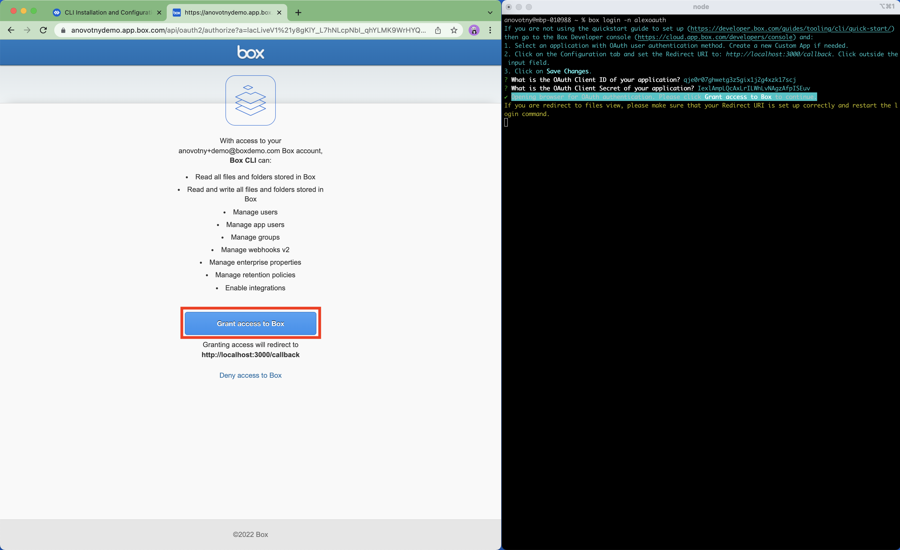

# CLI Installation and Configuration

<Choice option='cli.app_type' value='create_new,use_existing,clicked' color='none'>
Installers are available for Windows and macOS. However, the raw source-code is
available if you would like to build the CLI in other environments.

## Windows & macOS Installers

To install the latest CLI on your machine, download the latest
`.exe` for Windows or `.pkg` for macOS for the latest release.

<CTA to="https://github.com/box/boxcli/releases">
  Download the latest CLI installer
</CTA>

## Linux & Node install

Additionally, the CLI can be installed as a Node package on any platform,
including Linux. For this to work you will need to have
[Node JS](https://nodejs.org/) installed on your machine.

```bash
npm install --global @box/cli
```

## Source Code

The source code for the CLI is available via [GitHub][cli].

## Run configuration command

You will now need to configure the CLI by logging in to your Box App.

In this step, we will use the **Client ID** and **Client Secret** from the
previous step to log you in and create an **Access Token** for your user.

## The reason to log in

Currently you have provided us with the following information.

<Store disabled inline id='cli_credentials.client_id'>
  Client ID
</Store>

<Store disabled inline obscured id='cli_credentials.client_secret'>
  Client Secret
</Store>

<!-- markdownlint-disable line-length -->

<!--alex ignore execute-->
Open your terminal or command line and execute the command: `box login -n example_name`.

Copy the Client ID and Client Secret into the terminal window when prompted.

<!-- markdownlint-enable line-length -->

<ImageFrame center>
  
</ImageFrame>

Click the **Grant access to Box** button that appears in the browser window.

<ImageFrame center>
  
</ImageFrame>

If successful, you will see the following success message.

<ImageFrame center>
  
</ImageFrame>

## Confirm configuration

To confirm successful configuration, make your first Box API call with the Box
CLI by entering the command `box users:get me`.

<ImageFrame center>
  
</ImageFrame>

A successful response will provide details about your user account.

```json
Type: user
ID: ''0123456789''
Name: Aaron Levie
Login: example@box.com
Created At: '2020-01-01T09:45:01-07:00'
Modified At: '2021-03-01T09:30:05-07:00'
Language: en
Timezone: America/Los_Angeles
Space Amount: 999999999999999
Space Used: 6291500
Max Upload Size: 16106127360
Status: active
Job Title: ''
Phone: ''
Address: example+user@box.com
Avatar URL: ''
Notification Email: []
```

## Summary

* You installed the CLI
* You configured the CLI to use the OAuth 2.0 Application created earlier
* You **made your first Box CLI Box API call** confirmed the user associated
  with your Access Token

<Next>I installed and configured the CLI</Next>
</Choice>

<Choice option='cli.app_type' unset color='none'>
<Message danger>
  # Incomplete previous step

  Please complete the previous step to set up the **Box App** you want
  to use.
</Message>
</Choice>

[cli]: https://github.com/box/boxcli
[auth]: g://authentication/jwt/without-sdk/
[sa]: page://platform/user-types/#service-account/
[at]: g://authentication/tokens/
[dc]: https://app.box.com/developers/console
