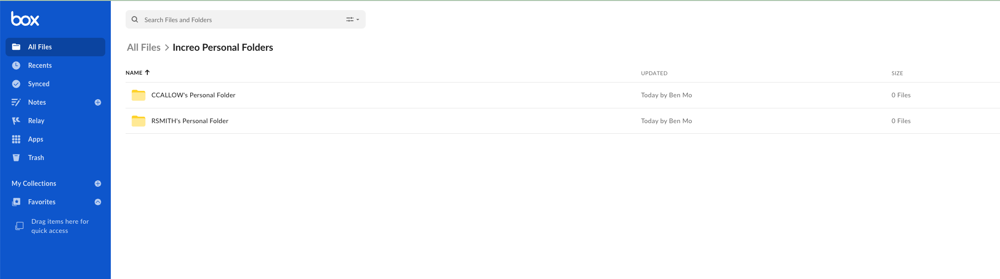

# Using PowerShell Scripts with the Box CLI

By itself, the CLI is already powerful, but using it alongside a PowerShell
script lets you complete repetitive tasks even quicker. We created an example
[scripts][scripts] folder within our CLI GitHub repository to help
jump start your development.

To show you how CLI scripts work, we are going to use the
provision and create users [script][script-1]
template.

This script uses the Box CLI to build and create a
personal folder structure, create managed users in bulk,
and provision such new users by adding them to the newly created
folder structure as collaborators with viewer or uploader roles.

<Message type='warning'>
  This part of the quick start is for service accounts
  and users with administrative privileges only.
  Skip this step if you are not a Box administrator
  or you do not use a service account.
</Message>

<YouTube id='i43YfP-dT_s' />

## Use case

To automatically create users and folder structure, the script
performs the following steps:

1. Uses a `.csv` file to load employee data in bulk.
2. Defines folder structure using a JSON file or uploads the structure from the user's local directory.
3. Creates each new managed user a predetermined personal folder structure

## Prerequisites

### Windows

Install the latest version of [dotnet core](https://dotnet.microsoft.com/download).

### MacOS & Linux

Install [PowerShell][pwsh]

<message>
If you encounter issues make sure you installed both
[dotnet core](https://dotnet.microsoft.com/download) and
[PowerShell][pwsh]
</message>

### Box CLI

To use the script, you will need the Box CLI
installed and configured. If you haven't done so yet, see [step 1][step 1] of
this quick start guide.
Alternatively, go to your [developer console][console], and follow the guide
[Setup with OAuth 2.0][auth].

### Create a personal folder parent folder

This script works by creating a folder structure for each user that is
created. In order to do this, you should go ahead and create a parent
folder for all of the personal folders to live in. Otherwise, every folder
will live in the root of the user that the CLI is setup with. You may name
and place the folder wherever you wish, but the user you setup the CLI with
must have access to the folder.

Here is an example of what the structure will look like after
running the script.

<ImageFrame border center>
  
</ImageFrame>

## Download the script

Clone the script to a directory of your choice
and navigate to that directory.

```bash
git clone https://github.com/box/boxcli.git box-cli
cd box-cli/examples/User\ Creation\ \&\ Provisioning/
```

## Configure the script settings

Adapt the script to run in your own environment.
In this example, you will use the sample data provided
with the script.

### Provide the parameters

There are a few parameters you need to supply before running the script:

- `EmployeeList`: Path to `Employee List` CSV.
- `PersonalFolderParentID`: Destination folder ID for all personal folders to be created in, either when using JSON file as input to create folder structure, or uploading local structure. This folder should be made prior to running the script the first time. It is not advised to make this value `0`, as this will create individual Personal folders in root of the account you set up the CLI with.
- `FolderStructureJSONPath`: Your own folder structure JSON path.
- `PersonalFolderSlug`: Ending name of the folder that will be created as parent for personal folders. It's set to `Personal Folder` by default, but feel free to set it to your needs. The username is concatenated with this value to create each user's personal folder name. ex - `rsmith2's Personal Folder`.
- `LocalUploadPath`: Local directory to upload folder structure directly.

<Message>
Specify either a local upload path or a JSON file with the folder
structure, not both.
</Message>

### Update the user list

You can use the following sample files to load users:
`Employees_1.csv`, `Employees_5.csv`, and `Employees_10.csv`.
Each will load 1, 5 or 10 new users.

Customize these files for a test run. For example, update the
`Employees_1.csv` with the following data:

```bash
firstName,lastName,email,username
Isaac,Newton,abc@abc.local,INewton23
```

With the `EmployeeList` parameter, specify which `.csv` file you would like
to load data from.

<Message warning>
  Emails must be unique across all of Box, and usernames must be unique across
  your specific Box instance. Otherwise, an error will be thrown when running
  the script.
</Message>

### Create folder structure

You can either create a folder structure from a JSON
file or upload it from your local drive.

#### Use a JSON file

The `Folder_Structure.json` file contains the folder structure you want to create.
As an example, you will create a `Market Research` and a `Sales Plays`
folder, each with a subfolder `Statistics` and `Big Pharma` respectively.
The script will place this folder structure
under the `Personal Folder` folder for that user inside the parent folder
you designate.

With the `FolderStructureJSONPath` parameter, provide the location of the
`Folder_Structure.json` file.

#### Upload file from local drive

You can also upload a folder structure directly
from the local file system. With the `LocalUploadPath` parameter, provide the
path to your local folder you want to upload. The folder is still named and
uploaded identically to the JSON file method.

### Update the parameters

You have 3 ways to pass parameters before running the script:

- Use static values in the script

    <Message>
    Remember to update all required parameters in the script before running.
    </Message>

    ```bash
    # Set Employee List CSV Path
    # firstname, lastname, email, username
    $EmployeeList = ""

    # Personal Folder Structure: Set either path build off JSON or directly upload
    # a local folder
    $FolderStructureJSONPath = ""
    $LocalUploadPath = ""

    # Ending slug of folder that will be used in creating personal folders for new
    # users. Value will get concatenated with username
    # If username is RSMITH, the personal folder name would be
    # RSMITH's Personal Folder
    $PersonalFolderSlug = ""

    # ID of parent folder for created personal folders to be created in
    # This folder should be created before running the script the first time.
    # It is not advised to make this value 0, as this will create individual
    # Personal folders in root of the account you set up the cli with
    $PersonalFolderParentID = ""
    ```

- Run the script with parameters

    You can specify parameters while running the script, for example:

    ```bash
    PS > ./Users_Create_Provision.ps1 -EmployeeList ./Employees_1.csv `
        -LocalUploadPath ./PersonalLocalUpload `
        -PersonalFolderSlug "Personal Folder" `
        -PersonalFolderParentID 123456789

    Starting User Creation & Provisioning script...
    ```

- Provide the parameters when prompted

    If some parameters are still missing at runtime, the script will prompt you to provide them:

    ```bash
    PS > ./Users_Create_Provision.ps1
    Please enter the path to the employee list CSV file:
    ./Employees_1.csv
    Please enter the path to the folder structure JSON file or the local upload path:
    Folder_Structure.json
    Folder structure JSON path set to: Folder_Structure.json
    Please enter the ID of the folder where you would like to create the personal folders:
    0
    Starting User Creation & Provisioning script...
    ```

## Run the script

1. Change the directory to the folder containing the script. In this example, it is the `User Creation & Provisioning` folder.

    ```bash
    pwsh
    ```

2. Run the script:

    ```bash
    PS /home/rvb/box-cli/examples/User Creation & Provisioning> ./Users_Create_Provision.ps1
    ```

    The response will be similar to the following:

    ```bash
    Starting User Creation & Provisioning script...

    firstName lastName email
    --------- -------- -----
    Isaac     Newton   abc@abc.local
    Extracting folder structure
    Found current User ID: 18622116055

    Created a user owned Onboarding folder with id: 164734146745

    Created subfolder Market Research under Onboarding folder with id: 164735375585

    Created subfolder under Statistics folder with id: 164734956242

    Created subfolder Sales Plays under Onboarding folder with id: 164735683001

    Created subfolder under Big Pharma folder with id: 164736160637
    Creating employee Managed User account with first name:
    Isaac, last name: Newton, email: abc@abc.local, and

    Created Managed user with id: 19605663027

    Type: collaboration
        ID: '37250833128'
    Created By:
        Type: user
        ID: '18622116055'
    Name: Rui Barbosa
    Login: barduinor@gmail.com
    Created At: '2022-06-07T13:58:05-07:00'
    Modified At: '2022-06-07T13:58:05-07:00'
    Expires At: null
    Status: accepted
    Accessible By:
        Type: user
        ID: '19605663027'
        Name: Isaac Newton
        Login: abc@abc.local
    Invite Email: null
    Role: viewer uploader
    Acknowledged At: '2022-06-07T13:58:05-07:00'
    Item:
        Type: folder
        ID: '164734146745'
        Sequence ID: '0'
        ETag: '0'
    Name: Onboarding
    Collaborated Managed User Isaac Newton to current users
    Onboarding folder for provisioning
    ```

## Running the script again for new users

<!--alex ignore -->
It is common to run this script regularly as your company hires new employees.
You can simply edit the `.csv` file, removing the previous rows of users and
adding the information for the new users. Then, the script may be ran again.

## Summary

You explored automation using a PowerShell script with the
Box CLI to provision users
and create an initial folder structure.

Make sure to explore our other [sample scripts][samples] for more use cases.

<Next>I know how to use the sample scripts to automate repetitive tasks</Next>

[scripts]: https://github.com/box/boxcli/tree/main/examples
[script-1]: https://github.com/box/boxcli/tree/main/examples/User%20Creation%20&%20Provisioning
[jwt-cli]: g://cli/cli-docs/jwt-cli
[pwsh]: https://docs.microsoft.com/en-us/powershell/scripting/install/installing-powershell?view=powershell-7.2
[step 1]: g://cli/quick-start/create-oauth-app
[console]: https://app.box.com/developers/console
[auth]: g://authentication/oauth2/oauth2-setup
[samples]: g://cli/scripts
