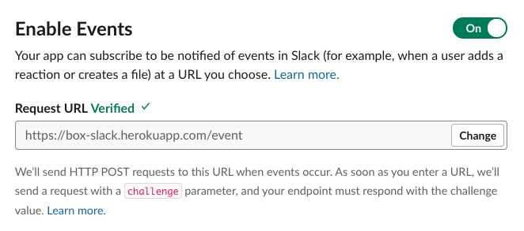
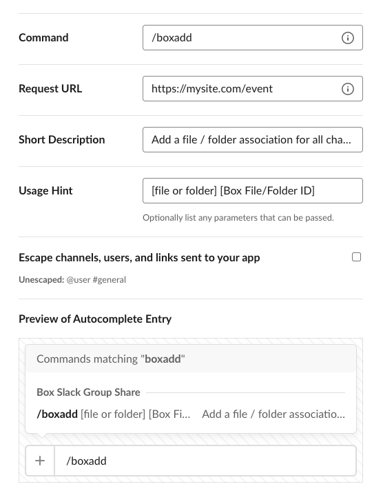

# Configure Slack

The first step in this guide is to create and configure a Slack application,
which will set up a Slack bot to be able to listen for user events in Slack
channels, and respond to slash commands by users in those channels to share Box
files and folders with the group.

This section will walk you through:

* Creating the bare Slack application.
* Configuring a `/boxadd` slash command to share Box files and folders with the
 channel group in Box.
* Configuring the Slack event listener to send notification to our application
 whenever a user joins or leaves the channel, so that the Box group can be
 updated.

Choose your preferred language / framework below to get started.

<Grid columns='3'>
  <Choose option='programming.platform' value='node' color='blue'>
    # Node
    Using the Express.js framework.
  </Choose>
  <Choose option='programming.platform' value='java' color='blue'>
    # Java
    Using the Spring Boot framework.
  </Choose>
  <Choose option='programming.platform' value='dotnet' color='blue'>
    # .NET
    Using the ASP.NET Core framework.
  </Choose>
</Grid>
<Grid columns='2'>
  <Choose option='programming.platform' value='python' color='blue'>
    # Python
    Using the Flask framework.
  </Choose>
  <Choose option='programming.platform' value='ruby' color='blue'>
    # Ruby
    Using the Sinatra framework.
  </Choose>
</Grid>

## Create the app

Go to the [Slack apps page][slack-apps] and click **Create New App**. Add an
**App Name**, select your **Development Slack Workspace** from the dropdown
list where the app bot will be deployed to, then click **Create App**.

<ImageFrame noborder center shadow>
  
</ImageFrame>

Once created, you will be redirected to the basic information section of the
app. You may adjust the icon and description of your app within the **Display
Information** section at the bottom to customize the app in your workspace.

## Configure the Slack app event listener

Where slash commands will allow Slack channel users to add Box content 
associations to the channel, the event listener will allow us to monitor for 
passive events within the channel. For this bot, we want to monitor for three 
[Slack events][slack-events] to produce actions within Box:

[`bot_added`][slack-event-bot-added] When the bot is first added to a channel, 
the bot will get a list of all users in the channel, then create a Box group
for those users. Content will be added to the group through the Slash commands.
[`member_joined_channel`][slack-event-member-joined] When a new Slack user
joins a channel they will be added to the Box group.
[`member_left_channel`][slack-event-member-left] When a channel user leaves or 
is removed, they will be removed from the Box group.

Responding to the event listener challenge
In order to set up a notification URL, to which new Slack event payloads will 
be sent, Slack requires a verification step. When you set an event listener URL
for your bot application code, Slack will immediately send a challenge to that 
URL to verify that it's valid. This will be an HTTP POST with a payload that
looks something like the following:

```javascript
{ 
  "token": "Jhj5dZrVaK7ZwHHjRyZWjbDl", 
  "challenge": "3eZbrw1aBm2rZgRNFdxV2595E9CY3gmdALWMmHkvFXO7tYXAYM8P",
  "type": "url_verification" 
}
```

In order to set up the URL for the event listener, that URL that is set needs 
to respond with a verification payload back to Slack, with a payload containing
the challenge value, similar to the following: 

```javascript
HTTP 200 OK Content-type: application/json {"challenge":"3eZbrw1aBm2rZgRNFdxV2595E9CY3gmdALWMmHkvFXO7tYXAYM8P"}
```

Deploy the following code to your public endpoint.

<!-- markdownlint-disable line-length -->
<Choice option='programming.platform' value='node' color='none'>

```javascript
const bodyParser = require('body-parser');
const app = require('express')();
const http = require('http'); 

app.use(bodyParser.urlencoded({ extended: true }));
app.use(bodyParser.json());

app.post('/process', (req, res) => {
  console.log(req.body);
  if (req.body && req.body.token && req.body.challenge && req.body.type === 'url_verification') {
    const reply = { challenge: req.body.challenge };
    res.status(200).send(reply);
  }
});

const port = process.env.PORT || 3000;
http.createServer(app).listen(port, () => {
  console.log(`Server started: Listening on port ${port}`);
});
```

</Choice>
<Choice option='programming.platform' value='java' color='none'>

```java

```

</Choice>
<Choice option='programming.platform' value='dotnet' color='none'>

```dotnet

```

</Choice>
<Choice option='programming.platform' value='python' color='none'>

```python

```

</Choice>
<Choice option='programming.platform' value='ruby' color='none'>

```ruby

```

</Choice>
<!-- markdownlint-enable line-length -->

Now that we have the code to respond to the Slack challenge when adding an 
event URL, we can configure that within the Slack app.

From your Slack app "Basic Information" tab, under "Add features and 
functionality", click on the button titled "Event Subscriptions" and do the 
following.

Toggle "Enable Events" to "On"
Under "Request URL" add in the public URL that you deployed the above code to, 
and be aware that we are listening at `{APPROUTE}/process` (such as
`https://myapp.com/process`).
Once you add in the URL and click outside the field, Slack will immediately 
send the challenge to the URL that you were hosting the code at above. If the
code responds correctly, you will see a green verified note beside the "Request 
URL" header.

<ImageFrame noborder center shadow>
  
</ImageFrame>

Expand the "Subscribe to bot events" section and click on the "Add Bot User 
Event" button.
Add `member_joined_channel` and `member_left_channel` to the events the bot is 
subscribed to. These will send events when anyone new is added to the channel.
Click the "Save Changes" button at the bottom of the page. 

## Configure the Slack app slash command

To associate files or folders in Box with the Slack channels, we can use Slack
slash commands. This will allow any person in the channel to add content
through a manually input command. 

Through this command, a channel user will be able to type `/boxadd [FOLDER/FILE
ID]` into the channel, which will create the association between the file /
folder and the channel in Box.

From the **Basic Information** tab of your application, under **Add features and
functionality**, click on the button titled **Slash Commands**. 

In the page that comes up, click **Create New Command** and input the following:

* Command: This is the command that a channel user will use to associate
 a Box file / folder ID with the channel. We use `/boxadd` for this quick start.
* Request URL: The URL that is listening for and responding to slash
 commands in our Slack bot.
* Short Description: A description of what the Slash command will do.
* Usage Hint: Additional parameters that may be passed to the command. In 
 our case, that's the Box file / folder ID.

<ImageFrame noborder center shadow>
  
</ImageFrame>

Click "Save" to add the command to our Slack app.

## Add Remaining Scopes

When slash commands or notification events are sent to our application from
Slack, they will contain a Slack user ID which relates to the action that was
taken. To translate that ID to Box, we need to get the Slack user email. That
requires two extra scopes.

From your Slack application configuration, click on **OAuth & Permissions** in
the left menu, then do the following.

* Scroll down to the **Scopes** section.
* Click on the **Add an OAuth Scope** button under **Bot Token Scopes**..
* Search for and add `users:read` and `users:read.email`.

## Deploy Bot to Slack Workspace

With the configuration settings in place, the last step is to install the
application into your Slack workspace. From the "Basic Information" page of the
app, expand the "Install your app to your workspace" section. 

<ImageFrame noborder center shadow>
  
</ImageFrame>

Click the button to "Install App to Workspace".

<ImageFrame noborder center shadow>
  
</ImageFrame>

Once the "Allow" button is clicked you should see a success message. Your bot
is now installed within the workplace.

## Summary

* You've created your Slack application.
* You've configured user event notifications, slash commands, and additional
  scoping.
* You deployed your Slack bot to your workspace.

<Observe option='programming.platform' value='node,java,python,dotnet,ruby'>
  <Next>I have my local application set up</Next>
</Observe>

[slack-apps]: https://api.slack.com/apps
[slack-events]: https://api.slack.com/events
[slack-event-bot-added]: https://api.slack.com/events/bot_added
[slack-event-member-joined]: https://api.slack.com/events/member_joined_channel
[slack-event-member-left]: https://api.slack.com/events/member_left_channel
