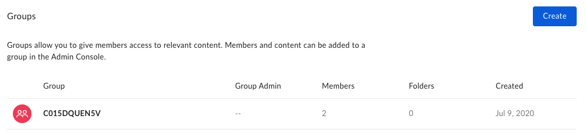
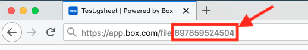

# Test the bot

In this last section we'll test the full range of functionality of the Slack
bot.

* Group creation: When a bot is added to a channel, a new Box group should be
 created with all of the current channel participants. Only those
 people in the channel with matching Box accounts (based on email address
 matching) should be added.
* User event functions: When a user enters or leaves a channel, they should be
 added or removed from the channel group.
* Content add functions: When a user enters a valid `/boxadd` slash command,
 that content should be shared with the group through a new collaboration.

<Message type='notice'>
  If you haven't done so already, ensure that all code in the previous step is
  deployed to your publicly accessible hosting location.
</Message>

## Testing group creation

When a bot is first added to a channel, there are a number of expectations.

* A new group is created with a name that matches the Slack channel ID.
* All people currently in the channel are added to the group, as long as their
 Slack email address matches an enterprise account with the same email.

When the Slack bot was configured in [step 1][step1], we installed it within
the Slack workspace. To test group creation we need to add it to a channel.

From any Slack channel, invite the Slack bot, either through the Slack UI or
using a `/invite @bot_app_name` command.

Once added, verify that the group is created in Box and members have been
added. From a Box enterprise admin account, go to the
[Users and Groups][box-users-groups] section of the admin console. If
successful, you will see a group with an random alpha-numeric string as the
group name. This is the Slack channel ID, which is mirrored in the group name.

<ImageFrame noborder center shadow>
  
</ImageFrame>

Under the **Members** column, you should also see a number indicating the
number of Box users with matching email addresses that were found in the
enterprise and added to the group during group creation.

If you see your group and members, this step is a success.

<Message type='notice'>
  If you see no members added to the group, and no errors being returned from
  the bot application, the most likely cause is email mismatch. Ensure that the
  email addresses used by the accounts in Slack match the emails used by users
  in your Box enterprise.
</Message>

## Testing user event functions

Keep the [Users and Groups][box-users-groups] section of the Box admin
console open and take note of the number in the **Members** column beside your
Slack group. 

From the Slack channel with the bot invited, add or remove someone other than
the bot from the channel. 

Refresh the users and groups section of the Box admin console and you should
see the members number drop or increase depending on if you added or removed a
user.

If the number of members changes, this step is a success.

## Testing content add functions

To test the functionality of sharing content with the group, you will need
access to two users in the channel, one person to share the content from their
Box account, and another person in the group to view their list of files to
verify that the content was shared.

From the Slack channel with the bot invited, type in the slash command to share
files or folders with the group, in the format of
`/boxadd [file/folder] [ID of file/folder]`, such as
`/boxadd folder 324554221`. 

<Message type='notice'>
  The file or folder ID specified needs to be content within the Box account of
  the person sharing it. 
</Message>

To find the ID of a file or folder in a Box account, load up the file or folder
within [the Box site](https://box.com), then look at the URL. The ID will be the
last string in the URL.

<ImageFrame noborder center shadow>
  
</ImageFrame>

Once the command is typed in, go to the [the Box site](https://box.com) account
of another person within the Slack channel and Box group. The content that was
shared should now be available to that account.

If the shared content is available to others in the group, this step is a
success.

## Next Steps

With our basic bot deployed we can now think about ways to improve the
experience on top of the content share that we've created. Next steps in this
journey may include any number of different areas of the Box landscape, such as
the following.

* Adding new slash commands for [creating shared links][next-steps-shared-link]
 for the files and folders shared with the group, allowing you to share the
 content with others who are not in the group.
* [Creating retention policies][next-steps-retention-policy] and
 [assigning them][next-steps-policy-assign] to any content shared with the
 group, allowing you to control the lifespan and governance of shared content.
* Adding new slash commands for allowing people in the channel to
 [comment on the files][next-steps-comment] that are shared with the group.

[step1]: g://collaborations/connect-slack-to-group-collabs/configure-slack
[box-users-groups]: https://app.box.com/master/groups
[next-steps-shared-link]: g://shared-links/create/
[next-steps-retention-policy]: r://post-retention-policies
[next-steps-policy-assign]: r://post-retention-policy-assignments
[next-steps-comment]: r://post-comments