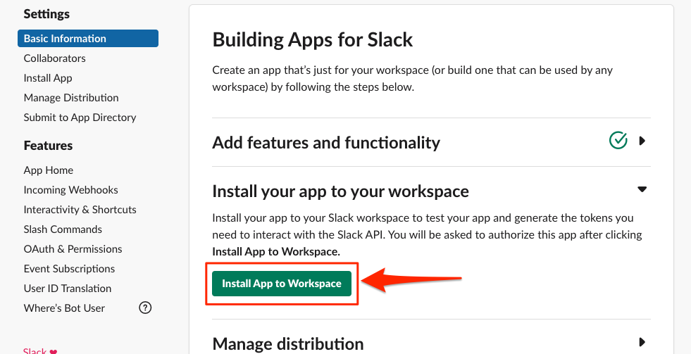

# Test the bot

With the configuration settings in place, the last step is to install the
application into your Slack workspace. From the "Basic Information" page of the
app,
expand the "Install your app to your workspace" section. 

<ImageFrame noborder center shadow>
  
</ImageFrame>

Click the button to "Install App to Workspace".

<ImageFrame noborder center shadow>
  
</ImageFrame>

Once the "Allow" button is clicked you should see a success message. Your bot
is now installed within the workplace.
