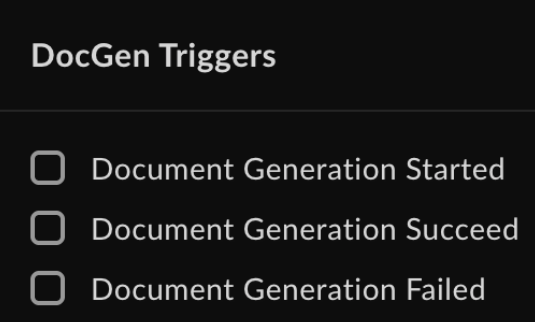

# Get started with Box Doc Gen

To start generating documents with Box Doc Gen API you will need a platform application and a developer token to
authenticate your calls. You also need a Doc Gen template that will serve as an input source for your document.

## Enable Box Doc Gen

To use Box Doc Gen, make sure it is enabled by an
admin in the Admin Console.
If you are a Box Admin, you will find the necessary information in
[Enterprise Settings: Content & Sharing Tab][settings] documentation.

## Create and upload a Box Doc Gen template

To use Box Doc Gen API to generate documents, a Box Doc Gen template must already exist in Box. You have the following options to create a template:

* Install the [Box Doc Gen Template Creator add-in for Microsoft Word][template-addin].
* Create a Box Doc Gen template [using a JSON file][json-template] or manually create [template tags][template-tags].

## Create a platform application

First you need to create a platform application
you will use to make calls. To create
an application, follow the guide
on [creating platform apps][createapps].

## Generate a developer token

You need a developer token
to authenticate your app when sending requests.

To generate a token:

1. Go to **Developer Console** > **My Platform Apps**.
2. Click the **Options menu** button (…) on the right.
3. Select **Generate Developer Token**. The token will be automatically generated and saved to clipboard.

You can also open your app, go to
**Configuration** > **Developer Token**
and generate the token.

<Message type="notice">
A developer token is only valid for one hour.
</Message>

For additional details, see [developer token][token].
After you generate the token, you can use it in cURL
or other clients, such as [Postman][postman], to make
calls.

## Use webhooks 

You can create webhooks to monitor Doc Gen events and automate your business process or workflow.

Follow the instructions for [adding webhooks][webhooks]. Your content type is your Doc Gen template file or folder.

The supported [events][events] are:

* `DOCGEN_DOCUMENT_GENERATION_STARTED`
* `DOCGEN_DOCUMENT_GENERATION_SUCCEEDED` 
* `DOCGEN_DOCUMENT_GENERATION_FAILED`

Information that is posted in a notification:

* Trigger name.
* Webhook trigger timestamp.
* Template file ID.
* Template file version ID.
* Template file name.
* Destination folder.
* Generated file ID (if the document generation process succeeds).
* Output type (DOCX or PDF).
* Reason (if the document generation process fails).

[token]: g://authentication/tokens/developer-tokens
[createapps]: g://applications/app-types/platform-apps
[postman]: g://tooling/postman
[settings]: https://support.box.com/hc/en-us/articles/4404822772755-Enterprise-Settings-Content-Sharing-Tab#h_01FYQGK5RW42T07GV985MQ9E9A
[template-addin]: https://support.box.com/hc/en-us/articles/36587535449747-Installing-Box-Doc-Gen-Add-in
[template-tags]: https://support.box.com/hc/en-us/articles/36151895655059-Creating-A-Box-Doc-Gen-Template-Manually
[json-template]: https://support.box.com/hc/en-us/articles/36148012877843-Creating-a-Box-Doc-Gen-Template-using-JSON-data
[webhooks]: g://webhooks/v2/create-v2/
[events]: g://webhooks/triggers
