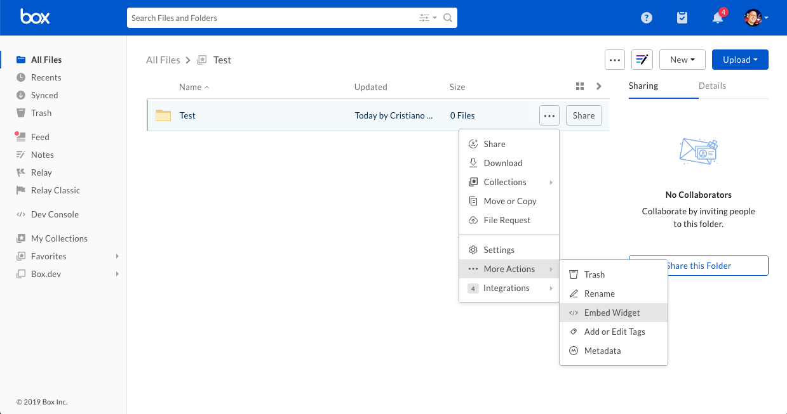
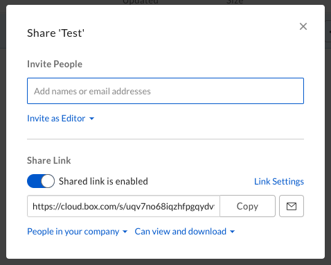

# Box Embed

Box Embed is a HTML-based framework that makes it possible to embed the entire
Box experience anywhere people work. Box Embed provides the ability to upload,
search, comment, share, tag, and most importantly edit files using Box Edit.

## Configure

### From the web

To grab your Box Embed code from the Box web app, navigate to the folder of
choice, click on the ellipsis beside the folder, go to More Actions, and click
Embed Widget.

<ImageFrame border>
  
</ImageFrame>

You are presented with options to adjust the size, view, and sorting.

<ImageFrame border>
  
</ImageFrame>

Once you are done customizing the embed widget, all you will need to do is copy
and paste the embed code into your site or web application.

## Programmatically

If you want to add more customization to Box Embed, you have the ability to
build it programmatically. The format for an embed snippet is as follows.

<!-- markdownlint-disable line-length -->

```html
<iframe
  src="https://{custom_domain}.app.box.com/embed/s/{shared link value}?view={list or icon}&sortColumn={name, date, or size}&sortDirection=ASC"
  width="{pixels}"
  height="{pixels}"
  frameborder="0"
  allowfullscreen
  webkitallowfullscreen
  msallowfullscreen
></iframe>
```

<!-- markdownlint-enable line-length -->

### Finding your shared link value

The first step to building an embed `iframe` programmatically is to generate or
find the value for the shared link. One way to find this value is by using the Box
web app.

<ImageFrame border>
  
</ImageFrame>

Additionally, you can also find this shared link value through the API using the
[`GET /files/:id`](e://get-files-id) or [`GET /folders/:id`](e://get-folders-id)
endpoint and passing in the query parameter `fields=shared_link`.

```curl
curl https://api.box.com/2.0/folders/12345?fields=shared_link \
  -H "authorization: Bearer ACCESS_TOKEN"
```

```json
"shared_link": {
  "url": "https://app.box.com/s/dsbJFzdO7qZxdfOHFzdO7qZxdfOH",
  "download_url": null,
  "vanity_url": null,
  ...
}
```

### Parameters

Next, you will want to choose your view customization options. The following is
a list of optional parameters you can configure.

<!-- markdownlint-disable line-length -->

|                       |                                                                                              |
| --------------------- | -------------------------------------------------------------------------------------------- |
| `view`                | The view type for your files or folders. Can be `list` (default) or `icon`.                  |
| `sortColumn`          | The order the files or folders are sorted in. Can be `name`, `date` (default), or `size`.    |
| `sortDirection`       | The sort direction of files or folders. Can be `ASC` (default) or `DESC`.                    |
| `showParentPath`      | Hide or show the folder path in the header of the frame. Can be `true` or `false` (default). |
| `showItemFeedActions` | Hide or show file comments or tasks. Can be true (default) or false.                         |

<!-- markdownlint-enable line-length -->

### Full Screen Capabilities

To enable full screen capabilities for the Box Embed snippet, include one or more
of the following parameters if you want the object to be viewable in full screen
within an `<iframe>`:

- `allowfullscreen`
- `webkitallowfullscreen`
- `mozallowfullscreen`
- `oallowfullscreen`
- `msallowfullscreen`

## Expiring Embed Links

For files, another option is to call the [`GET /files/:id`](e://get-files-id)
and request an `expiring_embed_link` using the `fields` query parameter.

```curl
curl https://api.box.com/2.0/files/12345?fields=expiring_embed_link \
  -H "authorization: Bearer ACCESS_TOKEN"
```

```json
{
  "etag": "1",
  "expiring_embed_link": {
    "token": {
      "access_token": "1!rFppcinUwwwDmB4G60nah7z...",
      "expires_in": 3646,
      "restricted_to": [
        {
          "object": {
            "etag": "1",
            "file_version": {
              "id": "34567",
              "sha1": "1b8cda4e52cb7b58b354d8da0068908ecfa4bd00",
              "type": "file_version"
            },
            "id": "12345",
            "name": "Image.png",
            "sequence_id": "1",
            "sha1": "1b8cda4e52cb7b58b354d8da0068908ecfa4bd00",
            "type": "file"
          },
          "scope": "base_preview"
        },
       ...
      ],
      "token_type": "bearer"
    },
    "url": "https://cloud.app.box.com/preview/expiring_embed/...."
  },
  "id": "12345",
  "type": "file"
}
```

The `url` attribute can be used in an `<iframe>` to embed an auto expiring Box
Embed interface.

```html
<iframe
  src="<YOUR-GENERATED-BOX-EMBED-LINK"
  width="{pixels}"
  height="{pixels}"
  frameborder="0"
  allowfullscreen
  webkitallowfullscreen
  msallowfullscreen
/>
```

### Parameters

Extra parameters can be added to this URL as well to customize the UI. To do so,
add the following parameters to the `url` as query parameters. The eventual URL
would look something like this.

```sh
https://app.box.com/preview/expiring_embed/[HASH]?[parameterName]=true
```

<!-- markdownlint-disable line-length -->

|                   |                                                                                                                                                                                                                                                                                                                                                                                                                                             |
| ----------------- | ------------------------------------------------------------------------------------------------------------------------------------------------------------------------------------------------------------------------------------------------------------------------------------------------------------------------------------------------------------------------------------------------------------------------------------------- |
| `showDownload`    | Shows the download button in the embedded header bar if the viewer has permissions to download the file. Document file types will also show a print button since print and download are governed by the same permissions. Defaults to `false`.                                                                                                                                                                                              |
| `showAnnotations` | Enables users with permission Preview and above to annotate document and image previews. Also shows annotations that are already on the document. To learn more about the file types that annotations is available on as well as the types of annotations, you can refer to our Annotations page. Annotations are available today on web browsers only. On mobile browsers, users will be able to view annotations but not create new ones. |

<!-- markdownlint-enable line-length -->

## Custom Logo

Paid Box customers have the option to remove the Box logo in the file Preview.
To do so, visit the **Admin Console**, **Enterprise Settings**, **Custom
Setup** and toggle the **Embed widget customization** off to hide the Box
logo.

## Limitations

Box Embed is not optimized for mobile browsers and should not be used in web
experiences designed for mobile devices. Many UI elements, like the **download**
and **print** options might not show in mobile browsers.

[logo]: https://community.box.com/t5/Get-Started-Guide-for-New-Admins/Customize-Your-Account-s-Branding/ta-p/301
