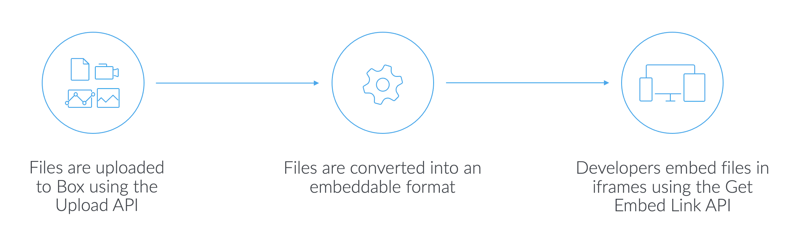

# Box View

Box View is an embeddable service that allows developers to upload, convert,
and display files in their web and mobile apps via a high-fidelity,
interactive file viewer.

## Features

### View any file

Embed documents, images, videos, 360-degree videos and images, 3D models, and
dozens of other files in any web or mobile app using a standard `<iframe>`.

### Ease of use

Upload files to Box via a secure API and receive an embeddable HTML5
snippet to place into your application's UI.

### Collaboration in context

Allow end users to collaborate and mark up documents, presentations, and images
with annotations. Users can highlight text or comment on specific areas of a
file rendering.

## How does Box View work

1. Upload files into Box using our [secure upload API][upload]. All content is stored in Box's secure cloud storage infrastructure with virus scanning and 256 bit encryption.
2. Upon upload, files are converted into HTML5 compatible assets, which are designed to render crisply and responsively.
3. An embeddable URL is requested to access the file rendering. Previews can be embedded directly in your application using an `<iframe>` URL.

<ImageFrame border center shadow>
  
</ImageFrame>

## Customize your experience with Box Content Preview

[Box Content Preview](g://embed/ui-elements/preview) may be used to create
customized client-side experiences with the converted files.

## Use cases

- Convert and display PDF resumes in a recruiter application
- Convert and display course materials, including documents, videos, and PDFs in a student portal
- Convert and display HD video in a media room
- Convert and display sales collateral, including documents, videos, PDFs, and 3D models in a field sales enablement application

[upload]: e://post-files-content
