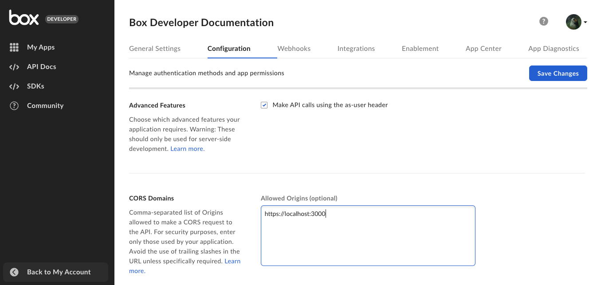

# Content Explorer - Metadata view

With Content Explorer you can also display files and folders
based on their metadata.
The metadata view uses [metadata template][template] and [metadata query][metadata-query] to
find the data you want to display.

## Prerequisites

* Read the [Content Explorer][explorer] guide.
* Check the [metadata terminology][terminology].
* Check the information on [metadata queries][metadata-query].
## Create and configure an app

1. [Create a Box app][box-app].
2. Add the local development address in the CORS Domains: 
3. Generate a [developer token][token].

## Create a metadata template

The next step is to create a metadata template you will use to populate the Content Explorer.

1. Create a metadata template. You can use [Metadata API][creating-templates-api] or [Admin Console][creating-templates-ui] to do so.
2. Apply an already created template to a Box folder. Make sure you enable the
cascade policy. For detailed instructions, see
[instructions on customizing and applying templates][apply-templates].

## Display metadata view

To make things easier, you can use a [sample project][metadata-project] to
launch metadata view.

1. Clone the metadata sample project.
2. Update the placeholders in [`App.js`][appjs] with actual values:

| Parameter | Description |
| --- | --- |
| `DEVELOPER_TOKEN` | [Developer token][token] generated in the the Developer Console. |
| `ENTERPRISE_ID` | Enterprise ID copied from the **General Settings** tab of your application. |
| `METADATA_TEMPLATE_NAME`| Name of your already created metadata template. **Note**: To make sure you provided the proper name, use the [metadata API][get-template] to retrieve the name, or copy it from the URL in the Admin Console.  If you decide to change the template name in the UI, you change the label only. The name to use in the component is always the you provided at the beginning. |
| `ROOTFOLDER_ID` | ID of Box folder to which you applied the metadata template. |

The `defaultView`, `fieldsToShow`, and `metadataQuery` parameters are already
defined in the sample project, as in the example below.

<Message type='notice'>
You can add or hide specific metadata columns using the `fieldsToShow` parameter
(for example **Last modified by**) to display in the Content Explorer.
</Message>

For additional information on metadata queries, see [this guide][metadata-query].

3. Pass the required parameters to the Content Explorer component.

    ```js
    [...]

      function App() {
          [...]

          return (
              <IntlProvider locale="en">
                <div className="App">
                  <header className="App-header">
                    <h2>Metadata view in Content Explorer</h2>
                  </header>
                  <section>
                    <div className="metadata-based-view">
                      <ContentExplorer
                        rootFolderId={rootFolderID}
                        token={token}
                        metadataQuery={metadataQuery}
                        fieldsToShow={fieldsToShow}
                        defaultView={defaultView}
                      />
                    </div>
                  </section>
                </div>
              </IntlProvider>
          );
      }

      export default App;
    ```

A sample code for a React component including the Content Explorer metadata view would look as follows:

```js
function App() {
    // Get the token from Developer Console (app's configuration tab)
    const token = "<DEVELOPER_TOKEN>";

    // Folder ID with a metadata template applied
    // The metadataQuery will apply to this folder
    const rootFolderID = "<ROOTFOLDER_ID>";

    // Get ENTERPRISE_ID from Developer Console (app's general settings)
    const EID = "<ENTERPRISE_ID>";

    // Get templatekey from Admin Console (Content -> Metadata -> check url for ID)
    const templateName = "<METADATA_TEMPLATE_NAME>";

    // Define metadata source
    // Example: enterprise_123456789.metadatatemplate
    const metadataSource = `enterprise_${EID}.${templateName}`;
    const metadataSourceFieldName = `metadata.${metadataSource}`;
    
    const metadataQuery = {
        from: metadataSource,

        // Filter items in the folder by existing metadata key
        query: "key = :arg1",

        // Display items with value
        query_params: { arg1: "value" },

        // Define the ancestor folder ID
        ancestor_folder_id: 0,

        // Define which other metadata fields you'd like to display
        fields: [
            `${metadataSourceFieldName}.name`,
            `${metadataSourceFieldName}.last_contacted_at`,
            `${metadataSourceFieldName}.industry`,
            `${metadataSourceFieldName}.role`,
        ],
    };

    // The metadata fields/columns to view - must be valid field names from the metadata template
    const fieldsToShow = [
        // Determine if the user can edit the metadata directly from Content Explorer component
        { key: `${metadataSourceFieldName}.name`, canEdit: false },

        // Determine label alias on metadata column with displayName prop
        { key: `${metadataSourceFieldName}.industry`, canEdit: false, displayName: "alias" },
        { key: `${metadataSourceFieldName}.last_contacted_at`, canEdit: true },
        { key: `${metadataSourceFieldName}.role`, canEdit: true },
    ];

    // defaultView - a required prop to paint the metadata view.
    // If not provided, you'll get regular folder view.
    const defaultView = "metadata";

    return (
        <IntlProvider locale="en">
            <div className="App">
                <header className="App-header">
                    <h2>Metadata view in Content Explorer</h2>
                </header>
                <section>
                    <div className="metadata-based-view">
                        <ContentExplorer
                            rootFolderId={rootFolderID}
                            token={token}
                            metadataQuery={metadataQuery}
                            fieldsToShow={fieldsToShow}
                            defaultView={defaultView}
                        />
                    </div>
                </section>
            </div>
        </IntlProvider>
    );
}

export default App;
```

## Display name and key parameters

* The `displayName` parameter is the display name of the template.
* The `templateKey` parameter is a unique identifier of the template. It needs 
to be unique across the enterprise for which you create the metadata template.
If you don't provide the `templateKey` parameter, API creates a unique one
based on the value in `displayName`.
* The `[fields].displayName` parameter is the display name of the field as it
is shown to the user in the web and mobile apps.
* The `[fields].key` parameter is a unique identifier for a specific field in
the template. The identifier must be unique within the template to which it
belongs.

## Key

To decide which fields to show, the metadata Content Explorer uses metadata
[field keys][field-key], not the [display names][display-name]. You can see the
display names in the Admin Console and user view, but you can obtain the field
keys through the API.

The field keys are not changing, even if you change the metadata display name.
This ensures that the functionality works properly, despite any changes to the
metadata in UI view.

### Key sanitization

[Keys][field-key] are restricted to alphanumeric characters only:

* No hyphens `-` or underscores `_` are permitted.
* Only letters (`a-z, A-Z`) and numbers (`0-9`) are allowed.

**Non-Latin characters:**

If keys contain characters from non-Latin alphabets (such as Cyrillic, Arabic,
Chinese, etc.) they are automatically renamed to generic identifiers:

* `field` for the first occurrence
* `field1`, `field2`, and so on for subsequent occurrences

<Message type='notice'>
**TIP**: For a detailed flow, see [Metadata view blog post][blogpost].
</Message>

[terminology]: g://metadata/#metadata-terminology
[template]: g:///metadata/2-templates/0-index
[explorer]: g:///embed/ui-elements/explorer
[blogpost]: https://medium.com/box-developer-blog/metadata-view-in-box-content-explorer-4978e47e97e9
[creating-templates-api]: g:///metadata/templates/create
[creating-templates-ui]: https://support.box.com/hc/en-us/articles/360044194033-Customizing-Metadata-Templates
[appjs]: https://github.com/box-community/content-explorer-metadata/blob/main/src/App.js
[box-app]: g:///applications/app-types
[token]: g://authentication/tokens/developer-tokens
[apply-templates]: https://support.box.com/hc/en-us/articles/360044196173-Using-Metadata
[metadata-project]: https://github.com/box-community/content-explorer-metadata/tree/main
[get-template]: e://metadata/templates/get/#get-a-metadata-template-by-name
[metadata-query]: g://metadata/queries
[get-id]: e://get-metadata-templates-id-id-schema/
[field-key]: e://post-metadata-templates-schema/#param-fields-key
[display-name]: e://post-metadata-templates-schema/#param-fields-displayName
