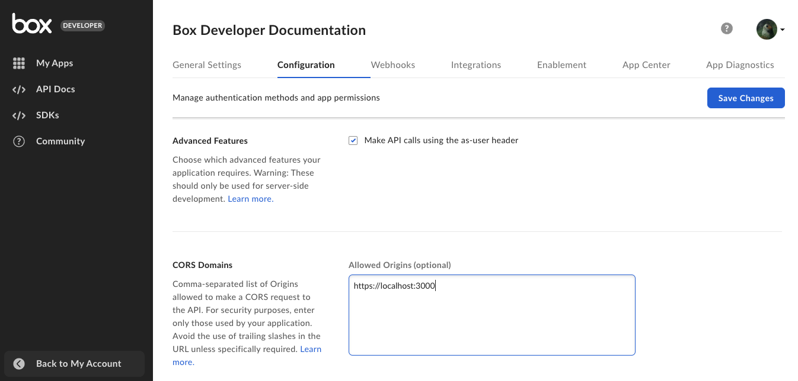
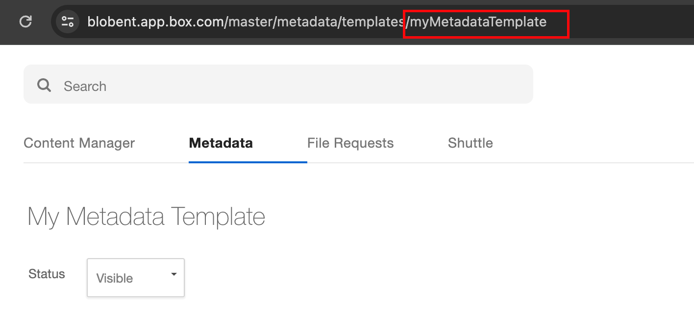

# Content Explorer

The Box Content Explorer UI Element allows developers to embed a folder view of
content stored on Box in their desktop or mobile web application. The library
fetches information about a specified folder through the Box API and then
renders the content in a folder view, similar to the main Box web application.
Users can then navigate through the folder hierarchy and perform file operations
like rename, delete, and share.

Content Explorer comes with a metadata view that uses
metadata query to find files and folders based
on their metadata. The data is then displayed in the embedded view.

## Installation

[Learn how to install](g://embed/ui-elements/installation) Box UI elements
either through NPM or the Box CDN.

## Authentication

The UI Elements are designed in an authentication agnostic way so whether
you are using UI Elements for users who have Box accounts (Managed Users) or
non-Box accounts (App Users), UI Elements should work out of the box. The
reason for this is that UI Elements only expect a "token" to be passed in for
authentication, and Box provides two different ways to generate tokens - OAuth
and JWT.

<CTA to="g://authentication/select">
  Learn about selecting an authentication method
</CTA>

## Sample HTML

```html
<!DOCTYPE html>
<html lang="en-US">
    <head>
        <meta charset="utf-8" />
        <title>Box Content Explorer Demo</title>

        <!-- Latest version of the explorer css for your locale -->
        <link
            rel="stylesheet"
            href="https://cdn01.boxcdn.net/platform/elements/{VERSION}/en-US/explorer.css" />
    </head>
    <body>
        <div class="container" style="height:600px"></div>
        <!-- Latest version of the explorer js for your locale -->
        <script src="https://cdn01.boxcdn.net/platform/elements/{VERSION}/en-US/explorer.js"></script>
        <script>
            var folderId = "123";
            var accessToken = "abc";
            var contentExplorer = new Box.ContentExplorer();
            contentExplorer.show(folderId, accessToken, {
                container: ".container",
            });
        </script>
    </body>
</html>
```

## Demo

<iframe
  height="560"
  scrolling="no"
  title="Box Content Explorer"
  src="//codepen.io/box-platform/embed/wdWWdN/?height=560&theme-id=27216&default-tab=result&embed-version=2&editable=true"
  frameborder="no"
  allowtransparency="true"
  allowfullscreen="true"
  style="width: 100%;"
></iframe>

## API

```js
const { ContentExplorer } = Box;
const contentExplorer = new ContentExplorer();

/**
 * Shows the content explorer.
 *
 * @param {string} folderId - The root folder id
 * @param {string} accessToken - Box API access token
 * @param {Object} [options] - Options
 * @return {void}
 */
contentExplorer.show(folderId, accessToken, options);

/**
 * Hides the content explorer, removes all event listeners, and clears out the
 * HTML.
 *
 * @return {void}
 */
contentExplorer.hide();

/**
 * Clears out the internal in-memory
 * cache for the content explorer forcing
 * re-load of items via the API.
 *
 * @public
 * @return {void}
 */
contentExplorer.clearCache();

/**
 * Adds an event listener to the content explorer. Listeners should be added
 * before calling show() so no events are missed.
 *
 * @param {string} eventName - Name of the event
 * @param {Function} listener - Callback function
 * @return {void}
 */
contentExplorer.addListener(eventName, listener);

/**
 * Removes an event listener from the content explorer.
 *
 * @param {string} eventName - Name of the event
 * @param {Function} listener - Callback function
 * @return {void}
 */
contentExplorer.removeListener(eventName, listener);

/**
 * Removes all event listeners from the content explorer.
 *
 * @return {void}
 */
contentExplorer.removeAllListeners();
```

### Parameters

| Parameter     | Type   | Description                                                                                                                                                                      |
| ------------- | ------ | -------------------------------------------------------------------------------------------------------------------------------------------------------------------------------- |
| `folderId`    | String | Box Folder ID. This will be the ID of the folder you want to navigate. If you want to use the Box All Files folder, then use `0` as the `folderId`.                              |
| `accessToken` | String | Box API access token to use. This should have read/write access to the folder above. The value passed in for the token is assumed to never expire while the explorer is visible. |
| `options`     | Object | Optional options. See below for details. For example: `contentExplorer.show(FOLDER_ID, TOKEN, {canDelete: false})` would be used to hide the delete option.                      |

### Options

| Parameter              | Type     | Default                                                    | Description                                                                                                                                                                                                                                                                                                                                         |
| ---------------------- | -------- | ---------------------------------------------------------- | --------------------------------------------------------------------------------------------------------------------------------------------------------------------------------------------------------------------------------------------------------------------------------------------------------------------------------------------------- |
| `container`            | String   | `document.body`                                            | CSS selector of the container in which the content explorer should be placed. Calling hide() will clear out this container.                                                                                                                                                                                                                         |
| `sortBy`               | String   | `name`                                                     | The initial sort by option for the content list. Value can be either `id`, `name`, `date` or `size`.                                                                                                                                                                                                                                                |
| `sortDirection`        | String   | `ASC`                                                      | The initial sort direction option for the content list. Value should be either `ASC` or `DESC`.                                                                                                                                                                                                                                                     |
| `logoUrl`              | String   |                                                            | URL of custom logo to show in header. If this value is the string box then the box logo will show.                                                                                                                                                                                                                                                  |
| `canPreview`           | Boolean  | `true`                                                     | If this option is set to `true` AND `can_preview` permission on the file is `true`, files on the content explorer will be clickable. Clicking on a file will launch preview of that file. This option has no effect when the file permission `can_preview` is set to `false`. This is only applicable to files that can be previewed.               |
| `canDownload`          | Boolean  | `true`                                                     | Visually hides the download option if this is set to `false`. Hiding the option alone will not prevent downloading unless the file permissions also set `can_download` to `false`. This option has no effect when the file permission `can_download` is set to `false`. This is only applicable to files.                                           |
| `canDelete`            | Boolean  | `true`                                                     | Visually hides the delete option if this is set to `false`. Hiding the option alone will not prevent deleting unless the item permissions also set `can_delete` to `false`. This option has no effect when the item permission `can_delete` is set to `false`.                                                                                      |
| `canRename`            | Boolean  | `true`                                                     | Visually hides the rename option if this is set to `false`. Hiding the option alone will not prevent renaming unless the item permissions also set `can_rename` to `false`.                                                                                                                                                                         |
| `canUpload`            | Boolean  | `true`                                                     | Visually hides the upload option if this is set to `false`. Hiding the option alone will not prevent uploading unless the current folder permissions also set `can_upload` to `false`. This option has no effect when the folder permission `can_upload` is set to `false`.                                                                         |
| `canCreateNewFolder`   | Boolean  | `true`                                                     | Visually hides the create new folder option. Hiding the option alone will not prevent creating a new folder unless the folder item permissions also set `can_upload` to `false`. This option has no effect when the folder item permission `can_upload` is set to `false`.                                                                          |
| `canShare`             | Boolean  | `true`                                                     | Visually hides the share button if set to `false`. Hiding the button alone will not prevent sharing unless the item `permissions` also set `can_share` to false. This option has no effect when the item permission `can_share` is set to `false`.                                                                                                  |
| `canSetShareAccess`    | Boolean  | `true`                                                     | Visually hides the sharing drop down select that allows changing share access, if set to `false`. Hiding the select drop down alone will not prevent changing the share access unless the item permissions also set `can_set_share_access` to `false`. This option has no effect when the item permission `can_set_share_access` is set to `false`. |
| `sharedLink`           | String   |                                                            | Shared link URL, required if folder is shared and the access token doesn't belong to an owner or collaborator of the file.                                                                                                                                                                                                                          |
| `sharedLinkPassword`   | String   |                                                            | Shared link password, required if shared link has a password.                                                                                                                                                                                                                                                                                       |
| `size`                 | String   | `undefined`                                                | Indicates to the content explorer to fit within a small or large width container. Value can be absent or one of `small` or `large`. If absent the UI Element will adapt to its container and automatically switch between `small` width or `large` width mode.                                                                                      |
| `isTouch`              | Boolean  | Defaults to the browser and device's default touch support | Indicates to the Content Explorer that it's is being rendered on a touch enabled device.                                                                                                                                                                                                                                                            |
| `autoFocus`            | Boolean  | `false`                                                    | When set to `true`, the item grid will get focus on initial load.                                                                                                                                                                                                                                                                                   |
| `defaultView`          | String   | `files`                                                    | Value can be either be `files`, `recents` or `metadata`. When set to `recents`, by default you will see recent items instead of the regular file/folder structure. `metadata` is required to display the metadata view in Content Explorer. If not provided, you'll get a regular folder view.                                                      |
| `requestInterceptor`   | Function |                                                            | Function to intercept requests. For an example see [this CodePen](https://codepen.io/box-platform/pen/jLdxEv). Our underlying XHR library is `axios.js` and we follow a [similar approach for interceptors](https://github.com/axios/axios#interceptors).                                                                                           |
| `responseInterceptor`  | Function |                                                            | Function to intercept responses. For an example see [this CodePen](https://codepen.io/box-platform/pen/jLdxEv). Our underlying XHR library is `axios.js` and we follow a [similar approach for interceptors](https://github.com/axios/axios#interceptors).                                                                                          |
| `ContentOpenWithProps` | Object   | `{ show: false }`                                          | Allows you to show the Open With Element when previewing via the explorer.                                                                                                                                                                                                                                                                          |
| `token`                | String   |                                                            | Developer token generated in the Developer Console.                                                                                                                                                                                                                                                                                                 |
| `metadataQuery`        | Object   |                                                            | Metadata query used to get the information for the metadata view.                                                                                                                                                                                                                                                                                   |
| `rootFolderID`         | String   |                                                            | Folder ID with a metadata template applied. `metadataQuery` will apply to this folder.                                                                                                                                                                                                                                                              |
| `fieldsToShow`         | Object   |                                                            | The metadata fields/columns to view - must be valid field names from the metadata template.                                                                                                                                                                                                                                                         |

### Events

| Event Name | Event Data                           | Description                                 |
| ---------- | ------------------------------------ | ------------------------------------------- |
| `select`   | `Array<File \| Web Link \| Folder>`  | Will be fired when item rows are selected.  |
| `rename`   | `File \| Web Link \| Folder`         | Will be fired when an item is renamed.      |
| `preview`  | `File`                               | Will be fired when a file is previewed.     |
| `download` | `Array<File>`                        | Will be fired when items are downloaded.    |
| `delete`   | `Array<File>`                        | Will be fired when items are deleted.       |
| `upload`   | `Array<File>`                        | Will be fired when items are uploaded.      |
| `navigate` | `Folder`                             | Will be fired when navigating into folders. |
| `create`   | `Folder`                             | Will be fired when a new folder is created  |

## Keyboard Shortcuts

When the item grid has focus, either manually by clicking on it or
programmatically via javascript or via the above mentioned `autoFocus` prop, the
following keyboard shortcuts will work if their corresponding operations are
applicable and allowed.

| Key                     | Action                             |
| ----------------------- | ---------------------------------- |
| `Arrow Up`              | Previous item row                  |
| `Arrow Down`            | Next item row                      |
| `Ctrl/Cmd + Arrow Up`   | First item row                     |
| `Ctrl/Cmd + Arrow Down` | Last item row                      |
| `/`                     | Search                             |
| `Shift + X`             | Select an item row                 |
| `Delete`                | Delete the selected item           |
| `Enter`                 | Open the selected item             |
| `Shift + R`             | Rename the selected item           |
| `Shift + S`             | Share the selected item            |
| `Shift + D`             | Download the selected item         |
| `g then f`              | Navigates to the root folder       |
| `g then u`              | Upload to the current folder       |
| `g then b`              | Focuses the root folder breadcrumb |
| `g then r`              | Recent items                       |

## Scopes

If your application requires the end user to only be able to access a subset of
the Content Explorer functionality, you can use [Downscoping][downscope] to
appropriately downscope the Access Token to a resulting token that has the
desired set of permissions, and can thus, be securely passed to the end user
client initializing the Content Explorer.

Below are a set of UI Element-specific scopes to go alongside Downscoping. These
allow developers to enable/disable UI controls on the Content Explorer by
configuring the appropriate scopes on the downscoped token. To learn
more, see [Dedicated Scopes for Box UI Elements][scopes].

### Base Scope

| Scope Name      | Permissions granted                                                               |
| --------------- | --------------------------------------------------------------------------------- |
| `base_explorer` | Allows access to content in the folder tree based on user/file/token permissions. |

### Feature Scopes

| Scope Name      | Permissions granted                                                                                       |
| --------------- | --------------------------------------------------------------------------------------------------------- |
| `item_preview`  | Automatically enables preview of the file, upon user click (requires Preview UI Element to be referenced) |
| `item_download` | Allows files/folders contents to be downloaded                                                            |
| `item_rename`   | Allows files/folders to be renamed                                                                        |
| `item_share`    | Allows sharing of resource specified under "resource" of the downscope request.                           |
| `item_delete`   | Allows file/folders to be deleted                                                                         |

### Sample Scenarios

| Scenario                                                                                  | Scopes                                                                                                            |
| ----------------------------------------------------------------------------------------- | ----------------------------------------------------------------------------------------------------------------- |
| User want to navigate folder structure (basic functionality)                              | `base_explorer`                                                                                                   |
| User want basic functionality + preview                                                   | `base_explorer` + `item_preview`                                                                                  |
| User want basic functionality + preview + download                                        | `base_explorer` + `item_preview` + `item_download`                                                                |
| User want basic functionality + preview + download + rename file/folder names             | `base_explorer` + `item_preview` + `item_download` + `item_rename`                                                |
| User wants all functionality (basic, preview, download, rename, share, upload and delete) | `base_explorer` + `item_preview` + `item_download` + `item_rename` + `item_delete` + `item_share` + `item_upload` |

## Metadata view

With Content Explorer you can also display files
and folders based on their metadata.
This view is called the metadata view and uses
metadata template and metadata query to find the data you
want to display.

### Create and configure an app

1. [Create a Box app][box-app].
2. Add the local development address in the CORS Domains: 
3. Generate a [developer token][token].

### Create a metadata template

The next step is to create a metadata template you will use to populate the Content Explorer.

1. Create a metadata template. You can use [Metadata API][creating-templates-api] or [Admin Console][creating-templates-ui] to do so.
2. Apply an already created template to a Box folder. Make sure you enable the cascade policy. For detailed instructions, see [instructions on customizing and applying templates][apply-templates].

### Display metadata view

To make things easier, you can use a [sample project][metadata-project] to launch metadata view.

1. Clone the metadata sample project.
2. Update the placeholders in [`App.js`][appjs] with actual values:

   | Parameter                | Description                                                                                                                                                                                                                                                                                                                                                                                                                                        |
   | ------------------------ | -------------------------------------------------------------------------------------------------------------------------------------------------------------------------------------------------------------------------------------------------------------------------------------------------------------------------------------------------------------------------------------------------------------------------------------------------- |
   | `DEVELOPER_TOKEN`        | [Developer token][token] generated in the the Developer Console.                                                                                                                                                                                                                                                                                                                                                                                   |
   | `ENTERPRISE_ID`          | Enterprise ID copied from the **General Settings** tab of your application.                                                                                                                                                                                                                                                                                                                                                                        |
   | `METADATA_TEMPLATE_NAME` | Name of your already created metadata template. **Note**: To make sure you provided the proper name, use the [metadata API][get-template] to retrieve the name, or copy it from the URL in the Admin Console.  If you decide to change the template name in the UI, you change the label only. The name to use in the component is always the you provided at the beginning. |
   | `ROOTFOLDER_ID`          | ID of Box folder to which you applied the metadata template.                                                                                                                                                                                                                                                                                                                                                                                       |

    The `defaultView`, `fieldsToShow`, and `metadataQuery` parameters are already defined in the sample project, as in the example below.

    For additional information on metadata queries, see [this guide][metadata-query].

3. Pass the required parameters to the Content Explorer component.

    ```js
    [...]

      function App() {
          [...]

          return (
              <IntlProvider locale="en">
                <div className="App">
                  <header className="App-header">
                    <h2>Metadata view in Content Explorer</h2>
                  </header>
                  <section>
                    <div className="metadata-based-view">
                      <ContentExplorer
                        rootFolderId={rootFolderID}
                        token={token}
                        metadataQuery={metadataQuery}
                        fieldsToShow={fieldsToShow}
                        defaultView={defaultView}
                      />
                    </div>
                  </section>
                </div>
              </IntlProvider>
          );
      }

      export default App;
    ```

A sample code for a React component including the Content Explorer metadata view would look as follows:

```js
function App() {
    // Get the token from Developer Console (app's configuration tab)
    const token = "<DEVELOPER_TOKEN>";

    // Folder ID with a metadata template applied
    // The metadataQuery will apply to this folder
    const rootFolderID = "<ROOTFOLDER_ID>";

    // Get ENTERPRISE_ID from Developer Console (app's general settings)
    const EID = "<ENTERPRISE_ID>";

    // Get templatekey from Admin Console (Content -> Metadata -> check url for ID)
    const templateName = "<METADATA_TEMPLATE_NAME>";

    // Define metadata source
    // Example: enterprise_123456789.metadatatemplate
    const metadataSource = `enterprise_${EID}.${templateName}`;
    const metadataSourceFieldName = `metadata.${metadataSource}`;
    
    const metadataQuery = {
        from: metadataSource,

        // Filter items in the folder by existing metadata key
        query: "key = :arg1",

        // Display items with value
        query_params: { arg1: "value" },

        // Define the ancestor folder ID
        ancestor_folder_id: 0,

        // Define which other metadata fields you'd like to display
        fields: [
            `${metadataSourceFieldName}.name`,
            `${metadataSourceFieldName}.last_contacted_at`,
            `${metadataSourceFieldName}.industry`,
            `${metadataSourceFieldName}.role`,
        ],
    };

    // The metadata fields/columns to view - must be valid field names from the metadata template
    const fieldsToShow = [
        // Determine if the user can edit the metadata directly from Content Explorer component
        { key: `${metadataSourceFieldName}.name`, canEdit: false },

        // Determine label alias on metadata column with displayName prop
        { key: `${metadataSourceFieldName}.industry`, canEdit: false, displayName: "alias" },
        { key: `${metadataSourceFieldName}.last_contacted_at`, canEdit: true },
        { key: `${metadataSourceFieldName}.role`, canEdit: true },
    ];

    // defaultView - a required prop to paint the metadata view.
    // If not provided, you'll get regular folder view.
    const defaultView = "metadata";

    return (
        <IntlProvider locale="en">
            <div className="App">
                <header className="App-header">
                    <h2>Metadata view in Content Explorer</h2>
                </header>
                <section>
                    <div className="metadata-based-view">
                        <ContentExplorer
                            rootFolderId={rootFolderID}
                            token={token}
                            metadataQuery={metadataQuery}
                            fieldsToShow={fieldsToShow}
                            defaultView={defaultView}
                        />
                    </div>
                </section>
            </div>
        </IntlProvider>
    );
}

export default App;
```

<Message type='notice'>
**TIP**: For a detailed flow, see [Metadata view blog post][blogpost].
</Message>

## Custom actions

You can expand the actions in the **More Options** menu for files and folders in Content Explorer and Content Picker. Your custom options show when user clicks the ellipsis button.

<iframe height="560"
scrolling="no" 
title="Box custom icons" 
src="https://codepen.io/box-platform/embed/EaaMMKQ?default-tab=html%2Cresult" frameborder="no"
allowtransparency="true"
allowfullscreen="true"
style="width: 100%;"
></iframe>

[downscope]: guide://authentication/tokens/downscope
[scopes]: guide://api-calls/permissions-and-errors/scopes
[box-app]: g:///applications/app-types
[token]: g://authentication/tokens/developer-tokens
[templates]: g://metadata/templates
[metadata-project]: https://github.com/box-community/content-explorer-metadata/tree/main
[creating-templates-api]: g:///metadata/templates/create
[creating-templates-ui]: https://support.box.com/hc/en-us/articles/360044194033-Customizing-Metadata-Templates
[apply-templates]: https://support.box.com/hc/en-us/articles/360044196173-Using-Metadata
[appjs]: https://github.com/box-community/content-explorer-metadata/blob/main/src/App.js
[blogpost]: https://medium.com/box-developer-blog/metadata-view-in-box-content-explorer-4978e47e97e9
[metadata-query]: g://metadata/queries
[get-template]: g://metadata/templates/get/#get-a-metadata-template-by-name
