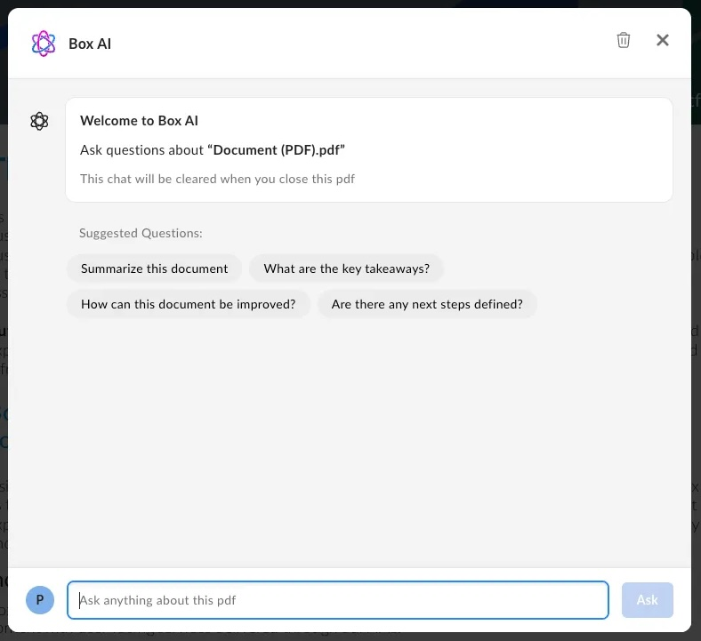

# Content Preview

The Box Content Preview UI Element allows developers to embed high
quality and interactive previews of Box files in their desktop or mobile web
application.

## Content Preview Element vs Content Preview Library

The Content Preview UI Element works differently from the other UI Elements, as the React component is a wrapper for the [Box Content Preview library][previewlib]. It also requires passing a language (defaults to `en-US`) since the preview library bundles are localized.

```js
var ContentPreview = require("./ContentPreview").default;

<IntlProvider locale="en">
  <ContentPreview
    contentSidebarProps={{
      detailsSidebarProps: {
        hasAccessStats: true,
        hasClassification: true,
        hasNotices: true,
        hasProperties: true,
        hasRetentionPolicy: true,
        hasVersions: true,
      },
      features: FEATURES,
      hasActivityFeed: true,
      hasMetadata: true,
      hasSkills: true,
      hasVersions: true,
    }}
    hasHeader={true}
    features={FEATURES}
    fileId={FILE_ID}
    token={TOKEN}
    {...PROPS}
  />
</IntlProvider>;
```

The Content Preview Library fetches information
about the file and its converted representations
through the Box API, chooses the appropriate
viewer for the file type, dynamically loads
the necessary static assets and file representations,
and finally renders the file.

This UI Element also allows loading previews of
multiple files in the same container and exposes
arrows to navigate between those files.
It powers Preview in the main Box web application
as well as the [expiring embed link object][expiredembed].

## Installation

[Learn how to install](g://embed/ui-elements/installation) Box UI elements
either through NPM or the Box CDN.

## Authentication

UI Elements are designed in an authentication-agnostic way so whether
they will work for Managed Box Users and non-Box users (App Users). The
reason for this is that UI Elements only expect a [token][token] for authentication, and Box provides two different ways to generate tokens - OAuth and JWT.

<CTA to="g://authentication/select">
  Learn about selecting an authentication method
</CTA>

## Supported File Types

Box Content Preview supports 120+ file types, including most document and image
formats, HD video, 3D models, 360-degree images, and 360-degree videos. You can
find the full list of supported file types [here][filetypes].

<Message warning>
  Note that where supported file types contain references to other
  objects, for example `DWG` files, those references are not supported in the
  Box preview. A notice will be displayed to all end users viewing a DWG file
  that contains unsupported references letting them know to take alternate steps
  to complete their workflow.
</Message>

## Demo

Use the navigation arrows to preview different file types.

<iframe
  width="100%"
  height="560"
  scrolling="no"
  frameborder="no"
  title="Box Content Preview Demo"
  src="//codepen.io/box-platform/embed/rmZdjm/?height=560&theme-id=27216&default-tab=result&embed-version=2&editable=true"
  allowtransparency="true"
  allowfullscreen="true"
  style="width: 100%;"
></iframe>

## API

```js
const { Preview } = Box;
const preview = new Preview();

/**
 * Shows a preview.
 *
 * @public
 * @param {string} fileId - File ID to preview
 * @param {string} accessToken - Box API access token
 * @param {Object} [options] - Options
 * @return {void}
 */
preview.show(fileId, accessToken, options);

/**
 * Hides the preview.
 *
 * @return {void}
 */
preview.hide();

/**
 * Prints the current file, if printable.
 *
 * @return {void}
 */
preview.print();

/**
 * Downloads the current file.
 *
 * @return {void}
 */
preview.download();

/**
 * Resizes the current preview, if applicable. This function only needs to
 * be called when preview's viewport has changed while the window has not.
 * If the window is resizing, then preview will automatically resize itself.
 *
 * @return {void}
 */
preview.resize();

/**
 * Adds an event listener to the preview. Listeners should be added
 * before calling show() so no events are missed.
 *
 * @param {string} eventName - Name of the event
 * @param {Function} listener - Callback function
 * @return {void}
 */
preview.addListener();

/**
 * Removes an event listener from the preview.
 *
 * @param {string} eventName - Name of the event
 * @param {Function} listener - Callback function
 * @return {void}
 */
preview.removeListener(eventName, listener);

/**
 * Removes all event listeners from the preview.
 *
 * @return {void}
 */
preview.removeAllListeners();
```

### Parameters

| Parameter     | Type   | Description                                                                                                                                                                      |
| ------------- | ------ | -------------------------------------------------------------------------------------------------------------------------------------------------------------------------------- |
| `fileId`      | String | Box File ID.                                                                                                                                                                     |
| `accessToken` | String | Box API access token to use. This should have read/write access to the folder above. The value passed in for the token is assumed to never expire while the explorer is visible. |
| `options`     | Object | Optional options. See below for details. For example: `contentExplorer.show(FOLDER_ID, TOKEN, {canDelete: false})` would be used to hide the delete option.                      |

### Options

| Parameter            | Type    | Default         | Description                                                                                                                                                                                                                                                                                                               |
| -------------------- | ------- | --------------- | ------------------------------------------------------------------------------------------------------------------------------------------------------------------------------------------------------------------------------------------------------------------------------------------------------------------------- |
| `container`          | String  | `document.body` | CSS selector of the container in which Preview should be placed                                                                                                                                                                                                                                                           |
| `sharedLink`         | String  |                 | Shared link URL, required if file is shared and the access token doesn't belong to an owner or collaborator of the file                                                                                                                                                                                                   |
| `sharedLinkPassword` | String  |                 | Shared link password, required if shared link has a password                                                                                                                                                                                                                                                              |
| `collection`         | Array   |                 | List of file IDs to preview over. When used, this will show previews of multiple files within the same container and expose arrows to navigate between those files. Note that `FILE_ID` needs to be included in this list and that the SDK doesn't support collections with files that require a shared link or password. |
| `header`             | String  | `light`         | Values that control header visibility and background color. Use `none` for no header, `light` for a light header and background, and `dark` for a dark header and background                                                                                                                                              |
| `logoUrl`            | String  |                 | URL of custom logo to show in header. If this value is the string box then the box logo will show                                                                                                                                                                                                                         |
| `showAnnotations`    | Boolean | `false`         | Whether annotation button in header and annotations on content are shown                                                                                                                                                                                                                                                  |
| `showDownload`       | Boolean | `false`         | Whether download button is shown in header. Will also control print button visibility in viewers that support print. Note that this option will not override download permissions on the access token.                                                                                                                    |

## Token Generator Function

The Preview library optionally takes a token generator function instead of a
string token. Using a token generator function allows you to dynamically
determine what tokens Preview should use. For example, you can pass in different
access tokens for each file or make sure your token is refreshed and valid
before showing a preview. The token generator function should return a promise
that resolves in either a single string token that applies to all of the files
being previewed or a map of typed file IDs to access token for those files.

```js
// Example token generator function that resolves to a single access token
var singleTokenGenerator = function () {
  return someApi.getToken().then(function (data) {
    return data.token;
  });
};

// Example token generator function that resolves to a map of tokens
var mapTokenGenerator = function () {
  return Promise.resolve({
    file_1234: "some_token_abcd",
    file_2345: "some_token_bcde",
  });
};
```

## Events

The preview object exposes `addListener` and `removeListener` for binding to
events. Event listeners should be bound before `show()` is called, otherwise
events can be missed.

```js
const listener = (value) => {
    // Do something with value
};

// Attach listener before calling show otherwise events can be missed
var preview = new Box.Preview();
preview.addListener(EVENTNAME, listener);

// Show a preview
preview.show(...);

// Remove listener when needed
preview.removeListener(EVENTNAME, listener);
```

`EVENTNAME` can be one of the following:

- `viewer` event will be triggered when we have the viewer instance first available. This will be the same object that is also a property included in the `load` event. Preview triggers this event before `load` so that clients can attach their listeners before the `load` event is triggered.
- `load` event will be triggered on every preview load when `show()` is called or if inter-preview navigation occurs. The event data will contain:

  ```js
  error: 'message', // Error message if any error occurred while loading
  viewer: {...},    // Instance of the current viewer object if no error occurred
  metrics: {...},   // Performance metrics
  file: {...}       // Box file object with properties defined in file.js
  ```

- `navigate` event will be triggered when navigation happens. The event includes the file ID of the file being navigated to, and this event will trigger before `load`.
- `notification` event will be triggered when either the preview wrapper or one of the viewers wants to notify something like a warning or non-fatal error. The event data will contain:

  ```js
  message: 'message', // Message to show
  type: 'warning'    // 'warning', 'notice', or 'error'
  ```

- `viewerevent` Each viewer will trigger its own sets of events. For example, the Image viewer will trigger `rotate` or `resize`, etc. while other viewers may trigger another set of events. The preview wrapper will also re-emit events at the preview level, with event data containing:

  ```js
  event: EVENTNAME,         // Event name
  data: DATA,               // Event data object
  viewerName: VIEWERNAME,   // Name of the viewer. See VIEWERNAME above
  fileId: fileId            // The file ID
  ```

### Example event usage

```js
var preview = new Box.Preview();
preview.addListener("viewer", (viewer) => {
  viewer.addListener("rotate", () => {
    // Do something when a viewer rotates a preview
  });
});

preview.addListener("load", (data) => {
  const viewer = data.viewer;
  viewer.addListener("rotate", () => {
    // Do something when a viewer rotates a preview
  });
});

preview.addListener("viewerevent", (data) => {
  if (data.viewerName === "Image") {
    if (data.event === "rotate") {
      // Do something when an image preview is rotated
    }
  } else if (data.viewerName === "Image360") {
    if (data.event === "rotate") {
      // Do something different when a 360-degree image is rotated
    }
  } else {
  }
});

preview.addListener("rotate", (data) => {
  if (data.viewerName === "Image") {
    // Do something when an image preview is rotated
  } else if (data.viewerName === "Image360") {
    // Do something different when a 360-degree image is rotated
  } else {
  }
});
```

## Annotations

You can enable V4 [annotations][annotationsguide] in content preview. New
annotations will sync in real time.

To add V4 annotations to preview:

1. Run `npm i box-annotations@latest`to install [box annotations][annotations].

<Message warning>
Box annotations version should be at least major version 4 and up.
</Message>

2. Run `npm i box-ui-elements@16.0.0` to install [BUIE][buie] version with annotation related change.

<Message warning>
Box UI elements should be the lowest working version that contains
fully working V4 annotations.
</Message>

3. Import content preview and box annotations into your application:

   ```js
   import boxAnnotations from "https://cdn.skypack.dev/box-annotations@latest";

   var file_id = "YOUR FILE ID";
   var accessToken = "YOUR ACCESS TOKEN";

   /* Enable annotations in sidebar */
   var contentSidebarProps = {
     hasActivityFeed: true,
     features: {
       activityFeed: {
         annotations: {
           enabled: true,
         },
       },
     },
   };

   var options = {
     container: ".previewer",
     contentSidebarProps: contentSidebarProps,

     /* Enable annotations in preview */
     enableAnnotationsDiscoverability: true,
     enableAnnotationsImageDiscoverability: true,
     showAnnotations: true,
     showAnnotationsControls: true,
     showAnnotationsDrawingCreate: true,
   };

   /* BoxAnnotations */
   var annotations = new BoxAnnotations();

   /* Box Preview */
   var contentPreviewer = new Box.ContentPreview();

   /* Set annotation into previewer */
   options["boxAnnotations"] = annotations;

   /* Show previewer */
   contentPreviewer.show(file_id, accessToken, options);
   ```

<Message warning>
The property `features: { activityFeed: { annotations: { enabled: true  } } } }
` is subject to change in the future.
</Message>

```html
<link href="https://cdn01.boxcdn.net/platform/elements/16.0.0/en-US/preview.css" rel="stylesheet" type="text/css"></link>
<script src="https://cdn01.boxcdn.net/platform/elements/16.0.0/en-US/preview.js"></script>

<style>
  .previewer {
    border: 1px solid #eee;
    height: 500px;
    width: 100%;
  }
</style>

<div class="previewer"></div>

<script type="module" src="./script.js"></script>
```

## Box AI for UI Elements

<Message type='notice'>

Box AI for UI Elements is a beta feature and
it is available to **Enterprise Plus** customers.
</Message>

Box AI for UI Elements enhances the Content Preview UI Element
with additional features, allowing the developers
to add the Box Q&A AI functionality to their custom app.
Enriched with Box AI features, the Preview UI element brings the following functionality:

- Q&A and document summaries.
- A **clear conversation** button that resets the conversation with Box AI.
- Citations that, if present, appear below the answer.
- Markdown support that allows you to ask AI to respond in Markdown format, including bullet points or tables
- Question history that is kept under the hood so that both users and the AI can refer to previous context to achieve the best answer possible.
- Suggested questions that appear at the top of the chat to assist with the conversation.



### Enable Box AI for UI Elements

To enable the Box AI modal in content preview header, follow these steps:

1. Make sure your Node and React versions are `18.x` or higher.
2. Download the [npm package that contains Box AI for UI Elements][aipackage] or directly from [Box CDN][installation].
3. Install the peer dependencies:

   - [`box-ai-content-answers`][box-ai-content-answers]
   - [`blueprint-web`][blueprint-web]
   - [`blueprint-web-assets`][blueprint-web-assets]

   To do so, run the following command:

   ```sh
   npx install-peerdeps box-ui-elements
   ```

### Using JavaScript

To enable Box AI features, pass the `contentAnswersProps` prop in the Preview element. The fields `show`, `isCitationsEnabled`, `isMarkdownEnabled`, `isResetChatEnabled` and `suggestedQuestions` are included by default.

```js
const preview = new Box.Preview();
const suggestedQuestions = [
 {
   label: 'What are the key takeaways?',
   prompt: 'What are the key takeaways?',
   id: '1234',
 },
 {
   label: 'Summarize this document',
   prompt: 'Summarize this document',
   id: '5678',
 },
];

preview.show(<FILE_ID>, <TOKEN>, {
   container: '.preview-container',
   contentAnswersProps={
     show: true,
     isCitationsEnabled: true,
     isMarkdownEnabled: true,
     isResetChatEnabled: true,
     suggestedQuestions={suggestedQuestions}
       }
   hasHeader: true,
});
```

### Using React component

You can also add Box AI element to a header in a React component.
To do so, add `contentAnswersProps` prop. The fields `show`, `isCitationsEnabled`, `isMarkdownEnabled`, `isResetChatEnabled` and `suggestedQuestions` are included by default.

<Message type='notice'>

To localize the `suggestedQuestions` properly, make sure that the prompts are translated. The optional `label` property is for screen readers, while the `prompt` property is the text displayed to the user in the AI modal.

</Message>

```js
import ContentPreview from 'box-ui-elements/es/elements/content-preview';
import { IntlProvider } from "react-intl";

const suggestedQuestions = [
  {
    label: 'What are the key takeaways?',
    prompt: 'What are the key takeaways?',
    id: '1234',
  },
  {
    label: 'Summarize this document',
    prompt: 'Summarize this document',
    id: '5678',
  },
];

export default () => {
    const token = process.env.REACT_APP_BOX_DEVELOPER_TOKEN
    let folderID = process.env.REACT_APP_BOX_PREVIEW_FILE_ID
    return (
      <IntlProvider locale="en">
         <ContentPreview
            contentAnswersProps={{
              show: true,
              isCitationsEnabled: true,
              isMarkdownEnabled: true,
              isResetChatEnabled: true,
              suggestedQuestions={suggestedQuestions}
            }}
            fileId={FILE_ID}
            token={TOKEN}
            {...PROPS}
         />
      </IntlProvider>
  );
};
```

You can further customize your apps using the following event listeners for Content Preview available with this release: `onAsk`, `onClearConversations`, and `onRequestClose`.

## Scopes

If your application requires the end user to only be able to access a subset of
the Content Preview functionality, you can use [Downscoping][downscope] to
appropriately downscope the Access Token to a resulting token that has the
desired set of permissions, and can thus, be securely passed to the end user
client initializing the Content Preview.

Below is a set of UI Element-specific scopes to go alongside Downscoping. These
allow developers to enable/disable UI controls on the Content Preview by
configuring the appropriate scopes on the downscoped token. To learn
more, see [Dedicated Scopes for Box UI Elements][scopes].

### Base Scope

| Scope Name     | Permissions granted                               |
| -------------- | ------------------------------------------------- |
| `base_preview` | Allows the user to preview the file, nothing else |

### Feature Scopes

| Scope Name             | Permissions granted                                                                                                                                                                                                                                                                                                                               |
| ---------------------- | ------------------------------------------------------------------------------------------------------------------------------------------------------------------------------------------------------------------------------------------------------------------------------------------------------------------------------------------------- |
| `item_download`        | Allows downloading/printing the content from the generated preview                                                                                                                                                                                                                                                                                |
| `annotation_edit`      | Allows users to edit annotations (delete). Note: For highlight annotations to work, the text layer on the document needs to be enabled for the user. Text layer is disabled for all users that don't have download permissions on the file. To enable highlight annotations for a user, please ensure they have download permissions on the file. |
| `annotation_view_all`  | Allows users to view all users' annotations.                                                                                                                                                                                                                                                                                                      |
| `annotation_view_self` | Allows users to view their own annotations only.                                                                                                                                                                                                                                                                                                  |

<Message>
  # Enable highlight annotations with scopes The highlight scope is not included
  with `annotation_edit` and `annotation_view_all` scopes. The downscoped access
  token will need to include the `item_download` scope to enable highlighting.
</Message>

### Sample Scenarios

| Scenario                                                                                                                                                                       | Scopes                                                      |
| ------------------------------------------------------------------------------------------------------------------------------------------------------------------------------ | ----------------------------------------------------------- |
| User should only be able to preview (not download/print, annotate)                                                                                                             | `base_preview`                                              |
| User should be able to preview, download and print                                                                                                                             | `base_preview` + `item_download`                            |
| User should be able to preview and view all annotations (not download, print or create annotations)                                                                            | `base_preview` + `annotation_view_all`                      |
| User should be able to preview, and create annotations but only view their own.                                                                                                | `base_preview` + `annotation_view_self` + `annotation_edit` |
| User should be able to preview, edit annotations and view all annotations                                                                                                      | `base_preview` + `annotation_view_all` + `annotation_edit`  |
| User should be able to preview and only view their own annotations but not add/delete (ex: after review period has expired, all documents need to be stored in read only mode) | `base_preview` + `annotation_view_self`                     |

<!-- i18n-enable localize-links -->

[filetypes]: https://support.box.com/hc/en-us/articles/360043695794-Viewing-Different-File-Types-Supported-in-Box-Content-Preview

<!-- i18n-disable localize-links -->

[downscope]: guide://authentication/tokens/downscope
[scopes]: g://api-calls/permissions-and-errors/scopes
[annotations]: https://github.com/box/box-annotations
[buie]: https://github.com/box/box-ui-elements/releases/tag/v16.0.0
[annotationsguide]: g://embed/ui-elements/annotations.md
[previewlib]: https://github.com/box/box-content-preview
[ainpm]: https://www.npmjs.com/package/box-ui-elements/v/19.0.0-beta.34
[expiredembed]: r://file--full/#param-expiring_embed_link
[token]: g://authentication/tokens/developer-tokens
[aipackage]: https://github.com/box/box-ui-elements/releases/tag/v20.0.0-beta.17
[installation]: g://embed/ui-elements/installation
[blueprint-web]: https://www.npmjs.com/package/@box/blueprint-web
[box-ai-content-answers]: https://www.npmjs.com/package/@box/box-ai-content-answers
[blueprint-web-assets]: https://www.npmjs.com/package/@box/blueprint-web-assets
