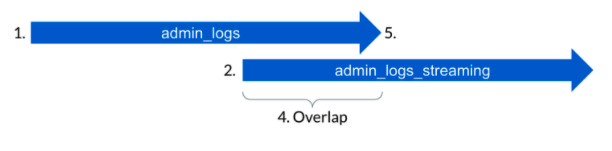

# Migrating From History To Stream

Box recommends that applications subscribing to live events through
`admin_logs` migrate to `admin_logs_streaming`. `admin_logs_streaming` provides
lower and more consistent latency, as well as ensures that late arriving
events will not be missed. Events can be deduplicated between `admin_logs` and
`admin_logs_streaming` by their event IDs.

## Enterprise `stream_type` comparison

### Benefits of `admins_logs_streaming`

- Ensures late arriving events are not missed by your subscribing application
- Provides 80% lower latency (during normal operations)
- Has much more consistent latency (during normal operations)
- Recovers much more gracefully from a fault, because your service no longer has to manage backfilling late events

### Differences between `admin_logs` and `admin_logs_streaming`

- Provides two weeks of event history (i.e. retention)
- Does not support the `created_after` and `created_before` filter parameters
- May contain duplicates (provides an 'at least once' guarantee)
- No longer returns events in chronological order (events are returned in roughly the order they are processed)

### Similarities between `admin_logs` and `admin_logs_streaming`

- Shares the same [`GET /events`][events-api] API endpoint
- Returns the same events payload (events can be deduplicated across the two stream types by event ID)
- Enables filtering by `event_type`
- Allows paginating through events via a `stream_position`

## How to migrate from `admin_logs` to `admin_logs_streaming`

### 1. Existing requests will look something like the below

<!-- markdownlint-disable line-length -->
```curl
curl https://api.box.com/2.0/events?stream_type=admin_logs&stream_position=1632893855 \
  -H "authorization: Bearer <ACCESS_TOKEN>"
```
<!-- markdownlint-enable line-length -->

### 2. Begin overlapping existing requests with `admin_logs_streaming`

- Start two weeks ago and backfill:

    <!-- markdownlint-disable line-length -->
    ```curl
    curl https://api.box.com/2.0/events?stream_type=admin_logs_streaming&stream_position=0 \
      -H "authorization: Bearer <ACCESS_TOKEN>"
    ```
    <!-- markdownlint-enable line-length -->

or

- Start now and run in parallel:

    <!-- markdownlint-disable line-length -->
    ```curl
    curl https://api.box.com/2.0/events?stream_type=admin_logs_streaming&stream_position=now \
      -H "authorization: Bearer <ACCESS_TOKEN>"
    ```

### 3. Paginate through results until now and deduplicate with `admin_logs` events

```curl
curl https://api.box.com/2.0/events?stream_type=admin_logs_streaming&stream_position=1632893855 \
  -H "authorization: Bearer <ACCESS_TOKEN>"
```
<!-- markdownlint-enable line-length -->

### 4. Continue to overlap until confident

### 5. Turn off old `admin_logs` requests

<ImageFrame center shadow border>

</ImageFrame>

[events-api]: e://events
