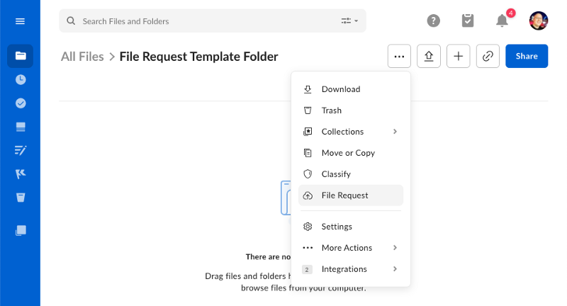
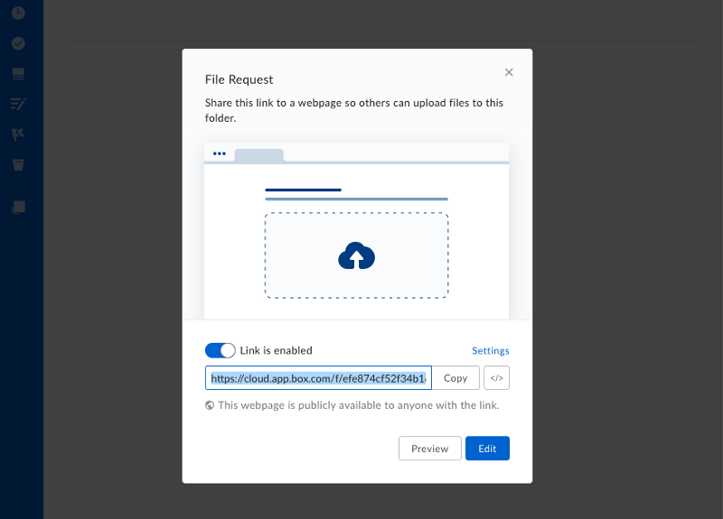

---
related_endpoints:
  - post_file_requests_id_copy
related_guides:
  - file-requests/copy
required_guides: []
related_resources:
  - file_request
---

# Create a template File Request

Currently, the API only allows the creation of new file requests by copying an
existing file request associated to another folder. Please check our below
guide on creating a template folder with a template file request.

## 1. Template folder

First off, create a template folder that you can associate the template file
request to. This can be any folder really, but we recommend using a
folder that is only used for this purpose.

A folder can be created through the Box web or mobile interface, or through the
[`POST /folders`](e://post_folders) API.

<Message notice>

When using server-side JWT authentication, we recommend creating folder that
is owned by the application's
[Service Account](page://platform/user-types/#service-account). This way,
the folder can't be accidentally deleted by a regular Box user.

</Message>

## 2. Template file request

To create a file request, navigate to the template folder in the web app an
d click the 3 dots at the top of the page. Then, select **File Request** from
the menu.

<ImageFrame center shadow>



</ImageFrame>

In the next configuration panel, click the **Edit** button to visit the file
request configuration page.

<ImageFrame center shadow>



</ImageFrame>

On the configuration page, you can set configure the title and description,
before saving the page.

This page will also have the ID of the file request in the URL. Make a note of
the URL as the number at the end is the file request's ID, which you will need
when working with the API.

```sh
https://*.app.box.com/filerequest/2338423584
```

<Message warning>

If your template folder belongs to a JWT user, you will need to
[invite](e://post-collaborations) a managed Box user to the folder before
it can be seen in the web app. Invite yourself to the folder to allow yourself
to add a file request to the folder via the app.

</Message>

## 3. Using a template

A template file request can be used to create new copies using the
[`POST /file-requests/:id/copy`](e://post_file_requests_id_copy)
API. With the ID of a new folder in hand, you can copy the existing
request, including its title, description and form-configuration
to a new folder [with one API call](g://file-requests/copy).
