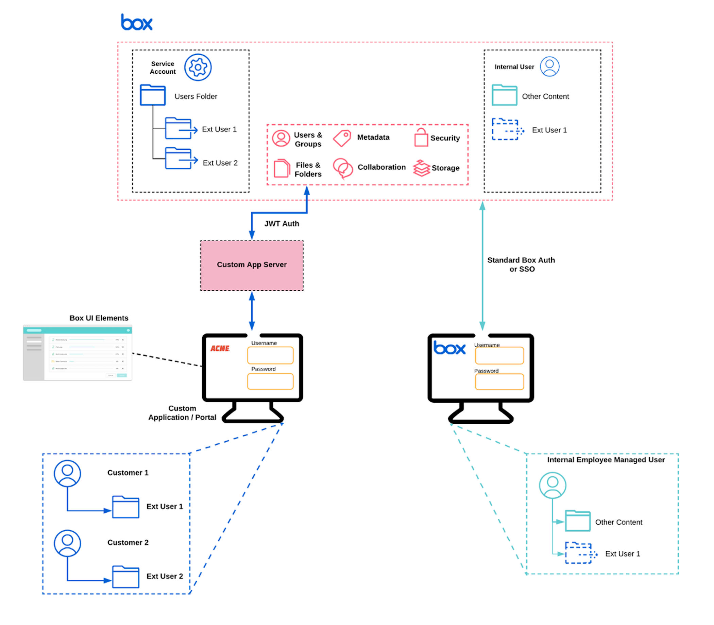

# User Models

Once you confirm your use case is a good fit for Box Platform and you have a
solid understanding of the types of users involved, you can select a user model
to begin application architecture. 

## Classic

<ImageFrame center shadow border>

</ImageFrame>

In this model, the application has internal and external users. The external
users share or collaborate on content with internal users who use the Box web
application.

- **Internal User Type**: Managed Users
- **External User Type**: App Users
- **Content Owned By**: Application Service Account or Managed Users
- **Examples**: vault Portals, Document Submissions, Field Worker Applications

Benefits of this user model:

1. Allows for a custom experience for external end users
2. Removes the need to build additional functionality for internal users because
  they can access the Box web application
3. Allows App Users to be mapped to your own identity system like `Auth0`
4. Record and report all actions to meet to meet security and compliance
  requirements

## App User

<ImageFrame center shadow border>

</ImageFrame>

In this model, the application has internal and external users who all leverage
the same custom UI.

- **Internal User Type**: App Users
- **External User Type**: App Users
- **Content Owned By**: App Users (Internal and External)
- **Examples**: Vault Portals, Document Submissions, Field Worker Applications

Benefits of this user model:

1. Allows for a custom experience for internal and external users
2. Allows for greater control over content permissions
3. Separates managed user and application content by allowing managed users to
  have separate App User accounts
4. Allows App Users to be mapped to your own identity system like `Auth0`
5. Record and report all actions to meet security and compliance
  requirements or track in other systems

## Service Account

<ImageFrame center shadow border>

</ImageFrame>

In this model, the application has internal and external users, but the user
object already exists. This model also works well when users are transient
in nature, but the content must persist. 

- **Internal User Type**: Managed Users
- **External User Type**: Managed by your customer’s applications
- **Content Owned By**: Application's Service Account
- **Examples**: Wealth Management Portal, Insurance Claim Workflow

Benefits of this user model:

1. Useful when the App User model would complicate existing applications
2. Useful when there is not a good 1:1 end user/app user mapping, such as if
  users are mapped as groups
3. Since the Service Account owns all content, permissions are easier to manage.
4. Ability to implement a token exchange to ensure that broad scoped access to
  the Service Account does not occur

## System to system 

<ImageFrame center shadow border>

</ImageFrame>

In this model, no user content normally needs to be handled.

- **External User Type**: N/A
- **Internal User Type**: N/A
- **Content Owned By**: Application's Service Account
- **Examples**: Back Office Applications, Integrations, User Provisioning,
 Folder Auto-Creation

Benefits of this user model:

1. Useful when user construct isn’t needed (e.g. departmental or company owned
 content that transcends user ownership)
2. Allows for complete control of permission assignment to backend services
 because the Service Account can be granted elevated scopes, 
