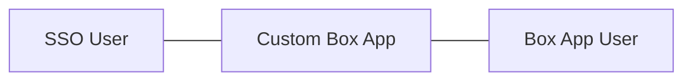

# Identity management & Apps

Single Sign-On (SSO) services are often used as part of a company's **Identity
and Access Management (IAM)** solution. When deployed, these services grant
users the ability to securely authenticate multiple applications by logging in
once, with only one set of credentials (username and password).



Box is one of the applications that can be connected to the SSO service of a
company. Integrating these applications into your custom apps will allow you to
provision Box users on the fly for any of your end users, without those users
knowing they have a Box account.

<Message notice>
  Popular SSO services include `Okta`, `Auth0`, `Microsoft Azure AD`,
  `OneLogin`, `G Suite`, and `Ping Identity`, but there are many others that may
  be deployed.
</Message>

## Connecting SSO to apps

When integrating SSO services into a Box application programmatically, we are
referring to the following flow.

```mermaid
sequenceDiagram
   participant Browser
   participant Web Server
   participant SSO Provider
   Browser->>+Web Server: User visits web app
   Web Server->>-Browser: Redirected to SSO
   Browser->>+SSO Provider: User logs in
   SSO Provider->>-Browser: Redirected back to web app
   Browser->>+Web Server: Pass SSO user details
   Web Server-->>+Box API: Find or create a new app user
   Box API-->>-Web Server: Return app user details
   Web Server->>-Browser: Display files to user
```

1. A user accesses your web or mobile application in a logged out state.
2. The user is redirected to your SSO provider to log in, typically via
   `OAuth 2` and `OpenID Connect`.
3. After login, the user is redirected back to your application along with
   their SSO identity credentials.
4. Your application does a check to see if an associated Box account already
   exists for this user.
5. If an existing Box account already exists for this user, the application
   uses the SSO identity to make API calls on behalf of that user in Box.
6. If there is not already an associated Box account for this user, a
   new Box user account is created based on the SSO identity. The unique user ID
   from the SSO service is then linked to the new Box user, creating an
   association between the two accounts. This new Box user is then API calls on
   behalf of that user in Box.

<Message notice>
  # Box web app and SSO

  If you wish to connect your SSO service to the Box website instead of a Box
  application, Box provides a number of [integration options][sso-support] for
  supporting SSO integrations of the [Box web application](https://www.box.com)
  via SAML 2.0.
</Message>

[sso-support]: https://support.box.com/hc/en-us/articles/360043696514-Setting-Up-Single-Sign-On-SSO-for-your-Enterprise