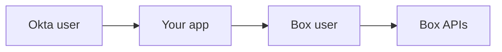

# Okta app user provisioning

[Okta][okta] is a popular access management and identity platform used by
companies to provide a unified method for managing and authenticating into
multiple applications with a single set of credentials and a single secure
dashboard. 

When connected to a custom Box application, the [Okta APIs][okta-dev] may be
used to provide a single login mechanism to identify users within the Box
application, allowing you to have a unified experience between your unified
identity system (Okta) and the Box APIs. 

<ImageFrame noborder center shadow>
  
</ImageFrame>

## Overview 

This quick start guide will walk through how to programmatically use Okta to
log in to a Box application, provisioning an app user in Box that is linked to
the Okta user, then make Box API calls on behalf of that user. 

This will take you through the following steps.

1. [Scaffold your application code][step1] so that
   we have a web application that we can log in to.
1. [Setup and configure your Okta application][step2] and create
   a first user that we can use to log into the web app with, and eventually
   create a Box account for.
1. [Setup and configure your Box application][step3] so that we 
   can connect your web application to Box.
1. [Create a log in flow for your application][step4],
   allowing the Okta user to log in to your web application.
1. [Find an existing Box user, and optionally create a Box user][step5] the
   first time that Okta user logs into your web application.
1. [And finally, run the application][step6] and the see
   the complete flow in action.

<Message warning>
  To simplify this guide we will not create any user interface for the web
  application. Instead we will provide some output via the application console /
  terminal, or directly as text output in the browser.
</Message>

<Next>
  I am ready to get started
</Next>

[okta]: https://www.okta.com/
[okta-dev]: https://developer.okta.com/
[step1]: g://identity-management/quick-start/scaffold-application-code/
[step2]: g://identity-management/quick-start/configure-okta/
[step3]: g://identity-management/quick-start/configure-box/
[step4]: g://identity-management/quick-start/logging-into-app/
[step5]: g://identity-management/quick-start/find-or-create-box-users/
[step6]: g://identity-management/quick-start/run-the-app/
