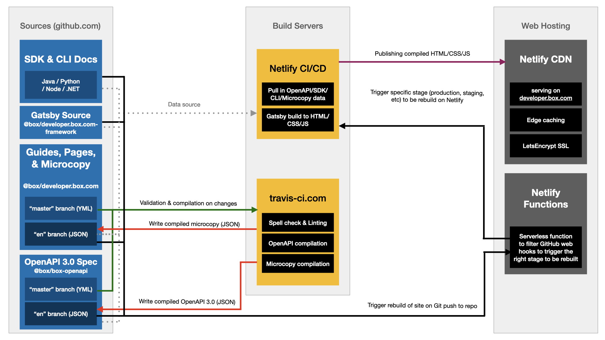

<!-- does not need translation -->

# Developer Documentation Architecture

The following is an overview of the build system for the new
[developer documentation] site. 

## High Level Architecture

The build architecture for developer documentation is split into three
parts:

- Validating and resolving sources used to build the developer documentation,
- Fetching sources and compiling the site when any of the sources change,
- Publishing the site to our hosting provider.

<ImageFrame center shadow border>
  
</ImageFrame>

## Stages Overview

Below table contains an overview of all currently deployed stages, and where
they pull their sources from.

<!-- markdownlint-disable line-length -->

| Sources | Production | Staging | Japan |
| --- | --- | --- | --- |
| | developer.box.com | staging.developer.box.com | ja.developer.box.com |
| OpenAPI | @box/openapi#master | @box/openapi#staging | |
| OpenAPI Compiled (EN) | @box/openapi#en | @box/openapi#en-staging @boxopenapi#jp |
| Microcopy & Guides (EN) | @box/developer.box.com#master | @box/developer.box.com#staging | |
| Microcopy & Guides Compiled (EN) | @box/developer.box.com#en | @box/developer.box.com#en-staging | @box/developer.box.com#jp |
| Gatsby Site | @box/developer.box.com-framework#master | @box/developer.box.com-framework#staging | @box/developer.box.com-framework#master |

<!-- markdownlint-enable line-length -->

## Video Overviews

These videos contain an overview of the developer documentation site, build
system, and services:

- [High level fireside chat],
- Deep technical dive:
  - [Screen recording],
  - [Audio only].

[developer documentation]: https://box.dev
[High level fireside chat]: 
https://cloud.box.com/s/bf7yfygd56ffes5awyw7xr5n7hrg3tiz
[Screen recording]: https://cloud.box.com/s/lmcj5kamjsxxwfad08d0iy78jmzsk7be
[Audio only]: https://cloud.box.com/s/mtbfmfwgxm4sn0m0xfz92rzlrv3239bh
