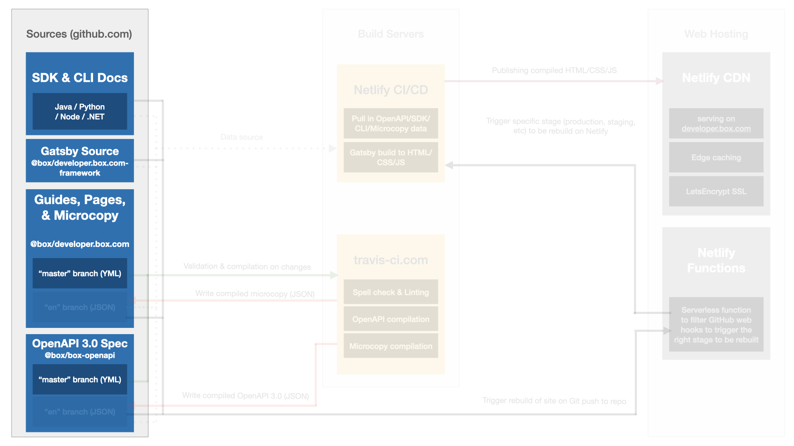

<!-- does not need translation -->

# Sources

A set of sources, managed by technical publications team (in collaboration
with the developer relations team) and other teams, is used to 
build the content for Box developer documentation documentation.
The sources are stored in GitHub repositories.

<ImageFrame center shadow border>
  
</ImageFrame>

## Site sources managed by Tech Pubs and Dev Rel teams

- [Box open API] - a set of files that represent the Open API 3.0 
specification for the Box Platform API. These files describe up-to-date
contents of the API endpoints. 
- [developer.box.com] - a set of files that represent the microcopy,
locale configuration, guides, and pages for the developer documentation
site.
- [Framework] - source for the Gatsby templates and importers for the
developer documentation site.
- [Changelog] - markdown source for all release notes for Box Platform:
APIs, SDKs, UI elements, and CLI.

## Site sources managed by other teams

- [CLI] - source code and documentation with code samples for the Box CLI.
- [Python SDK] - source code and documentation with code samples for the Box
Python SDK.
- [Node SDK] - source code and documentation with code samples for the Box Node
SDK.
- [Java SDK] - source code and documentation with code samples for the Box Java
SDK.
- [.NET SDK] - source code and documentation with code samples for the Box .NET
SDK.

## Source validation

[Box open API]: https://github.com/box/box-openapi
[developer.box.com]: https://github.com/box/developer.box.com
[Framework]: https://github.com/box/developer.box.com-framework
[Changelog]: https://github.com/box/box-developer-changelog
[CLI]: https://github.com/box/boxcli
[Python SDK]: https://github.com/box/box-python-sdk
[Node SDK]: https://github.com/box/box-node-sdk
[Java SDK]: https://github.com/box/box-java-sdk
[.NET SDK]: https://github.com/box/box-windows-sdk