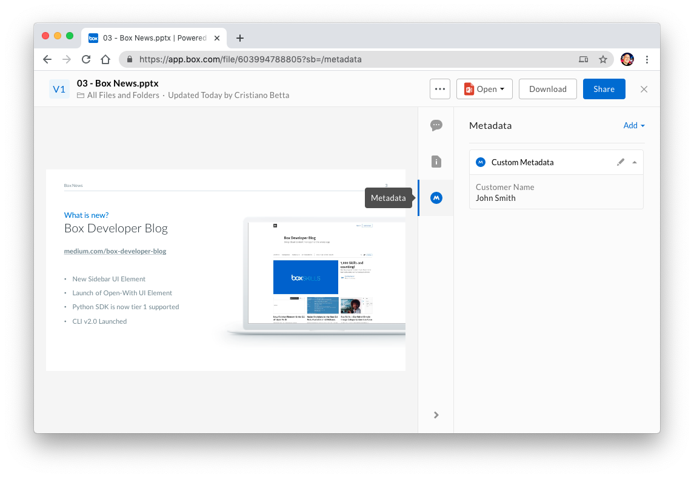

# Metadata

Metadata allows users and applications to define and store custom data
associated with files and folders.

<ImageFrame border center>

  

</ImageFrame>

Metadata consists of key/value pairs that are assigned to a file or a folder.
For example, an important contract may have the key/value pairs of
`clientNumber: 820183` and `clientName: bioMedicalCorp`.

## Templates, Fields, Instances, and Cascade Policies

Working with metadata requires a developer to work with a few
distinct types of resources.

* **Templates:**  A [metadata template][template] describes a re-usable set of
  key/value pairs that can be assigned to a file. For example, an `invoiceData`
  template might hold data about an invoice, having a field for the invoice ID
  as well as the customer ID.
  * **Fields:**  A [metadata template field][field] describes a specific
    piece of data within a metadata template. For example, the ID of an invoice
    might be represented as an `id` field on an `invoiceData` template.
* **Instances:** A [metadata instance][instance] describes the relation between
  a template and a file or folder, including the values that are assigned for
  every field. For example, a user might have assigned an `invoiceData` metadata
  template to a file and provided 2 values, one for the invoice ID and one for
  the customer ID.
* **Cascade Policies**: A [metadata cascade policy][cascade] describes
  how metadata instances applied to a folder should be applied to any item
  within that folder. For example, a user might assign the same `invoiceData`
  metadata template to a project folder (including the 2 values), allowing them
  to automatically apply to all the files and folders within that project folder.

## The purpose of metadata

Metadata can be used for many purposes. Enterprises may want to have a better
way to organize their digital assets for their marketing teams, or developers
may want to provide advanced content functionality such as facilitating
workflows or approvals.

For example, a `marketingCollateral` template may define where and when specific
marketing content should be used. Users can see a representation of the
template in the Box web application while navigating to a file preview.

To learn more, please visit [Box community articles][community].

[community]: https://community.box.com/t5/Organizing-and-Tracking-Content/Using-Metadata/ta-p/30765
[template]: g://metadata/templates
[instance]: g://metadata/instances
[cascade]: g://metadata/cascades
[field]: g://metadata/fields
