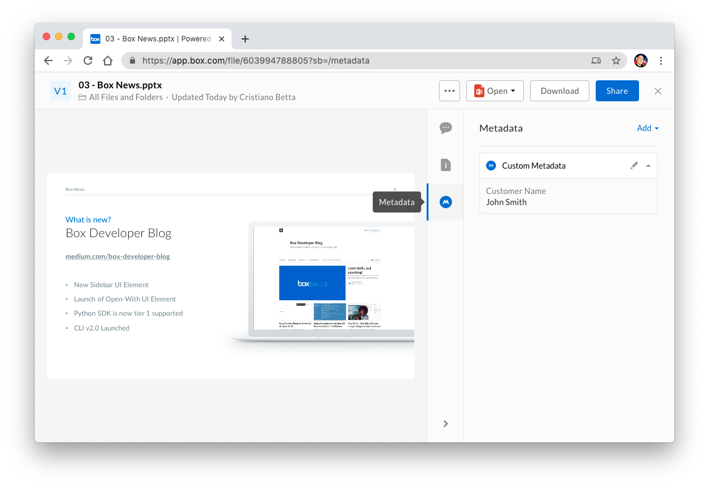

# Metadata Quick Start

The Metadata APIs are a great tool to allow applications to automatically add
additional information to files and folders.

<ImageFrame center>

  

</ImageFrame>

## Overview

This guide will take you through the following steps.

1. [List all templates](g://metadata/quick-start/list-all/)
   available to you.
2. [Create a custom metadata
   template](g://metadata/quick-start/create-template/) to hold data specific
   to your enterprise.
3. [Apply a custom metadata template](g://metadata/quick-start/create-instance/)
   to a file, allowing you to assign custom data to a file.
4. [Update metadata instance](g://metadata/quick-start/update-instance/)
   on a file, allowing you to change the data assigned to a file.
5. [Update a metadata template](g://metadata/quick-start/update-template/)
   and change the data applied to all instances of this template.

<Next>
  I am ready to get started
</Next>
