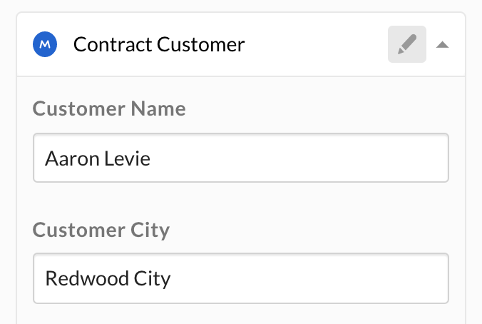

---
related_endpoints:
  - post_metadata_templates
  - put_metadata_templates_id_id_schema
related_guides: 
  - metadata/templates/create
  - metadata/templates/update
related_resources:
  - metadata_template
---

# String metadata field

A metadata field of type `string` is displayed to a user as a standard text-field.

<ImageFrame border center shadow width='400'>

  

</ImageFrame>

## Create a string field

A `string` field can be added to a metadata template either when [creating a
metadata template][g_create_template], or when [updating a
template][g_update_template] with the `addField` operation.

The required attributes for a `string` field are a `type`, a `displayName`, and a
`key`.

```json
{
  "scope": "enterprise",
  "displayName": "Customer",
  "fields": [
    {
      "type": "string",
      "key": "name",
      "displayName": "Name",
      "description": "The customer's legal name",
      "hidden": false
    }
  ]
}
```

Optionally, a `description` can be provided that is shown to a user in the UI,
and the field can be set to `hidden` to hide it from users in the web and mobile
apps.

## Update a string field

A `string` template field can be updated by [updating the
template][g_update_template] it belongs to. Updates to templates happen through
**operations** to ensure that any template that is already assigned to a file or
folder is updated as well.

When updating a `string` metadata field, the only relevant operation is the
`editField` operation, which can be used to change the field's `key`,
`displayName`, `description`, and `hidden` values.

```json
[
  {
    "op": "editField",
    "fieldKey": "name",
    "data": {
      "displayName": "Customer Name",
      "description": "The contact name at the customer",
      "key": "customer_name",
      "hidden": true
    }
  }
]
```

<Message warning>

This will affect existing instances of this template.

</Message>

[g_create_template]: g://metadata/templates/create
[g_update_template]: g://metadata/templates/update
