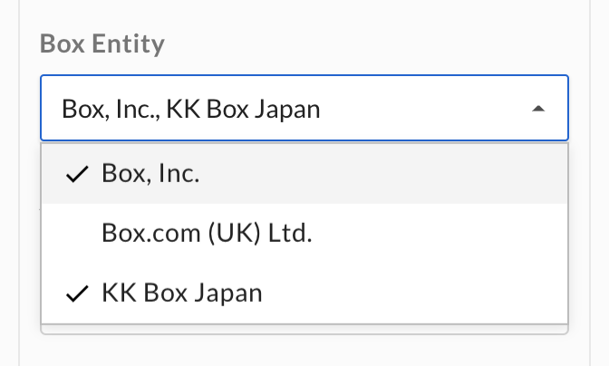

---
related_endpoints:
  - post_metadata_templates
  - put_metadata_templates_id_id_schema
related_guides:
  - metadata/templates/create
  - metadata/templates/update
related_resources:
  - metadata_template
---

# Multi Select metadata field

A metadata field of type `multiSelect` is displayed to a user as a dropdown
list. The user can select multiple items from the list.

<ImageFrame border center shadow width='400'>

  

</ImageFrame>

<Message notice>

A `multiSelect` field allows a user to select zero, 1, or more values. To force
a user to select only 1 value at most, use the [`enum`][g_enum_field] template
field.

</Message>

## Create a `multiSelect` field

A `multiSelect` field can be added to a metadata template either when [creating
a metadata template][g_create_template], or when [updating a
template][g_update_template] with the `addField` operation.

The required attributes for a `multiSelect` field are a `type`, a `displayName`,
a `key`, and a list of options.

```json
{
  "scope": "enterprise",
  "displayName": "Contract",
  "fields": [
    {
      "type": "multiSelect",
      "key": "box_entity",
      "displayName": "Box Entity",
      "description": "The Box entity that this contract belongs to",
      "hidden": false,
      "options": [
        {"key": "Box, Inc"},
        {"key": "Box.com (UK) Ltd."},
        {"key": "KK Box Japan"}
      ]
    }
  ]
}
```

Optionally a `description` can be provided that is shown to a user in the UI,
and the field can be set to `hidden` to hide it from users in the web and mobile
apps.

## Update a `multiSelect` field

A `multiSelect` template field can be updated by [updating the
template][g_update_template] it belongs to. Updates to templates happen through
**operations** to ensure that any template that is already assigned to a file or
folder is updated as well.

### Change basic field values

When updating a `multiSelect` metadata field one of the possible operations is
the `editField` operation which can be used to change the field's `key`,
`displayName`, `description` and `hidden` values.

```json
[
  {
    "op": "editField",
    "fieldKey": "box_entity",
    "data": {
      "displayName": "Box Entities",
      "key": "box_entities"
    }
  }
]
```

<Message>
  The `fieldKey` here represents the original key of the field to change. The
  `data.key` field is the new key of the field.
</Message>

<Message warning>

This will affect existing instances of this template.

</Message>

### Add an option

Adding an option to a `multiSelect` field can be achieved through the
`addMultiSelectOption` operation. The operation expects the `fieldKey` to be set
to the key of the `multiSelect` field to change, and a `data` object with the
`key` of the new option to add.

```json
[
  {
    "op": "addEnumOption",
    "fieldKey": "box_entity",
    "data": {
      "key": "Box (NL) BV"
    }
  }
]
```

The list of options should now be as follows.

```json
...
"options": [
  {"key": "Box, Inc"},
  {"key": "Box.com (UK) Ltd."},
  {"key": "KK Box Japan"},
  {"key": "Box (NL) BV"}
]
...
```

<Message warning>

This will affect existing instances of this template.

</Message>

### Reorder options

Reordering the options in an `multiSelect` field can be achieved through the
`reorderMultiSelectOptions` operation. The operation expects the `fieldKey` to
be set to the key of the `multiSelect` field to change, and an
`multiSelectOptionKeys` array with the keys of the options in order.

```json
[
  {
    "op": "reorderMultiSelectOptions",
    "fieldKey": "box_entity",
    "multiSelectOptionKeys": [
      "Box, Inc",
      "Box.com (UK) Ltd.",
      "Box (NL) BV",
      "KK Box Japan"
    ]
  }
]
```

The list of options should now be as follows.

```json
...
"options": [
  {"key": "Box, Inc"},
  {"key": "Box (NL) BV"},
  {"key": "Box.com (UK) Ltd."},
  {"key": "KK Box Japan"}
]
...
```

<Message warning>

New options can not be added with this operation. This will affect existing
instances of this template.

</Message>

### Edit an option

Editing an option of a `multiSelect` field can be achieved through the
`editMultiSelectOption` operation. The operation expects the `fieldKey` to be
set  to the key of the `multiSelect` field to change, and an
`multiSelectOptionKey` to be set to the key of the field option. Finally, it
expects a `data` object with the new `key` of the field option.

```json
[
  {
    "op": "editMultiSelectOption",
    "fieldKey": "box_entity",
    "multiSelectOptionKey": "Box (NL) BV",
    "data": {
      "key": "Box.nl BV"
    }
  }
]
```

The list of options should now be as follows.

```json
...
"options": [
  {"key": "Box, Inc"},
  {"key": "Box.nl BV"},
  {"key": "Box.com (UK) Ltd."},
  {"key": "KK Box Japan"}
]
...
```

<Message warning>

This will affect existing instances of this template.

</Message>

### Remove an option

Removing an option from an `multiSelect` field can be achieved through the
`removeMultiSelectOption` operation. The operation expects `fieldKey` to be set
to the key of the `multiSelect` field to change, and an `multiSelectOptionKey`
to be set to the key of the field option to remove.

```json
[
  {
    "op": "removeMultiSelectOption",
    "fieldKey": "customer_state",
    "multiSelectOptionKey": "KK Box Japan"
  }
]
```

The list of options should now be as follows.

```json
...
"options": [
  {"key": "Box, Inc"},
  {"key": "Box.nl BV"},
  {"key": "Box.com (UK) Ltd."}
]
...
```

<Message warning>

This will affect existing instances of this template. Any fields that were set
to this value will have the value removed from its list of selected values.

</Message>

[g_create_template]: g://metadata/templates/create
[g_update_template]: g://metadata/templates/update
[g_enum_field]: g://metadata/fields/enum
